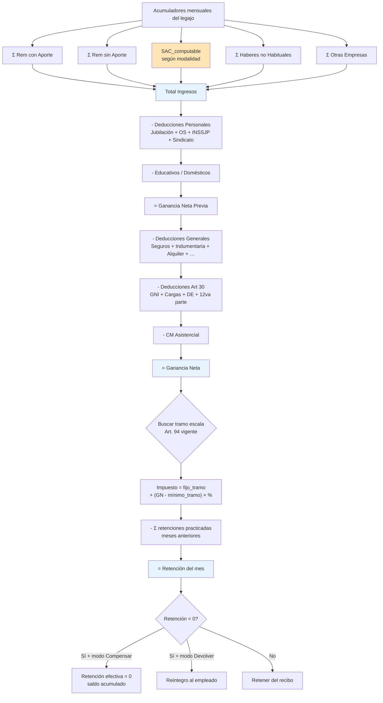
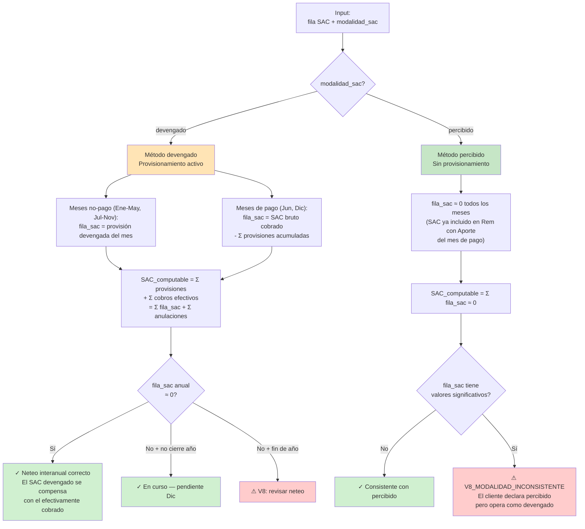
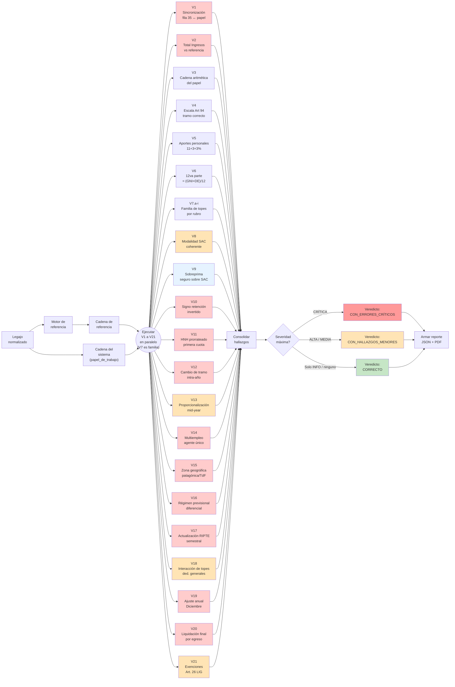
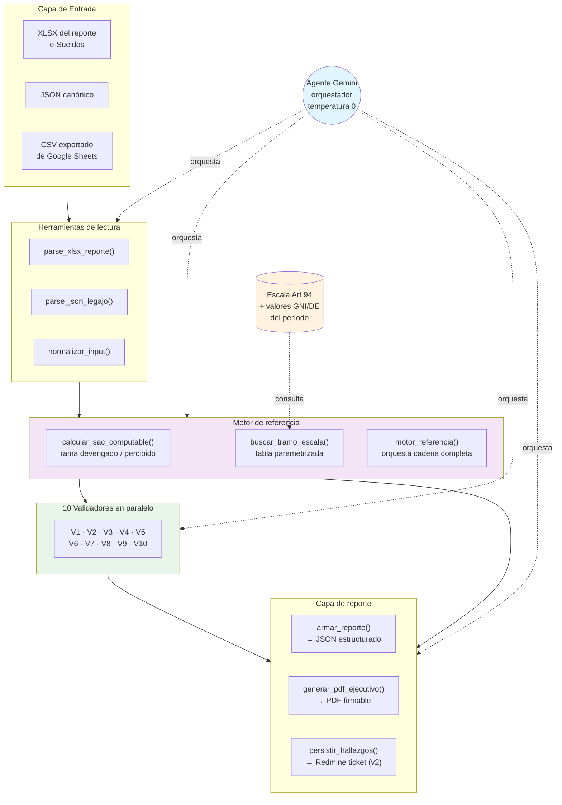

# Especificación Técnica — Controlador de Auditoría de Ganancias 4ta Categoría

**Producto**: e-Sueldos — Módulo de auditoría
**Destino**: Google Antigravity con agente Gemini
**Versión**: 1.0
**Autor**: Adrián Palma (e-Sueldos)
**Fecha**: Julio 2026

---

## 1. Contexto y motivación

El motor de cálculo de Impuesto a las Ganancias 4ta categoría de e-Sueldos presenta un bug estructural en el módulo de conciliación de provisiones de SAC, con manifestaciones distintas según la política contable del cliente. La investigación forense sobre cuatro liquidaciones reales identificó tres errores concretos que producen retenciones incorrectas — subretención en casos con provisionamiento activo, con impacto financiero por legajo que va desde ~525.000 ARS (NETSER, sueldo medio) hasta ~1.600.000 ARS (La Palabra, sueldo alto).

Este documento especifica un **controlador de auditoría** que, dado el reporte "Legajos Liquidados Detalle" de un legajo, produce un diagnóstico automatizado de la corrección del cálculo, identifica cuál de los errores conocidos se manifiesta, cuantifica el impacto, y sugiere el valor esperado corregido. El controlador **no reemplaza el motor de cálculo**: opera aguas abajo como capa de validación independiente.

## 2. Objetivo funcional

Recibir la matriz de acumuladores mensuales de un legajo (Enero–Diciembre) y devolver un diagnóstico estructurado que responda tres preguntas:

1. **¿El cálculo cierra internamente?** Es decir, ¿la cadena aritmética del papel de trabajo lateral es correcta y consistente con la fila 35 (Ganancia Neta mensual acumulada) del reporte.
2. **¿La base imponible está bien construida?** Es decir, ¿el Total Ingresos integra correctamente las provisiones de SAC según la política del cliente.
3. **¿La retención del mes es la que corresponde?** Es decir, comparación entre lo que el sistema retuvo y lo que un cálculo independiente arroja.

El controlador debe soportar tanto la modalidad **con provisionamiento mensual de SAC** (NETSER, La Palabra) como **sin provisionamiento** (Marinaro), y no debe producir falsos positivos en la segunda modalidad.

## 3. Marco normativo aplicable

- **Ley 20.628 (LIG)**, texto ordenado por Decreto 824/2019 y modificatorias.
- **Ley 27.743 (Paquete Fiscal 2024)**, artículos 76 a 88, que reestableció la 4ta categoría para el trabajo personal en relación de dependencia y derogó el "Impuesto Cedular a los Mayores Ingresos".
- **RG AFIP 5417/2023** y sus modificaciones (procedimiento de retención por parte del empleador como agente de retención).
- **Escala del Art. 94 LIG**, con actualización semestral por RIPTE.
- **Art. 82 inc. f) LIG** — tratamiento del SAC (nota: post Ley 27.743, el SAC integra la base imponible sin exención específica; la mecánica de neutralización se hace por vía de la 12va parte de las deducciones del Art. 30).
- **Art. 24 LIG** — criterios de imputación de rentas y gastos (percibido vs devengado).

### 3.1 Método del percibido vs devengado — regla fundamental

El impuesto a las ganancias distingue dos métodos de imputación temporal de rentas y gastos:

**Método del percibido (cash basis)**: la renta se imputa al período fiscal en el que se cobra efectivamente, y el gasto se imputa al período en que se paga efectivamente. Este es el **método general para la 4ta categoría** (trabajo personal en relación de dependencia) según el Art. 24 de la LIG.

**Método del devengado (accrual basis)**: la renta se imputa cuando nace el derecho a percibirla, aunque no se haya cobrado; el gasto se imputa cuando se genera la obligación, aunque no se haya pagado. Es el método general para 3ra categoría (empresas).

**Excepciones y aplicación al régimen de retención de la 4ta categoría**:

Para el cálculo de la retención mensual que realiza el empleador (RG 5417), la operativa práctica combina ambos criterios según el concepto:

- **Sueldo del mes**: se computa cuando se devenga (esencialmente coincide con el pago, salvo pagos fuera de fecha).
- **SAC**: aquí está el punto crítico. Hay dos escuelas operativas:
  - **Modalidad devengado (con provisionamiento)**: se reconoce 1/12 del SAC mensualmente como devengado. En Junio y Diciembre se anula la provisión acumulada y se integra el SAC efectivamente pagado. La base imponible del semestre incluye las provisiones.
  - **Modalidad percibido (sin provisionamiento)**: el SAC recién se integra a la base imponible en el mes de pago (Junio y Diciembre). La remuneración del mes de pago incluye el SAC efectivo como un componente más.
- **Deducciones del empleado (Art. 30, cargas de familia, aportes)**: se computan por lo devengado, mensualmente.
- **Deducciones generales (seguros, gastos médicos, alquileres, etc.)**: se computan por lo percibido — solo cuando se paga efectivamente.
- **Bonos, gratificaciones, no habituales**: se computan al percibirse, pero pueden prorratearse a lo largo del año fiscal si el sistema lo permite (Art. 82 y RG 5417).

**Implicancia para el controlador**: el motor de referencia debe soportar ambas modalidades de SAC (devengado y percibido) como configuraciones válidas del cliente. **No es un bug que un cliente use percibido y otro devengado — son dos políticas normativamente correctas**. El bug aparece cuando el sistema declara operar en modo devengado pero al calcular la base imponible del semestre omite las provisiones (que es el caso NETSER + La Palabra).

## 4. Modelo de datos de entrada

### 4.1 Estructura general

El input es un objeto que representa un legajo liquidado en un período fiscal. Se espera formato JSON, pero el controlador debe también aceptar CSV/XLSX con la estructura del reporte "Legajos Liquidados Detalle" de e-Sueldos.

```json
{
  "metadata": {
    "cliente": "string",
    "legajo": "string",
    "periodo_fiscal": "YYYY",
    "mes_liquidacion": 1-12,
    "modalidad_sac": "devengado" | "percibido",
    "metodo_imputacion_deducciones_generales": "percibido",
    "metodo_imputacion_haberes_no_habituales": "percibido" | "prorrateado",
    "modo_saldo_favor": "compensar" | "devolver",
    "poliza_seguro_cobra_sobre_sac": true | false | "desconocido"
  },
  "acumuladores_mensuales": {
    "ganancia_no_imponible": [12 valores],
    "conyuge": [12 valores],
    "hijos": [12 valores],
    "otras_cargas": [12 valores],
    "deduccion_especial": [12 valores],
    "doceava_parte_art30": [12 valores],
    "sindicatos": [12 valores],
    "inssjp": [12 valores],
    "jubilacion_otras_empresas": [12 valores],
    "obra_social_otras_empresas": [12 valores],
    "jubilacion": [12 valores],
    "aportes_obra_social": [12 valores],
    "primas_seguro": [12 valores],
    "remuneraciones_con_aporte": [12 valores],
    "remuneraciones_sin_aporte": [12 valores],
    "haberes_no_habituales": [12 valores],
    "remuneraciones_otras_empresas": [12 valores],
    "sac": [12 valores],
    "seguros_de_retiro": [12 valores],
    "seguros_dc": [12 valores],
    "indumentaria": [12 valores],
    "servicios_domesticos": [12 valores],
    "gastos_medicos": [12 valores],
    "educacion": [12 valores],
    "alquileres_10_inquilino": [12 valores],
    "donaciones": [12 valores],
    "diferencia_art83_ley27743": [12 valores],
    "ganancia_neta_fila35": [12 valores],
    "retencion_practicada": [12 valores],
    "porcentaje_aplicado": [12 valores]
  },
  "papel_de_trabajo_mes": {
    "total_ingresos": number,
    "deducciones_personales": number,
    "educativos_domesticos": number,
    "ganancia_neta_previa": number,
    "deducciones_generales_previa": number,
    "deducciones_art30": number,
    "cm_asistencial": number,
    "ganancia_neta": number,
    "escala_minimo_tramo": number,
    "sobre_diferencia": number,
    "porcentaje_tramo": number,
    "importe_fijo_tramo": number,
    "impuesto_determinado": number,
    "pagos_anteriores": number,
    "retencion_del_mes": number
  }
}
```

### 4.2 Consideraciones

- Los valores mensuales de Julio a Diciembre en cero indican que el período liquidado va hasta Junio (semestre) — es válido y frecuente.
- La `modalidad_sac` puede inferirse automáticamente: si la fila `sac` tiene provisiones no nulas en meses previos al de pago (típicamente Junio y Diciembre), es `devengado`; si es cero en todos los meses excepto los de pago (o si el SAC se integra directamente en `remuneraciones_con_aporte`), es `percibido`.
- El `modo_saldo_favor` viene de la parametrización del cliente y define qué hacer cuando `retencion_del_mes < 0`.
- `poliza_seguro_cobra_sobre_sac` es un parámetro específico del cliente que determina si la póliza de seguros de retiro/vida aplica la alícuota sobre el SAC además del salario. Cuando es `true`, en el mes de pago del SAC (Jun/Dic) la cuota del seguro es aproximadamente el doble de la mensual. Cuando es `false`, se cobra una sola cuota. `"desconocido"` indica que el controlador debe activar V9 en modo informativo para revisión manual.

## 4bis. Información complementaria requerida para análisis exhaustivo

El reporte de acumuladores mensuales del sistema es **suficiente para detectar los tres errores conocidos**, pero está lejos de ser suficiente para un dictamen completo sobre la corrección de la retención. Cuando el controlador reciba solo el reporte, debe operar en **modo básico** y explicitar qué información adicional habilitaría un análisis exhaustivo.

### 4bis.1 Información del legajo (empleado)

Estos datos suelen estar en la ficha del empleado dentro del sistema y en su formulario SIRADIG:

- **Fecha de ingreso** — si el empleado ingresó a mitad de año, las deducciones del Art. 30 se prorratean por los meses efectivamente trabajados.
- **Fecha de egreso** (si aplica) — mismo criterio inverso: liquidación final con proporcionalidad.
- **Cargas de familia declaradas en SIRADIG** — cónyuge, hijos, otras cargas. Cada una tiene un monto de deducción específico. El reporte solo muestra el importe agregado; para validar hay que conocer la cantidad y tipo declarados.
- **Otros empleadores del período** — si el empleado tiene más de un empleo, uno actúa como agente de retención único y consolida. Los valores de `remuneraciones_otras_empresas`, `jubilacion_otras_empresas`, `obra_social_otras_empresas` en cero pueden ser correctos (no tiene otros empleos) o incorrectos (los tiene pero no informó).
- **Régimen previsional** — SIPA vs regímenes diferenciales (docente, minero, judicial, insalubre). Cambia las alícuotas de aportes.
- **Situación de revista** — activo, con licencia sin goce de haberes, suspensión, etc. Afecta la habitualidad de los cobros.
- **Zona de trabajo** — Zona Patagónica (Art. 27 LIG) tiene GNI y DE aumentados en 22%. Tierra del Fuego (Ley 19.640) tiene exenciones. El reporte no distingue: hay que saber la zona por el legajo.
- **Novedades del mes** — aumentos, retroactivos, licencias, ausentismos, embargos judiciales. Explican variaciones de la remuneración mes a mes.

### 4bis.2 Deducciones declaradas por el empleado (SIRADIG F.572)

El reporte muestra importes agregados pero no la traza documental. Para validar topes hay que conocer:

- **Cuotas médico asistenciales**: prestador, alícuota, si es prepaga voluntaria o descontada por planilla.
- **Gastos médicos**: comprobantes de honorarios profesionales (facturación tipo B, C o M).
- **Servicios domésticos**: si están registrados en el régimen simplificado (Ley 26.844), con recibo del régimen especial.
- **Alquileres**: contrato registrado en AFIP, monto anual, condición de único inmueble del inquilino.
- **Donaciones**: entidad receptora (debe estar en el listado autorizado de AFIP), forma de pago (banco/electrónica), tipo (dineraria/en especie).
- **Intereses hipotecarios**: escritura del inmueble, monto original del préstamo, si es única vivienda.
- **Primas de seguro de vida y retiro**: compañía aseguradora, tipo de póliza (retiro, mixto), fecha de contratación.
- **Aportes a planes de retiro privado**: fondos de retiro, alícuota, tope aplicable.

### 4bis.3 Parametrización del cliente en e-Sueldos

Estos son datos de configuración de la empresa cliente, no del empleado:

- **`modalidad_sac`** — devengado o percibido. **CRÍTICO**: define qué motor de referencia aplicar. Si no se declara, el controlador infiere.
- **`modo_saldo_favor`** — compensar o devolver. Define el tratamiento cuando `retencion_del_mes < 0`.
- **`poliza_seguro_cobra_sobre_sac`** — según póliza del cliente. Habilita o inhibe V9.
- **Convenio Colectivo aplicable** — para validar alícuotas de aportes específicos (algunos CCT tienen aportes adicionales sobre remuneración).
- **Régimen de horas extras** — al 50%, al 100%, exentas (Art. 82 inc. h) o gravadas según el caso.
- **Cuenta corriente Ganancias del cliente** — si mantiene saldos a favor acumulados de años anteriores.
- **Retenciones y percepciones de otros regímenes** que hayan sido tomadas como pago a cuenta.

### 4bis.4 Contexto normativo del período

- **Escala del Art. 94 vigente al mes de liquidación** — actualización semestral por RIPTE. El controlador debe tener la tabla parametrizada y actualizada.
- **Valores de GNI y Deducción Especial vigentes** — se actualizan semestralmente. Los valores usados en los cuatro casos (GNI mensual 429.316,88 y DE mensual 2.060.721,00) corresponden al primer semestre 2026. Hay que actualizarlos con cada RG que los modifique.
- **Cambios normativos intra-período** — si en mitad del período hubo una modificación (nueva ley, nueva RG), puede requerir recálculo retroactivo.

### 4bis.5 Comprobantes cruzados

Para un dictamen forense (no solo auditoría interna) haría falta:

- **Recibo de haberes original del mes** — para cruzar con la fila de remuneraciones y detectar si hubo conceptos extraños no reflejados en el acumulador.
- **F.649 anual del empleado** — reporte oficial anual que debe emitir el empleador. Debería coincidir al peso con los acumuladores anuales.
- **F.1357 o resúmenes de SIRADIG** — para verificar que las deducciones declaradas por el empleado en el sistema oficial de AFIP coinciden con las computadas en el sistema.
- **Constancia de retención de SICORE** — declaraciones juradas mensuales que presenta el empleador ante AFIP.

### 4bis.6 Qué se puede hacer con solo el reporte de acumuladores

Sin la información complementaria, el controlador puede:

- Detectar inconsistencias aritméticas internas del reporte (V1, V3, V6).
- Detectar el bug de conciliación de SAC (V2, V8).
- Detectar aplicación incorrecta de la escala (V4, siempre y cuando tenga la tabla parametrizada).
- Detectar inversión de signo en la retención (V10).
- Emitir hallazgos informativos sobre patrones sospechosos (V9).

Y no puede:

- Verificar que las deducciones declaradas tienen respaldo documental.
- Verificar que los topes se aplicaron sobre la base correcta (por ejemplo, gastos médicos con tope 5% de la GN — si la GN es incorrecta por el bug de SAC, el tope también lo será).
- Verificar régimen previsional aplicado, zona diferencial, régimen de horas extras, etc.
- Emitir dictamen para uso ante AFIP.

### 4bis.7 Qué te conviene mandarme a mí junto con la hoja

Para que yo pueda hacerte un análisis más completo cuando me pases una liquidación:

1. **La hoja de acumuladores del reporte** (que es lo que ya venís enviando). Suficiente para detectar los bugs conocidos.
2. **La modalidad de SAC del cliente** (devengado o percibido). Sin esto, tengo que inferir y puedo equivocarme.
3. **El modo de saldo a favor del cliente** (compensar o devolver). Cambia la interpretación de retenciones negativas.
4. **La póliza de seguro del cliente** (si cobra sobre SAC o no). Determina si la sobreprima de Junio es correcta o un error.
5. **Fecha de ingreso del empleado** si es del año en curso. Cambia el prorrateo de deducciones.
6. **SIRADIG del empleado** si querés que valide topes específicos de deducciones.
7. **El recibo de haberes de Junio** si querés cruzar remuneración declarada vs acumuladores.
8. **CCT y zona geográfica** si el empleado es de un régimen diferencial.

Con solo los ítems 1-4 te puedo hacer el 80% del análisis útil. El resto es para dictamen exhaustivo o cuando aparezca un caso raro que no encaje en el patrón conocido.

## 5. Reglas de cálculo — motor de referencia

El controlador implementa un **motor de referencia** con la fórmula correcta, contra el cual se compara el output del sistema auditado.

### 5.1 Cadena principal de cálculo

```
Total Ingresos      = Σ(Rem con Aporte) + Σ(Rem sin Aporte) + SAC_computable + Σ(Haberes no Habituales) + Σ(Rem Otras Empresas)

Deducciones Personales = Σ(Jubilación) + Σ(Aportes OS) + Σ(INSSJP) + Σ(Sindicatos) + Σ(Jub otras empresas) + Σ(OS otras empresas)

Ganancia Neta Previa   = Total Ingresos - Deducciones Personales - Educativos/Domésticos

Deducciones Art 30     = Σ(GNI) + Σ(Cónyuge) + Σ(Hijos) + Σ(Otras Cargas) + Σ(Deducción Especial) + Σ(12va parte Art 30)

Deducciones Generales  = Σ(Seguros de Retiro) + Σ(Seguros DC) + Σ(Indumentaria) + Σ(Servicios Domésticos)
                       + Σ(Gastos Médicos) + Σ(Educación) + Σ(Alquileres 10% Inq) + Σ(Donaciones) + …

Ganancia Neta          = Ganancia Neta Previa - Deducciones Generales - Deducciones Art 30 - CM Asistencial

Impuesto Determinado   = importe_fijo_tramo + (Ganancia Neta - escala_minimo_tramo) × porcentaje_tramo

Retención del Mes      = Impuesto Determinado - Σ(retenciones practicadas meses anteriores)
```

**Diagrama del pipeline de cálculo**:



### 5.2 Cálculo del SAC_computable — regla crítica

Esta es **la regla que el motor actual está fallando en modalidad devengado**. Definir con precisión ambas ramas:

#### 5.2.1 Modalidad devengado (`modalidad_sac == "devengado"`)

En esta modalidad el sistema debe:

1. Reconocer que la fila `sac` mensual contiene, para cada mes que no es de pago (Ene-May, Jul-Nov), la provisión devengada de ese mes. Esta provisión ya integra la base imponible del mes correspondiente.
2. Reconocer que en los meses de pago (Jun y Dic), la fila `sac` contiene el **neto** entre la anulación de las provisiones acumuladas del semestre y el SAC efectivamente cobrado en ese mes.
3. Al computar la base imponible del período fiscal:

```
SAC_computable_devengado = Σ(provisiones mensuales meses no-pago)
                         + Σ(cobros efectivos en meses de pago)

Equivalentemente, y esta es la forma matemáticamente robusta que el
sistema debe usar:

SAC_computable_devengado = Σ(fila_sac todos los meses transcurridos)
                         + Σ(anulaciones de provisiones en meses de pago)

donde la "anulación de provisiones" es el monto negativo con el que el
mes de pago compensa las provisiones anteriores.

Por eso, cuando la fila `sac` anual queda en cero (como en NETSER: -0,01), 
significa que el neto entre provisiones acumuladas y cobros efectivos 
del año se compensa. Pero la BASE IMPONIBLE del período debe incluir 
las provisiones más el cobro efectivo, NO solo el neto.
```

**Detección del bug actual**: si el sistema toma `SAC_computable = Σ(fila_sac)` sin sumar las anulaciones, entonces en Junio ese cálculo da un valor muy bajo o negativo, que resta indebidamente de la base. Esto es exactamente lo que hace el motor actual con NETSER y La Palabra.

#### 5.2.2 Modalidad percibido (`modalidad_sac == "percibido"`)

En esta modalidad el sistema debe:

1. Reconocer que la fila `sac` es prácticamente cero todos los meses (con posibles valores de redondeo).
2. Reconocer que el SAC efectivo se integra directamente dentro de `remuneraciones_con_aporte` del mes de pago (típicamente Junio: remuneración habitual + medio aguinaldo; Diciembre: remuneración habitual + medio aguinaldo).
3. Al computar la base imponible:

```
SAC_computable_percibido = Σ(fila_sac todos los meses)
                         ≈ 0 en la práctica

# El SAC ya está dentro de Σ(remuneraciones_con_aporte). No re-sumar.
```

**Precaución**: si un cliente declara modalidad `percibido` pero la fila `sac` tiene valores significativos, es inconsistente y el controlador debe reportar `V8_MODALIDAD_INCONSISTENTE`.

**Diagrama de decisión del SAC_computable**:



### 5.3 Cálculo de la 12va parte del Art. 30

```
doceava_parte_mensual = (GNI_mensual + Deducción_Especial_mensual) / 12
doceava_parte_acumulada = doceava_parte_mensual × meses_transcurridos_del_periodo
```

**Fuente de validación**: en los cuatro casos sin cargas familiares (§8.1-8.4), `(429.316,88 + 2.060.721,00) / 12 = 207.503,16` coincide al peso con la 12va parte mensual del reporte. En el caso 8.5 (con hijos declarados), `(429.316,88 + 203.905,29 + 2.060.721,00) / 12 = 224.495,26` también coincide al peso, lo que confirma que el motor extiende correctamente la fórmula con las cargas familiares. Esta regla está bien implementada en el motor actual.

### 5.4 Escala progresiva del Art. 94

La escala tiene 9 tramos. Cada tramo se define por: monto mínimo, monto máximo, importe fijo y porcentaje sobre el excedente.

Para el semestre analizado (primer semestre 2026), el tramo del 27% aplica a bases entre 13.500.203,10 y ~20.250.000, y el tramo del 35% aplica desde ~30.375.456,98. Los valores exactos se cargan como tabla parametrizada (ver Anexo A) y se actualizan semestralmente.

### 5.5 Modo de compensación / devolución

```
if retencion_del_mes < 0:
    if modo_saldo_favor == "compensar":
        retencion_efectiva = 0
        saldo_a_favor_acumulado += abs(retencion_del_mes)
        # Se compensa contra impuesto de meses futuros
    elif modo_saldo_favor == "devolver":
        retencion_efectiva = retencion_del_mes  # negativa, se reintegra al empleado
```

## 6. Validaciones que el controlador debe realizar

**Flujo general del proceso de validación**:



Codificación de colores del diagrama: rojo para validaciones críticas (detectan el bug conocido con impacto directo en la retención), naranja para validaciones de consistencia estructural, celeste para validaciones informativas de contexto.

### 6.0 Propiedades de cobertura por fase — marco general de las validaciones

Antes del catálogo de validaciones individuales, esta subsección define **propiedades de cobertura** organizadas por fase del cálculo. Cada propiedad es una condición general que debe verificarse, expresada de forma tal que atrape **cualquier escenario** que caiga en su ámbito, sin depender de enumeraciones casuísticas.

**El principio de cobertura**: una propiedad bien formulada verifica una invariante (matemática, normativa o de coherencia) que debe cumplirse siempre. Si la invariante se rompe, hay hallazgo — sin importar si el escenario es "común", "raro", o "no previsto". Las validaciones individuales (V1 a V21) son implementaciones concretas que ejecutan estas propiedades sobre los datos del reporte.

**Cómo leer esta sección**: cada fase presenta un conjunto de propiedades numeradas P.f.n (P de propiedad, f de fase, n de número). Cada propiedad indica su ámbito de aplicación (definido por características, no enumeración), la invariante que verifica, la condición de disparo del hallazgo, y qué validaciones concretas (V) la implementan. Si una propiedad no tiene V asociada, es un gap del catálogo actual que debe cubrirse.

**Perspectivas cubiertas**: cada propiedad está diseñada para satisfacer las cuatro miradas de un experto:
- **Auditor tributario**: la propiedad se sostiene ante AFIP; hay fundamento normativo verificable.
- **Liquidador de sueldos**: la propiedad refleja la operativa real del recibo y del sistema.
- **Contador**: la propiedad garantiza que el resultado final es correcto y trazable.
- **Matemático**: la propiedad es consistente aritmética y temporalmente; los redondeos no acumulan.

#### Fase 1 — Determinación de la Renta Bruta

**Propósito**: consolidar todos los conceptos que integran la base imponible del ejercicio con su tratamiento fiscal correcto.

**Invariantes fundamentales**:

**P.1.1 — Completitud de la clasificación fiscal**
Ámbito: todo concepto presente en el recibo del período (remunerativo, no remunerativo, indemnizatorio, descuento, deducción).
Invariante: cada concepto tiene una `clasificacion_fiscal_detallada` no nula, un `fundamento_normativo` referenciable, y flags `aplica_ganancias`/`aplica_aportes` coherentes con esa clasificación.
Disparo: existe al menos un concepto sin clasificación completa o con clasificación inconsistente con los flags.
Implementación: V21.a, V21.d, V20.b (dependiendo de categoría).
Cobertura declarada: atrapa cualquier concepto mal clasificado, incluyendo casos no previstos como bonos con reglas especiales, conceptos por acuerdo paritario específico, o conceptos por convenio con tratamiento fiscal atípico.

**P.1.2 — Coherencia del método de imputación por concepto**
Ámbito: todo concepto que integre la Renta Bruta.
Invariante: el método de imputación aplicado (percibido/devengado) coincide con el que la normativa establece para la categoría del concepto según Art. 24 LIG.
Disparo: método aplicado ≠ método normativo para al menos un concepto.
Implementación: V7.i, V8, V11.
Cobertura declarada: incluye SAC (según modalidad del cliente), HNH (según opción por evento), deducciones generales (siempre percibido), retroactivos (según política declarada).

**P.1.3 — Consolidación temporal completa**
Ámbito: todo concepto con carácter periódico o proyectable (SAC, HNH prorrateado, retroactivos con imputación diferida).
Invariante: la suma de valores mensuales del concepto en el año coincide con el acumulador anual, y el acumulador anual coincide con el valor efectivamente devengado hasta el mes de liquidación.
Disparo: descoordinación entre suma mensual y acumulador anual, o entre acumulador anual y devengamiento real.
Implementación: V1, V2, V11 (detección secundaria).
Cobertura declarada: atrapa el bug conocido de SAC (fila 35 vs papel), el bug de HNH (cuota omitida), y cualquier bug similar en conceptos futuros que se proyecten hacia adelante.

**P.1.4 — Integración de rentas de otras fuentes**
Ámbito: legajos con `tiene_otros_empleadores == true` o con conceptos que provienen de otras entidades pagadoras.
Invariante: si el cliente actúa como agente único de retención, todas las rentas informadas por el empleado como provenientes de otros empleadores están integradas en la base con su categorización correcta.
Disparo: existe información declarada de otras rentas no integrada, o integrada sin conservar su clasificación fiscal.
Implementación: V14.
Cobertura declarada: cubre pluriempleo simultáneo, sucesivo intra-año, e ingresos por otras categorías informados al agente único.

**P.1.5 — Exclusión de conceptos no gravados**
Ámbito: todo concepto con `aplica_ganancias == false`.
Invariante: el concepto tiene fundamento normativo válido para no gravar (Art. 26 LIG, Art. 20 LIG, o no remunerativo por CCT homologado con inaplicabilidad expresa a Ganancias), y no aparece integrado en el Total Ingresos.
Disparo: concepto con `aplica_ganancias == false` sin fundamento verificable, o concepto exento efectivamente sumado a la base.
Implementación: V21.a, V21.b.
Cobertura declarada: atrapa exenciones aplicadas indebidamente (sobrestima deducción, subretiene) y conceptos gravados marcados como exentos (misma dirección).

**P.1.6 — Tratamiento correcto de indemnizaciones y liquidaciones especiales**
Ámbito: liquidaciones donde `tipo_liquidacion` ∈ {liquidacion_final_egreso, complementaria, sac_junio, sac_diciembre}.
Invariante: cada concepto indemnizatorio o especial tiene desglose bruto/gravado/exento con `bruto = gravado + exento` y clasificación fiscal detallada referenciable a inciso normativo específico.
Disparo: inconsistencia aritmética en el desglose, o falta de fundamento en al menos un concepto.
Implementación: V20.b, V20.d.
Cobertura declarada: cubre indemnizaciones por antigüedad (con tope Vizzoti), preaviso, vacaciones no gozadas, gratificaciones voluntarias, mutuo acuerdo, y cualquier concepto especial de egreso o cierre.

**P.1.7 — Coherencia bruta del acumulador**
Ámbito: para cada fila de acumulador mensual en la Hoja 2.
Invariante: el valor de la columna `Total` es exactamente la suma de las 12 columnas mensuales, con tolerancia de redondeo.
Disparo: `abs(total - Σ(meses)) > TOLERANCIA`.
Implementación: incluida en validaciones pre-emisión del reporte (§6.1 spec del reporte) y verificada por V2 y V11.
Cobertura declarada: atrapa cualquier caso donde el motor consolide incorrectamente el acumulador anual, independientemente del concepto.

#### Fase 2 — Determinación de las Deducciones Admisibles

**Propósito**: identificar y cuantificar las deducciones que la ley permite, aplicando los criterios normativos específicos por tipo.

**P.2.1 — Verificación de admisibilidad por rubro**
Ámbito: toda deducción declarada (personal, general, Art. 30, otras).
Invariante: cada deducción cumple las condiciones de admisibilidad establecidas por la normativa específica de su rubro (registro, medio de pago, documentación, condición de la persona o del bien).
Disparo: existe una deducción cuyas condiciones no están explícitamente verificadas por el motor.
Implementación: V7.a-V7.i (por rubro), V21.a (exenciones).
Cobertura declarada: cubre alquileres (contrato registrado, única vivienda), donaciones (receptor autorizado, medio bancarizado), intereses hipotecarios (única vivienda), gastos médicos (comprobante válido), y cualquier rubro futuro parametrizado en `topes_por_rubro`.

**P.2.2 — Método de imputación por deducción**
Ámbito: toda deducción declarada.
Invariante: la deducción se computó por el método normativamente correcto (percibido para las declaradas vía SIRADIG, devengado para las del Art. 30 y aportes personales).
Disparo: método aplicado ≠ método normativo del rubro.
Implementación: V7.i.
Cobertura declarada: incluye deducciones con imputación temporal ambigua (retroactivos, compromisos futuros, seguros con prima anual pagada de una vez).

**P.2.3 — Cálculo correcto de la base para cada tope**
Ámbito: toda deducción con tope basado en una base variable (porcentaje de GNI, porcentaje de GN Previa, porcentaje de GN cerrada, valor absoluto por RG).
Invariante: la base declarada por el motor para calcular el tope coincide con la base que corresponde según la normativa del rubro.
Disparo: base declarada ≠ base normativa.
Implementación: V7.a (5% GN cerrada vs Previa), V7.d (GNI anual completo vs proporcional), V19.b (topes anuales en Diciembre).
Cobertura declarada: cubre el error de tomar GN Previa por GN cerrada, de proporcionalizar bases anuales, de aplicar valores desactualizados por falta de RIPTE.

**P.2.4 — Aplicación correcta del pre-cálculo antes del tope**
Ámbito: rubros con pre-cálculo declarado en `topes_por_rubro` (típicamente alquileres con 10%).
Invariante: el pre-cálculo se aplicó antes de topear, no después.
Disparo: `valor_pre_tope` no refleja el pre-cálculo declarado.
Implementación: V7.e (alquileres).
Cobertura declarada: atrapa el error de topear el 100% del pagado cuando debía toparse el 10%.

**P.2.5 — Orden de aplicación correcto entre topes interdependientes**
Ámbito: mes con al menos dos rubros que dependen de la Ganancia Neta.
Invariante: los topes basados en GN se aplican sobre la GN cerrada; el orden de aplicación sigue la secuencia normativa (RG 5417 Anexo I punto D).
Disparo: `orden_aplicacion_topes` ≠ orden normativo, o la base para topes % GN es la Previa en lugar de la cerrada.
Implementación: V18.
Cobertura declarada: cubre interacción entre gastos médicos, donaciones, cuota médico asistencial (todos dependientes de GN cerrada).

**P.2.6 — Proporcionalización cuando corresponde**
Ámbito: legajos con `fecha_ingreso > 1 enero` del período fiscal, o con `fecha_egreso < 31 diciembre`, o con cambios de situación de revista que interrumpen devengamiento.
Invariante: las deducciones del Art. 30 se proporcionalizan por los meses efectivamente trabajados.
Disparo: `factor_proporcionalidad` ≠ factor esperado según fechas del legajo.
Implementación: V13, V20.a.
Cobertura declarada: cubre ingreso mid-year, egreso mid-year, licencias sin goce prolongadas si están instrumentadas como interrupción del devengamiento.

**P.2.7 — Aplicación de valores vigentes según el período**
Ámbito: todo cálculo que consulta parámetros normativos (GNI, DE, cargas, escalas, topes absolutos).
Invariante: los valores usados son los vigentes en el mes al que corresponde el cálculo, no los actuales al momento de la ejecución.
Disparo: parámetro aplicado con `vigencia_desde` posterior al mes de cálculo, o con vigencia anterior a la RG aplicable en ese mes.
Implementación: V17.
Cobertura declarada: cubre actualizaciones semestrales, retroactivas dentro del período fiscal, y consistencia histórica en recálculos.

**P.2.8 — Consistencia aritmética de cada deducción individual**
Ámbito: cada rubro deducible.
Invariante: `valor_computado_final = min(monto_pagado_o_precalculo, tope_efectivo_aplicado)`, y `monto_computado ≤ monto_pagado_efectivo` en método percibido.
Disparo: valor computado excede tope o pagado; o consistencia interna del desglose de rubro rota.
Implementación: V7.a-V7.i.
Cobertura declarada: garantía matemática por rubro.

#### Fase 3 — Determinación de la Ganancia Neta

**Propósito**: aplicar las deducciones sobre la renta bruta según orden normativo y arribar a la base sobre la cual se aplica la escala.

**P.3.1 — Encadenamiento aritmético al peso**
Ámbito: la cadena completa Renta Bruta → GN Previa → GN antes de deducciones GN-dependientes → GN cerrada.
Invariante: cada paso cumple su fórmula al peso, sin acumulación de redondeo mayor a la tolerancia establecida.
Disparo: cualquier eslabón difiere de la operación aritmética esperada.
Implementación: V3.
Cobertura declarada: la propiedad se cumple para cualquier combinación de inputs — el motor no puede introducir errores en la aritmética de la cadena principal.

**P.3.2 — Regla del piso cero**
Ámbito: cálculos donde `GN < 0` matemáticamente.
Invariante: si la GN resultante es negativa, se toma cero como valor; no se genera saldo a favor por vía de deducciones excesivas.
Disparo: la GN reportada por el motor es negativa, o la fila 35 acumula un valor negativo.
Implementación: incluida en V3 y V8 con condición específica.
Cobertura declarada: cubre casos con deducciones extraordinariamente altas (indumentaria masiva, gastos médicos elevados, alquileres altos).

**P.3.3 — Coherencia entre rutinas paralelas del motor**
Ámbito: comparación entre la fila 35 del reporte (GN mensual acumulada) y la GN del papel de trabajo lateral.
Invariante: ambas rutinas producen la misma GN para el mes de liquidación, al peso.
Disparo: `abs(fila_35_del_mes - papel.ganancia_neta) > TOLERANCIA`.
Implementación: V1.
Cobertura declarada: atrapa cualquier des-sincronización entre módulos del motor, independientemente de la causa raíz.

**P.3.4 — Base correcta para deducciones GN-dependientes**
Ámbito: rubros con tope % GN (gastos médicos 5%, donaciones 5%, CMA 5%).
Invariante: la base sobre la cual se calcula el tope es la GN cerrada (post todas las deducciones no-GN-dependientes), no la GN Previa ni la GN Bruta.
Disparo: la base declarada para calcular el tope % GN no coincide con la GN cerrada.
Implementación: V18.
Cobertura declarada: cubre casos con múltiples deducciones GN-dependientes que interactúan.

**P.3.5 — Coherencia entre GN mensual y GN acumulada**
Ámbito: legajos con múltiples meses liquidados.
Invariante: la GN acumulada al mes N debe ser mayor o igual a la GN acumulada al mes N-1 (salvo devoluciones, licencias sin goce, o egreso).
Disparo: caída anómala de la GN acumulada entre meses consecutivos sin justificación en las novedades.
Implementación: parcialmente V12 (cambio de tramo); complementar con verificación de monotonicidad.
Cobertura declarada: atrapa errores de recálculo retroactivo que reduzcan la GN sin causa registrada.

#### Fase 4 — Determinación del Impuesto sobre la Ganancia Neta

**Propósito**: aplicar la escala progresiva del Art. 94 y determinar el impuesto correspondiente.

**P.4.1 — Identificación correcta del tramo**
Ámbito: todo mes con Ganancia Neta > 0.
Invariante: el tramo aplicado coincide con el que corresponde a la GN acumulada del mes según la tabla `escala_art94` vigente en ese mes.
Disparo: `tramo_aplicado ≠ tramo_correcto` para al menos un mes.
Implementación: V4, V12.
Cobertura declarada: atrapa aplicación de tramo incorrecto por cualquier causa (bug de lookup, tabla desactualizada, GN mal calculada aguas arriba).

**P.4.2 — Aritmética correcta de la escala progresiva**
Ámbito: cálculo del impuesto en cada mes.
Invariante: `Impuesto = importe_fijo_tramo + (GN - mínimo_tramo) × porcentaje / 100`, al peso.
Disparo: cualquier desvío de esta fórmula.
Implementación: V4.
Cobertura declarada: garantía matemática de la fórmula.

**P.4.3 — Escala vigente según el mes**
Ámbito: cada mes del período.
Invariante: la escala aplicada al mes N tiene `fecha_vigencia_desde ≤ primer_día_mes_N`.
Disparo: escala aplicada tiene vigencia posterior al mes, o vigencia anterior a la última RG modificatoria antes de ese mes.
Implementación: V17.
Cobertura declarada: cubre cambios semestrales, cambios extraordinarios por RG, y coherencia en recálculos retroactivos.

**P.4.4 — Cambio de tramo intra-año detectado y aplicado**
Ámbito: legajos donde la GN acumulada cruza un umbral de tramo entre dos meses del período.
Invariante: en el mes de cruce, el motor aplica el tramo superior y recalcula el impuesto acumulado consistentemente; los meses posteriores mantienen el nuevo tramo (o superior).
Disparo: cambio de tramo no detectado, o aplicado con retraso/anticipación.
Implementación: V12.
Cobertura declarada: cubre cualquier trayectoria de GN que cruce cualquier umbral en cualquier mes.

#### Fase 5 — Determinación de la Retención del Mes

**Propósito**: convertir el impuesto proyectado en la retención efectiva del mes.

**P.5.1 — Consistencia del acumulado de pagos anteriores**
Ámbito: cálculo mensual de la retención.
Invariante: `pagos_anteriores == Σ(retenciones_efectivas_meses_previos) + saldo_a_favor_previo_aplicado + retenciones_otras_empresas_computadas`.
Disparo: pagos anteriores declarados difieren de la suma esperada.
Implementación: V14 (parte otras empresas), extender con verificación explícita.
Cobertura declarada: atrapa doble contabilización, omisión, o mal manejo de saldos previos.

**P.5.2 — Aritmética simple de la retención**
Ámbito: cálculo de la retención del mes.
Invariante: `retencion_calculada = impuesto_determinado - pagos_anteriores`, al peso.
Disparo: desvío de la fórmula.
Implementación: V3.
Cobertura declarada: garantía matemática.

**P.5.3 — Tratamiento correcto del signo negativo**
Ámbito: cálculos donde `retencion_calculada < 0`.
Invariante: si el modo es `compensar`, `retencion_efectiva = 0` y el saldo se acumula; si el modo es `devolver`, `retencion_efectiva = retencion_calculada` y se reintegra; si el modo es `saldo_para_siradig`, se registra para informar al empleado.
Disparo: el modo aplicado no coincide con el declarado, o la retención efectiva no refleja el modo.
Implementación: V10.
Cobertura declarada: cubre todos los modos de tratamiento de saldo a favor.

**P.5.4 — Aplicación del saldo a favor acumulado de meses previos**
Ámbito: legajos en modo compensar con `saldo_a_favor_acumulado > 0`.
Invariante: cuando hay retención positiva del mes, se compensa primero contra el saldo acumulado antes de descontar del recibo.
Disparo: retención efectiva del mes sin considerar el saldo previo, o saldo previo no reducido tras la compensación.
Implementación: extender V10 con esta verificación.
Cobertura declarada: cubre cualquier trayectoria de saldos compensados a lo largo del año.

**P.5.5 — Coherencia entre retención practicada y retención efectiva**
Ámbito: comparación entre la retención declarada por el motor y la que se descuenta del recibo del empleado.
Invariante: ambas coinciden al peso.
Disparo: divergencia entre el output del motor de Ganancias y la fila del recibo.
Implementación: fuera del alcance directo del controlador; verificable mediante cruce entre la Hoja 8 y el recibo formal.
Cobertura declarada: gap conocido — requiere instrumentación externa. Nota informativa.

#### Fase 6 — Cierre de Ejercicio (Diciembre o Egreso)

**Propósito**: en la última liquidación del ejercicio, hacer los ajustes definitivos.

**P.6.1 — Activación correcta de la fase de cierre**
Ámbito: liquidaciones con `mes_liquidacion == 12` o con `fecha_egreso ≤ fecha_liquidacion`.
Invariante: el motor declara `tipo_liquidacion` correspondiente (ajuste_anual_diciembre o liquidacion_final_egreso), y ejecuta las validaciones adicionales de la fase.
Disparo: el mes o el egreso corresponden a fase 6 pero el motor procesa como `mensual_normal`.
Implementación: V19 disparador inicial.
Cobertura declarada: cubre cualquier legajo con cierre en cualquier mes del año.

**P.6.2 — Reconciliación de proyecciones vs valores efectivos**
Ámbito: conceptos que se proyectaron durante el año (SAC devengado, HNH prorrateados, provisiones).
Invariante: en el cierre, cada proyección se reconcilia contra el valor efectivamente cobrado o devengado; la diferencia (si existe) se integra a la base del cierre.
Disparo: existe una proyección no reconciliada al cierre del año fiscal.
Implementación: V19.a (SAC), extender para HNH y otras proyecciones.
Cobertura declarada: cubre cualquier concepto con imputación diferida durante el año.

**P.6.3 — Aplicación de topes anuales sobre bases anuales**
Ámbito: cada rubro deducible con tope basado en variable anual.
Invariante: en la fase 6, los topes se calculan sobre la base anual completa (no proporcional al mes).
Disparo: base declarada al cierre es proporcional en lugar de anual completa.
Implementación: V19.b.
Cobertura declarada: cubre todos los rubros con tope anual (gastos médicos, servicios domésticos, alquileres, donaciones).

**P.6.4 — Consideración del SIRADIG definitivo**
Ámbito: cierre anual de Diciembre.
Invariante: si el empleado envió SIRADIG definitivo antes del cierre, el cálculo usa esos datos; si no, se registra advertencia.
Disparo: `siradig_definitivo_recibido == true` pero el cálculo usó datos parciales; o `false` sin advertencia registrada.
Implementación: V19.c.
Cobertura declarada: cubre cualquier estado del SIRADIG al momento del cierre.

**P.6.5 — Determinación correcta del ajuste final**
Ámbito: liquidación de Diciembre con ajuste anual.
Invariante: `ajuste_a_practicar_en_diciembre == impuesto_anual_definitivo - retenciones_practicadas_ene_noviembre`.
Disparo: desvío de la fórmula.
Implementación: V19.d.
Cobertura declarada: garantía matemática del ajuste.

**P.6.6 — Resolución del saldo a favor en el cierre**
Ámbito: cierre con `ajuste_final < 0`.
Invariante: el motor aplica un mecanismo válido (devolucion_directa, saldo_para_siradig, compensacion_futuro con autorización) y registra el modo.
Disparo: saldo a favor final sin resolución declarada, o resolución no autorizada.
Implementación: V19.e.
Cobertura declarada: cubre cualquier configuración de política del cliente.

**P.6.7 — Tratamiento correcto de indemnizaciones en liquidación final**
Ámbito: liquidaciones con `tipo_liquidacion == liquidacion_final_egreso`.
Invariante: cada concepto indemnizatorio tiene tratamiento fiscal correcto según su naturaleza (Art. 20 inc. i LIG para indemnización por antigüedad hasta tope Vizzoti; todo lo demás gravado según doctrina AFIP); `bruto = gravado + exento` al peso.
Disparo: concepto mal clasificado, o tope Vizzoti mal aplicado, o inconsistencia aritmética en el desglose.
Implementación: V20.b, V20.c, V20.d.
Cobertura declarada: cubre cualquier concepto de egreso, incluyendo bonos por permanencia, gratificaciones extraordinarias, indemnizaciones voluntarias y por mutuo acuerdo.

**P.6.8 — Proporcionalización correcta en liquidación final**
Ámbito: liquidación por egreso.
Invariante: las deducciones del Art. 30 se prorratean por los meses efectivamente trabajados.
Disparo: `factor_proporcionalidad ≠ meses_trabajados / 12`.
Implementación: V20.a.
Cobertura declarada: cubre cualquier fecha de egreso.

**P.6.9 — Emisión del F.649 con período efectivo**
Ámbito: liquidación por egreso.
Invariante: el motor emite el F.649 con período corto (Enero al mes de egreso), o registra la ausencia de emisión.
Disparo: `certificado_f649_final_emitido == false` sin justificación operativa.
Implementación: V20.e.
Cobertura declarada: cubre el requisito documental para el empleado.

#### Trazabilidad — Validaciones que implementan cada propiedad

Esta tabla es la referencia inversa: para cada V, muestra qué propiedades cubre. Un V puede implementar múltiples propiedades; una propiedad puede requerir múltiples V.

| V     | Fase | Propiedades que implementa           |
|-------|------|--------------------------------------|
| V1    | 3    | P.3.3                                |
| V2    | 1    | P.1.3 (parte), P.1.7                 |
| V3    | 3, 5 | P.3.1, P.3.2 (parte), P.5.2          |
| V4    | 4    | P.4.1, P.4.2                         |
| V5    | 2    | P.2.1 (aportes)                      |
| V6    | 2    | P.2.8 (12va parte)                   |
| V7.a-i| 2    | P.2.1, P.2.2, P.2.3, P.2.4, P.2.8    |
| V8    | 1    | P.1.2 (SAC), P.3.2 (parte)           |
| V9    | 1    | informativa contextual               |
| V10   | 5    | P.5.3, P.5.4 (parcial)               |
| V11   | 1    | P.1.2 (HNH), P.1.3, P.1.7            |
| V12   | 4    | P.4.4, P.3.5 (parcial)               |
| V13   | 2    | P.2.6                                |
| V14   | 1, 5 | P.1.4, P.5.1 (parte)                 |
| V15   | 2    | P.2.3 (zona), P.2.7 (parte)          |
| V16   | 2    | P.2.1 (régimen), P.2.7 (parte)       |
| V17   | 4    | P.2.7, P.4.3                         |
| V18   | 3    | P.2.5, P.3.4                         |
| V19   | 6    | P.6.1, P.6.2, P.6.3, P.6.4, P.6.5, P.6.6 |
| V20   | 6    | P.6.7, P.6.8, P.6.9                  |
| V21   | 1    | P.1.1, P.1.5                         |

**Gaps identificados en el catálogo actual**:

- **P.5.5** (coherencia retención motor vs recibo) — sin implementación directa. Requiere cruce externo Hoja 8 + recibo.
- **P.5.1** — cubierta parcialmente por V14; falta verificación explícita de la suma total.
- **P.5.4** — cubierta parcialmente por V10; falta el detalle del arrastre.
- **P.3.5** — cubierta parcialmente por V12; falta la verificación de monotonicidad de GN acumulada.

Estos gaps deben cubrirse en futuras iteraciones con V nuevas o ampliación de las existentes.

### V1 — Sincronización fila 35 vs papel de trabajo

**Descripción**: la Ganancia Neta calculada mensualmente por el sistema (fila 35 del reporte) debe coincidir con la Ganancia Neta del papel de trabajo del mes de liquidación.

**Algoritmo**:
```
gn_fila35_mes = acumuladores.ganancia_neta_fila35[mes_liquidacion - 1]
gn_papel = papel_de_trabajo_mes.ganancia_neta
delta = gn_fila35_mes - gn_papel
if abs(delta) > TOLERANCIA_REDONDEO (0.05):
    hallazgo("V1_DESINCRONIZACION", severidad="ALTA", delta=delta)
```

**Impacto conocido**: en NETSER Legajo 67 inicial el delta era 876.069,64 (coincide con el SAC provisionado no computado). En La Palabra Legajo 1, más complejo por deducciones adicionales.

### V2 — Composición correcta del Total Ingresos

**Descripción**: verificar que el Total Ingresos declarado en el papel de trabajo sea consistente con la suma de sus componentes esperados según la modalidad de SAC.

**Algoritmo**:
```
sac_computable = calcular_sac_computable(acumuladores.sac, modalidad_sac)
ti_esperado = sum(remuneraciones_con_aporte) + sum(remuneraciones_sin_aporte) 
            + sac_computable + sum(haberes_no_habituales) + sum(remuneraciones_otras_empresas)
ti_declarado = papel_de_trabajo_mes.total_ingresos
delta = ti_esperado - ti_declarado
if abs(delta) > TOLERANCIA_REDONDEO:
    hallazgo("V2_TOTAL_INGRESOS_INCORRECTO", severidad="CRITICA", delta=delta,
             detalle=f"Faltante = {delta}, coincide con provisiones SAC Ene-May: {suma_provisiones}")
```

**Impacto conocido**: en La Palabra el delta era exactamente 4.599.585,70 (la suma de las provisiones SAC de Enero a Mayo). El controlador debe detectar esta coincidencia y flagearla explícitamente.

### V3 — Cadena aritmética del papel de trabajo

**Descripción**: verificar que las fórmulas del papel se cumplen paso a paso.

**Algoritmo**:
```
verificaciones = [
    ("GNPrev", papel.total_ingresos - papel.deducciones_personales - papel.educativos_domesticos, papel.ganancia_neta_previa),
    ("GN", papel.ganancia_neta_previa - papel.deducciones_generales_previa - papel.deducciones_art30 - papel.cm_asistencial, papel.ganancia_neta),
    ("Sobre_diff", papel.ganancia_neta - papel.escala_minimo_tramo, papel.sobre_diferencia),
    ("Impuesto", papel.importe_fijo_tramo + papel.sobre_diferencia * papel.porcentaje_tramo / 100, papel.impuesto_determinado),
    ("Retencion", papel.impuesto_determinado - papel.pagos_anteriores, papel.retencion_del_mes)
]
for nombre, calculado, declarado in verificaciones:
    if abs(calculado - declarado) > TOLERANCIA_REDONDEO:
        hallazgo(f"V3_{nombre}", severidad="ALTA", delta=calculado-declarado)
```

### V4 — Escala del Art. 94 aplicada correctamente

**Descripción**: verificar que el tramo declarado (mínimo, importe fijo, porcentaje) corresponde a la Ganancia Neta del legajo según la tabla vigente para el período.

**Algoritmo**:
```
tramo_esperado = buscar_tramo_escala(papel.ganancia_neta, periodo_fiscal, mes_liquidacion)
if (tramo_esperado.minimo != papel.escala_minimo_tramo
    or tramo_esperado.importe_fijo != papel.importe_fijo_tramo
    or tramo_esperado.porcentaje != papel.porcentaje_tramo):
    hallazgo("V4_TRAMO_ESCALA_INCORRECTO", severidad="CRITICA", 
             esperado=tramo_esperado, declarado=papel_de_trabajo)
```

### V5 — Consistencia de aportes personales

**Descripción**: verificar que Jubilación (11%), Obra Social (3%) e INSSJP (3%) representan el 17% de la remuneración con aporte, con tolerancia por tope máximo de aportes.

**Algoritmo**:
```
for mes in range(12):
    remuneracion = acumuladores.remuneraciones_con_aporte[mes]
    if remuneracion == 0: continue
    jub_esperada = remuneracion * 0.11  # respetar tope máximo si aplica
    if abs(acumuladores.jubilacion[mes] - jub_esperada) > TOLERANCIA:
        hallazgo("V5_JUBILACION", mes=mes, delta=...)
    # ídem OS e INSSJP
```

Excepción: cuando `remuneraciones_con_aporte == 0` y todo el paquete de aportes también, no es un hallazgo (caso Marinaro).

### V6 — 12va parte

**Descripción**: verificar `12va_parte_mensual == (GNI_mensual + DE_mensual) / 12`.

### V7 — Familia de validaciones de topes por rubro

**Descripción general**: verifica que cada deducción con tope se aplicó correctamente, considerando la base de cálculo específica del rubro, el método de imputación normativo, el pre-cálculo si aplica, la regla de agregación entre bases múltiples, y las condiciones de admisibilidad. V7 se descompone en una familia de sub-validaciones, una por rubro, para poder emitir diagnósticos específicos con recomendaciones accionables.

**Fuente de la regla normativa**: la tabla `Contexto_Normativo.topes_por_rubro` del reporte de e-Sueldos (Hoja 7 §5.7.3). El motor de referencia consulta esa tabla para cada rubro presente y ejecuta la validación específica.

**Algoritmo general (aplicado por cada sub-validación)**:

```
Para cada rubro presente en Paso 4 desglose_por_rubro:
    1. Buscar la regla normativa en topes_por_rubro (por rubro y vigencia del mes)
    2. Verificar método de imputación: si es distinto al de la regla, hallazgo
    3. Verificar cada componente del cálculo:
       a. monto_pagado_efectivo debe coincidir con la suma de comprobantes SIRADIG
       b. pre_calculo debe aplicarse ANTES del tope (si la regla lo indica)
       c. cada base_de_tope debe usar la fórmula normativa (verificar valor_base_calculado)
       d. regla_agregacion debe ser la de la norma
       e. valor_computado_final debe ser min(pre_calculo_o_pagado, tope_efectivo)
       f. condiciones_admisibilidad deben estar verificadas
    4. Si algo difiere, emitir hallazgo específico con delta cuantificado
```

**Sub-validaciones de la familia V7**:

#### V7.a — Gastos médicos

**Regla normativa** (RG 5417 Anexo I punto D.2): tope aplicable = menor entre 40% del GNI anual y 5% de la Ganancia Neta cerrada. Método: percibido.

**Detección específica**:
```
regla = topes_por_rubro["gastos_medicos"]
desglose = paso_4.desglose_por_rubro["gastos_medicos"]

# Verificar las dos bases
base_40_gni = 0.40 * contexto_normativo.gni_anual_general
base_5_gn = 0.05 * paso_8.ganancia_neta  # OJO: GN cerrada, no Previa

if abs(desglose.topes_evaluados[0].valor_tope_calculado - base_40_gni) > TOLERANCIA:
    hallazgo("V7A_TOPE_GNI_MAL_CALCULADO", severidad="ALTA",
             base_esperada=base_40_gni,
             base_declarada=desglose.topes_evaluados[0].valor_tope_calculado)

if abs(desglose.topes_evaluados[1].valor_tope_calculado - base_5_gn) > TOLERANCIA:
    hallazgo("V7A_TOPE_GN_MAL_CALCULADO", severidad="ALTA",
             detalle="Verificar si usó GN cerrada o GN Previa (error común)")

# Verificar regla de agregación
tope_esperado = min(base_40_gni, base_5_gn)
if abs(desglose.tope_efectivo_aplicado - tope_esperado) > TOLERANCIA:
    hallazgo("V7A_REGLA_AGREGACION_INCORRECTA", severidad="CRITICA",
             tope_esperado=tope_esperado,
             tope_aplicado=desglose.tope_efectivo_aplicado)

# Verificar aplicación del tope al valor final
valor_esperado = min(desglose.monto_pagado_efectivo, tope_esperado)
if abs(desglose.valor_computado_final - valor_esperado) > TOLERANCIA:
    delta = desglose.valor_computado_final - valor_esperado
    hallazgo("V7A_VALOR_COMPUTADO_INCORRECTO", severidad="CRITICA",
             delta_deduccion=delta,
             delta_retencion=-delta * alicuota_marginal)
```

**Referencia normativa**: Art. 85 inc. b) LIG; RG 5417 Anexo I punto D.2.

#### V7.b — Cuota médico asistencial

**Regla normativa**: tope = 5% de la Ganancia Neta cerrada. Método: percibido.

**Detección específica**:
```
regla = topes_por_rubro["cuota_medica_asistencial"]
desglose = paso_4.desglose_por_rubro["cuota_medica_asistencial"]

tope_esperado = 0.05 * paso_8.ganancia_neta
# Verificar base (misma verificación que V7.a base_5_gn)
# Verificar valor_computado_final = min(pagado, tope_esperado)
```

**Referencia normativa**: Art. 85 inc. a) LIG.

#### V7.c — Gastos educativos

**Regla normativa**: tope = 40% del GNI anual. Método: percibido.

**Detección específica**: similar a V7.a pero con una sola base.

**Referencia normativa**: Art. 85 inc. c) LIG.

#### V7.d — Servicios domésticos

**Regla normativa**: tope = GNI anual completo (no proporcional al período computado). Método: percibido.

**Punto crítico**: la base debe ser el GNI **anual**, no el GNI acumulado hasta el mes de liquidación. Un motor que use el GNI proporcional subestima el tope.

**Detección específica**:
```
regla = topes_por_rubro["servicios_domesticos"]
desglose = paso_4.desglose_por_rubro["servicios_domesticos"]

tope_esperado_anual = contexto_normativo.gni_anual_general  # completo, no prorrateado
base_declarada = desglose.topes_evaluados[0].valor_base_calculado

if abs(base_declarada - tope_esperado_anual) > TOLERANCIA:
    hallazgo("V7D_BASE_TOPE_PROPORCIONALIZADA_INDEBIDAMENTE", severidad="CRITICA",
             base_declarada=base_declarada,
             base_esperada=tope_esperado_anual,
             detalle="El tope de servicios domésticos usa el GNI anual completo, "
                     "no el proporcional al período liquidado.")
```

**Referencia normativa**: Ley 26.063 art. 16; RG 5417 Anexo I punto D.4.

#### V7.e — Alquileres del inquilino

**Regla normativa**: pre-cálculo = 10% del monto pagado. Tope = GNI anual completo. Método: percibido.

**Punto crítico**: el motor debe primero aplicar el 10%, y después topear. Un motor que topea el 100% del alquiler contra el GNI anual sobrestima gruesamente la deducción admisible.

**Detección específica**:
```
regla = topes_por_rubro["alquiler_vivienda"]
desglose = paso_4.desglose_por_rubro["alquiler_vivienda"]

# Verificar pre-cálculo (10% del pagado)
pre_calculo_esperado = 0.10 * desglose.monto_pagado_efectivo
if abs(desglose.pre_calculo_aplicado.resultado - pre_calculo_esperado) > TOLERANCIA:
    hallazgo("V7E_PRE_CALCULO_INCORRECTO", severidad="CRITICA",
             detalle="El motor debe aplicar 10% al monto pagado antes de topear.")

# Verificar tope (GNI anual)
tope_esperado = contexto_normativo.gni_anual_general
if abs(desglose.topes_evaluados[0].valor_tope_calculado - tope_esperado) > TOLERANCIA:
    hallazgo("V7E_TOPE_MAL_CALCULADO", severidad="ALTA", ...)

# Verificar valor final
valor_esperado = min(pre_calculo_esperado, tope_esperado)
if abs(desglose.valor_computado_final - valor_esperado) > TOLERANCIA:
    hallazgo("V7E_VALOR_FINAL_INCORRECTO", severidad="CRITICA", ...)

# Verificar condiciones de admisibilidad
if not desglose.condiciones_admisibilidad_verificadas["contrato_registrado_en_AFIP"].cumplida:
    hallazgo("V7E_CONDICION_NO_VERIFICADA", severidad="MEDIA",
             detalle="La deducción requiere contrato registrado en AFIP.")
```

**Referencia normativa**: Art. 85 inc. h) LIG; RG 5417 Anexo I punto D.5.

#### V7.f — Donaciones

**Regla normativa**: tope = 5% de la Ganancia Neta cerrada. Método: percibido. Condiciones: receptor en listado autorizado por AFIP, medio de pago bancarizado.

**Detección específica**:
```
regla = topes_por_rubro["donaciones"]
desglose = paso_4.desglose_por_rubro["donaciones"]

# Verificar receptor autorizado
if not desglose.condiciones_admisibilidad_verificadas["receptor_en_listado_AFIP"].cumplida:
    hallazgo("V7F_RECEPTOR_NO_AUTORIZADO", severidad="CRITICA",
             detalle="El receptor de la donación no está en el listado autorizado. "
                     "La deducción no es admisible.")

# Verificar medio de pago
if not desglose.condiciones_admisibilidad_verificadas["medio_pago_bancarizado"].cumplida:
    hallazgo("V7F_MEDIO_PAGO_NO_ADMITIDO", severidad="ALTA")

# Verificar tope 5% GN cerrada
tope_esperado = 0.05 * paso_8.ganancia_neta
# ... verificaciones habituales de tope
```

**Referencia normativa**: Art. 85 inc. c) LIG; RG 2681/2009.

#### V7.g — Seguros de vida, retiro, mixtos

**Regla normativa**: tope absoluto por RG, actualizado semestralmente. Método: percibido.

**Detección específica**:
```
regla = topes_por_rubro["primas_seguro_vida"]
desglose = paso_4.desglose_por_rubro["primas_seguro_vida"]

# El tope absoluto viene de la RG vigente en el mes
tope_vigente = regla.bases_de_tope[0].valor_absoluto_vigente
tope_declarado = desglose.topes_evaluados[0].valor_tope_calculado

if abs(tope_vigente - tope_declarado) > TOLERANCIA:
    hallazgo("V7G_TOPE_DESACTUALIZADO", severidad="ALTA",
             detalle=f"El motor está usando un tope absoluto de {tope_declarado} "
                     f"pero la RG vigente en el mes establece {tope_vigente}. "
                     f"Verificar tabla de topes por vigencia.")
```

**Referencia normativa**: Art. 85 inc. d) y g) LIG; RG semestral.

#### V7.h — Intereses hipotecarios

**Regla normativa**: tope absoluto por RG. Método: percibido. Condiciones: única vivienda del contribuyente.

**Detección específica**: similar a V7.g más verificación de condición de única vivienda.

**Referencia normativa**: Art. 85 inc. a) LIG.

#### V7.i — Verificación del método de imputación por rubro

**Descripción**: valida que cada rubro se computó con el método normativamente correcto (típicamente percibido para deducciones generales). Un motor que compute por devengado lo que debería ser percibido sobrestima la deducción si el empleado declara compromisos que aún no pagó.

**Detección**:
```
for rubro, desglose in paso_4.desglose_por_rubro.items():
    metodo_normativo = topes_por_rubro[rubro].metodo_imputacion
    metodo_aplicado = desglose.metodo_imputacion_aplicado
    if metodo_normativo != metodo_aplicado:
        hallazgo("V7I_METODO_IMPUTACION_INCORRECTO", severidad="CRITICA",
                 rubro=rubro,
                 metodo_normativo=metodo_normativo,
                 metodo_aplicado=metodo_aplicado)

    # Verificación adicional para percibido: monto_computado no puede exceder monto_pagado
    if metodo_normativo == "percibido":
        if desglose.monto_computado > desglose.monto_pagado_efectivo + TOLERANCIA:
            hallazgo("V7I_COMPUTO_EXCEDE_PAGADO", severidad="CRITICA",
                     rubro=rubro,
                     computado=desglose.monto_computado,
                     pagado=desglose.monto_pagado_efectivo,
                     delta=desglose.monto_computado - desglose.monto_pagado_efectivo)
```

**Referencia normativa**: Art. 24 LIG.

**Nota de implementación**: cuando el reporte no tiene comprobantes SIRADIG detallados por rubro, esta validación no puede correr con precisión total. En ese caso emite `V7I_SIN_COMPROBANTES_VERIFICAR_MANUAL` con severidad INFORMATIVA.

### V8 — Coherencia de la modalidad de SAC

**Descripción**: verificar que la modalidad declarada coincide con el patrón observado en la fila `sac`, y que la lógica de cálculo aplicada es consistente con esa modalidad.

**Patrones esperados**:
- `devengado`: valores no nulos en Enero-Mayo (provisión), valor negativo grande en Junio (anulación + cobro), valores no nulos en Julio-Noviembre (nueva provisión), valor negativo grande en Diciembre.
- `percibido`: valores en cero o de redondeo en todos los meses; el SAC efectivo aparece dentro de `remuneraciones_con_aporte` del mes de pago.

### V9 — Sobreprima de seguro sobre SAC en Junio

**Descripción**: detectar si el seguro de Junio duplica la cuota mensual (indicador de que la póliza aplica prima sobre SAC) y flagearlo para revisión normativa.

**Algoritmo**:
```
cuota_promedio = mean(seguros_de_retiro[0:5])  # Ene-May
if seguros_de_retiro[5] > cuota_promedio * 1.5:
    flag_informativo("V9_SOBREPRIMA_SEGURO_SAC",
                     detalle="El seguro de Junio duplica la cuota mensual. Verificar si la póliza cobra sobre SAC.")
```

### V10 — Saldo a favor enmascarado

**Descripción**: cuando el sistema muestra retención positiva pero el cálculo de referencia arroja negativa (o viceversa), detectar el gap y su relación con el modo de compensación.

**Algoritmo**:
```
retencion_declarada = papel.retencion_del_mes
retencion_referencia = motor_referencia(acumuladores, papel).retencion_del_mes
if signo(retencion_declarada) != signo(retencion_referencia):
    hallazgo("V10_INVERSION_SIGNO_RETENCION", severidad="CRITICA",
             declarada=retencion_declarada, referencia=retencion_referencia,
             detalle=f"Modo saldo a favor: {modo_saldo_favor}")
```

### V11 — HNH prorrateado: primera cuota no integrada en mes de pago

**Descripción**: la RG 5417 punto B.5 permite prorratear haberes no habituales (bonos, gratificaciones, retroactivos) en cuotas mensuales iguales desde el mes de pago hasta diciembre. **La primera cuota corresponde al mes de pago, no al mes siguiente**. Un motor de Ganancias que arranca el prorrateo con offset de uno pierde permanentemente la cuota del mes de pago, y ese faltante se arrastra hasta fin de año fiscal sin recuperación automática.

**Fórmula normativa del prorrateo** (DEBE-SER que el motor de referencia aplica):

```
meses_prorrateo = 13 - mes_pago      # cuenta desde mes_pago inclusive hasta Dic
cuota_mensual = importe_hnh_total / meses_prorrateo
# Distribución: fila_hnh[m] = cuota_mensual para m in [mes_pago-1 .. 11]  (0-based)
```

**Casos borde a contemplar**:

| Escenario                             | Comportamiento esperado                                   |
|---------------------------------------|-----------------------------------------------------------|
| HNH pagado en Enero (`mes_pago = 1`)  | 12 cuotas iguales de `importe/12` en columnas Ene-Dic     |
| HNH pagado en Diciembre               | 1 sola cuota (equivale a modalidad percibido)             |
| HNH pagado en mes futuro al liquidación | Proyección visible, no acumulada aún hasta que devengue |
| Múltiples HNH en el mismo mes         | Cada uno se distribuye independientemente y las cuotas se suman |
| HNH con `modalidad = percibido`       | Todo el importe en la columna del mes de pago, sin distribución |

**Detección primaria** (cuota omitida en mes de pago):

```
fila_hnh = acumuladores.haberes_no_habituales
primer_mes_con_valor = min(i for i, v in enumerate(fila_hnh) if abs(v) > TOLERANCIA)
if primer_mes_con_valor > mes_liquidacion - 1:  # meses son 0-indexados en el array
    cuota_mensual = fila_hnh[primer_mes_con_valor]
    meses_faltantes = primer_mes_con_valor - (mes_liquidacion - 1)
    delta_base = cuota_mensual * meses_faltantes
    delta_retencion_estimado = delta_base * escala_tramo.alicuota_marginal / 100

    # Verificar posible cambio de tramo por efecto del delta
    gn_actual = papel.ganancia_neta
    gn_con_delta = gn_actual + delta_base
    tramo_actual = buscar_tramo(gn_actual)
    tramo_con_delta = buscar_tramo(gn_con_delta)
    if tramo_actual.numero != tramo_con_delta.numero:
        # El delta empuja al empleado a un tramo superior; recalcular impacto
        delta_retencion_exacto = calcular_impuesto(gn_con_delta) - calcular_impuesto(gn_actual)
    else:
        delta_retencion_exacto = delta_retencion_estimado

    hallazgo("V11_HNH_CUOTA_MES_PAGO_OMITIDA", severidad="CRITICA",
             delta_base=delta_base,
             delta_retencion=delta_retencion_exacto,
             cambio_de_tramo=(tramo_actual.numero != tramo_con_delta.numero),
             detalle=f"El prorrateo debía arrancar en {mes_liquidacion}, "
                     f"arrancó en {primer_mes_con_valor + 1}. "
                     f"Cuota faltante: {cuota_mensual}. "
                     f"Referencia normativa: RG 5417/2023 Anexo I punto B.5.")
```

**Detección secundaria** (acumulador anual inconsistente con distribución mensual):

```
suma_meses = sum(fila_hnh)
total_declarado = acumuladores.haberes_no_habituales_total
if abs(suma_meses - total_declarado) > TOLERANCIA:
    hallazgo("V11B_ACUMULADOR_HNH_INCONSISTENTE", severidad="ALTA",
             suma_columnas=suma_meses, total_declarado=total_declarado,
             detalle="El acumulador anual no consolida los valores mensuales. "
                     "Puede ser un problema estructural del motor de consolidación.")
```

**Cuantificación del impacto**: `delta_retencion = cuota_mensual × alícuota_marginal_tramo`, ajustado por cambio de tramo si aplica. **El impacto es persistente**: la cuota omitida no se recupera en meses siguientes porque el motor sigue acumulando correctamente las cuotas subsiguientes, arrastrando siempre el faltante de la primera. Al cierre del año fiscal, el acumulador HNH queda `cuota_mensual` unidades por debajo del DEBE-SER.

**Proyección obligatoria del impacto anual**: el controlador debe emitir en el reporte una tabla mes a mes desde `mes_liquidacion` hasta Diciembre mostrando: `acumulador_debe_ser`, `acumulador_as_is`, `delta_base_mes`, `delta_retencion_mes`. Esto convierte al hallazgo en accionable, no en meramente diagnóstico.

**Interacción con V2**: cuando V11 se dispara sobre un legajo, V2 (Total Ingresos) también puede disparar por el mismo delta subyacente. Para evitar doble contabilización en `impacto_estimado_ars`, la regla es:

- Si V11 y V2 disparan sobre el mismo delta (la diferencia coincide al peso con `cuota_mensual × meses_faltantes`), consolidar como un solo impacto y priorizar V11 como hallazgo primario (es más específico y accionable).
- Si V2 dispara con un delta distinto o mayor, emitir ambos hallazgos independientemente.

**Recomendación técnica emitida por el Controlador** (obligatoria en el output para V11):

```
recomendacion_tecnica: {
    ubicacion_probable_bug: "función que distribuye HNH prorrateado (nombre estimado: distribuir_hnh_prorrateado o similar)",
    fix_pseudocodigo: "
        # Cambiar:
        for m in range(mes_pago, 12):
            fila_hnh[m] = cuota
        # Por:
        for m in range(mes_pago - 1, 12):
            fila_hnh[m] = cuota
    ",
    criterio_binario_aceptacion: f"Retención del mes debe pasar de {retencion_as_is} a {retencion_debe_ser}",
    test_regresion_sugerido: "test_hnh_prorrateo_desde_mes_pago(hnh={importe}, mes_pago={mes})"
}
```

**Referencia normativa**: RG 5417/2023 Anexo I punto B.5: "el importe se prorrateará en cuotas iguales entre el mes de pago y el mes de diciembre inclusive". El texto es literal: "entre el mes de pago" incluye el mes de pago como primera cuota.

### V12 — Cambio de tramo intra-año mal aplicado

**Descripción**: cuando la Ganancia Neta acumulada del legajo cruza un umbral de escala del Art. 94 entre dos meses, el motor debe recalcular el impuesto determinado usando el nuevo tramo. Si tiene un bug de sincronización similar al de SAC, el cambio puede aplicarse tarde, temprano, o quedar aplicado incorrectamente al recalcular meses anteriores.

**Detección**: comparar el `numero_tramo` que el sistema aplicó en cada mes contra el que corresponde a la Ganancia Neta acumulada de ese mes según la tabla vigente. Detectar meses donde el tramo aplicado no coincide.

**Algoritmo**:
```
for mes in range(1, mes_liquidacion + 1):
    gn_mes = acumuladores.ganancia_neta_fila35[mes - 1]
    tramo_aplicado = log_calculo.pasos[8].numero_tramo_del_mes[mes - 1]
    tramo_correcto = buscar_tramo(gn_mes, escala_vigente_en(mes))
    if tramo_aplicado != tramo_correcto.numero:
        hallazgo("V12_CAMBIO_TRAMO_MAL_APLICADO", severidad="CRITICA",
                 mes=mes, tramo_aplicado=tramo_aplicado,
                 tramo_correcto=tramo_correcto.numero,
                 gn_mes=gn_mes,
                 delta_impuesto=recalcular_impuesto_del_mes(mes, tramo_correcto))
```

**Referencia normativa**: Art. 94 LIG.

### V13 — Proporcionalización de deducciones Art. 30 por ingreso/egreso mid-year

**Descripción**: cuando un empleado ingresa o egresa en un mes distinto al arranque del período fiscal, las deducciones del Art. 30 (GNI, DE, cargas familiares) se prorratean por los meses efectivamente trabajados. Un motor que no aplica esta proporcionalización sobrestima o subestima la base imponible.

**Detección**: verificar que el `factor_proporcionalidad` declarado en el Paso 5 del Log_Calculo coincida con lo calculado a partir de `fecha_ingreso` y `fecha_egreso` del legajo.

**Algoritmo**:
```
fecha_ingreso = legajo_empleado.fecha_ingreso
fecha_egreso = legajo_empleado.fecha_egreso  # puede ser null
factor_esperado = calcular_factor_proporcional(fecha_ingreso, fecha_egreso, periodo_fiscal, mes_liquidacion)
factor_declarado = log_calculo.paso_5.factor_proporcionalidad

if abs(factor_esperado - factor_declarado) > TOLERANCIA:
    delta_deducciones_art30 = (factor_esperado - factor_declarado) * D30_anual
    delta_retencion = delta_deducciones_art30 * alicuota_marginal

    hallazgo("V13_PROPORCIONALIZACION_INCORRECTA", severidad="ALTA",
             factor_declarado=factor_declarado, factor_esperado=factor_esperado,
             delta_retencion=delta_retencion)
```

**Caso borde**: cuando el legajo ingresa el día 15 o posterior de un mes, hay debate normativo sobre si ese mes cuenta como completo o no se cuenta. El motor de referencia debe declarar qué criterio usa y ser consistente.

**Referencia normativa**: Art. 30 LIG último párrafo (deducciones por período efectivamente trabajado).

### V14 — Multiempleo con agente de retención único

**Descripción**: cuando un empleado tiene más de un empleador simultáneo, uno de ellos actúa como agente único de retención y debe integrar en la base imponible las remuneraciones de las otras empresas, y descontar las retenciones ya practicadas por ellas. Un motor que no consolida correctamente puede subretener (si no integra remuneraciones ajenas) o sobreretener (si no descuenta retenciones ajenas).

**Detección**: verificar que el legajo con `tiene_otros_empleadores == true` tenga integradas correctamente las cifras.

**Algoritmo**:
```
if legajo_empleado.tiene_otros_empleadores:
    rem_otras_declarada = sum(novedad.remuneraciones_otras_empresas for novedad in legajo.novedades)
    rem_otras_computada = log_calculo.paso_1.remuneraciones_otras_empresas
    if abs(rem_otras_declarada - rem_otras_computada) > TOLERANCIA:
        hallazgo("V14_MULTIEMPLEO_REM_NO_INTEGRADAS", severidad="CRITICA", ...)

    ret_otras_declarada = sum(novedad.retenciones_otras_empresas for novedad in legajo.novedades)
    ret_otras_computada = log_calculo.paso_11.retenciones_otras_empresas_computadas
    if abs(ret_otras_declarada - ret_otras_computada) > TOLERANCIA:
        hallazgo("V14_MULTIEMPLEO_RET_NO_DESCONTADAS", severidad="CRITICA", ...)
```

**Nota**: si el legajo declara múltiples empleadores pero `cuit_agente_retencion_designado` no coincide con el CUIT del cliente actual, entonces este empleador NO debería estar reteniendo. Emitir hallazgo `V14_AGENTE_INCORRECTO`.

**Referencia normativa**: RG 5417 Anexo I punto F (multiempleo).

### V15 — Zona geográfica: patagónica y Tierra del Fuego

**Descripción**: en zona patagónica los valores de GNI y Deducción Especial se incrementan en 22% (Art. 27 LIG). En Tierra del Fuego hay exenciones específicas de la Ley 19.640. Un motor que no aplica los valores correctos según la zona del legajo genera bases imponibles incorrectas.

**Detección**: verificar que el `gni_anual_efectivamente_usado` y `de_anual_efectivamente_usado` del Paso 5 coincidan con los valores de la zona declarada en `legajo_empleado.zona_geografica`.

**Algoritmo**:
```
zona = legajo_empleado.zona_geografica
valores_esperados = contexto_normativo.gni_de_por_zona[zona]
valores_declarados = log_calculo.paso_5.gni_de_efectivamente_usados

if valores_esperados != valores_declarados:
    hallazgo("V15_ZONA_GEOGRAFICA_MAL_APLICADA", severidad="CRITICA",
             zona_legajo=zona,
             valores_esperados=valores_esperados,
             valores_declarados=valores_declarados)
```

**Caso borde**: legajos con cambio de zona intra-año (traslado del empleado). El motor debería recalcular el prorrateo con el promedio ponderado por meses en cada zona. La spec normativa sobre esto es ambigua — dejar como INFORMATIVO hasta consulta al consultor tributario.

**Referencia normativa**: Art. 27 LIG (zona patagónica); Ley 19.640 (TdF).

### V16 — Régimen previsional diferencial

**Descripción**: el régimen general SIPA aplica 11% de jubilación, 3% de obra social, 3% INSSJP. Pero existen regímenes diferenciales (docente, judicial, minero, insalubre, personal de casas particulares) con alícuotas distintas. Un motor con alícuotas hardcodeadas produce resultados incorrectos para estos regímenes.

**Detección**: verificar que las `alicuotas_aplicadas` del Paso 3 coincidan con las del `regimen_previsional` declarado en el legajo.

**Algoritmo**:
```
regimen = legajo_empleado.regimen_previsional
alicuotas_esperadas = tabla_regimenes[regimen]  # tabla parametrizada
alicuotas_declaradas = {
    "jubilacion": log_calculo.paso_3.alicuota_jubilacion_aplicada,
    "obra_social": log_calculo.paso_3.alicuota_obra_social_aplicada,
    "inssjp": log_calculo.paso_3.alicuota_inssjp_aplicada
}
for concepto, esperada in alicuotas_esperadas.items():
    if alicuotas_declaradas[concepto] != esperada:
        hallazgo("V16_REGIMEN_ALICUOTA_INCORRECTA", severidad="CRITICA",
                 regimen=regimen, concepto=concepto,
                 alicuota_esperada=esperada,
                 alicuota_aplicada=alicuotas_declaradas[concepto])
```

**Referencia normativa**: Leyes previsionales específicas por régimen.

### V17 — Actualización semestral RIPTE

**Descripción**: en julio de cada año se publican las nuevas escalas del Art. 94 y valores de GNI/DE actualizados por RIPTE, con vigencia retroactiva al primer día del período fiscal en algunas circunstancias. Un motor que solo aplica los valores nuevos desde julio en adelante (sin recalcular retroactivo) genera desalineación acumulada.

**Detección**: para cada mes del período, verificar que la `escala_fecha_vigencia_aplicada` coincida con la RG que corresponde a ese mes.

**Algoritmo**:
```
for mes in range(1, mes_liquidacion + 1):
    escala_aplicada = log_calculo.pasos[8].escala_fecha_vigencia_del_mes[mes - 1]
    escala_correcta = tabla_normativa.escala_vigente_en(periodo_fiscal, mes)
    if escala_aplicada != escala_correcta:
        hallazgo("V17_ESCALA_INCORRECTA_PARA_MES", severidad="CRITICA",
                 mes=mes,
                 fecha_aplicada=escala_aplicada,
                 fecha_correcta=escala_correcta)
```

**Nota crítica**: este validador debe ejecutarse contra una tabla normativa mantenida por Anthropic/e-Sueldos con las fechas exactas de las RG. Sin esta tabla, V17 no puede ejecutar.

**Referencia normativa**: RG semestrales que actualizan Art. 94.

### V18 — Interacción de topes entre deducciones generales

**Descripción**: los topes de deducciones generales tienen interacciones complejas. Los topes basados en porcentaje de la Ganancia Neta (donaciones 5%, gastos médicos 5% GN) dependen de que la GN esté cerrada, pero la GN se cierra después de aplicar las deducciones generales. Hay un orden de aplicación normativo que muchos motores implementan mal.

**Detección**: verificar que el `orden_aplicacion_topes` declarado en Paso 4 sea correcto y que ningún tope base referencie una GN calculada antes de aplicar todas las deducciones que la componen.

**Algoritmo**:
```
orden_declarado = log_calculo.paso_4.orden_aplicacion_topes
orden_correcto = normativa.orden_aplicacion_topes_deducciones_generales

# Verificar coherencia del orden
if orden_declarado != orden_correcto:
    hallazgo("V18_ORDEN_TOPES_INCORRECTO", severidad="ALTA", ...)

# Verificar que la base para topes % GN sea la GN final (post todas las deducciones)
base_para_topes_pct_gn = log_calculo.paso_4.base_para_tope_pct_gn
gn_final = log_calculo.paso_8.ganancia_neta
if abs(base_para_topes_pct_gn - gn_final) > TOLERANCIA:
    hallazgo("V18_BASE_TOPE_INCORRECTA", severidad="ALTA",
             base_declarada=base_para_topes_pct_gn,
             base_correcta=gn_final)
```

**Referencia normativa**: Art. 85 LIG y RG 5417 Anexo I punto D (orden de aplicación).

### Nota sobre la relación entre V7 (familia) y V18

V7.a a V7.i validan cada rubro individualmente contra su regla normativa específica. V18 valida la interacción entre rubros cuando varios comparten la misma base (la Ganancia Neta).

**Regla de consolidación**: si V18 dispara indicando que la base para topes % GN es incorrecta, todos los hallazgos V7.a, V7.b, V7.f de ese mismo reporte quedan condicionados a esa observación. El controlador debe emitir un comentario cruzado indicando: "los hallazgos V7.x sobre topes % GN dependen de la corrección previa señalada por V18".

**Orden de aplicación normativo esperado** (RG 5417 Anexo I punto D):

1. Deducciones generales sin dependencia de GN (seguros, indumentaria, alquileres).
2. Deducciones con tope basado en GNI (servicios domésticos, educativos).
3. Deducciones con tope basado en GN Previa (algunos casos especiales).
4. Cálculo de GN cerrada.
5. Deducciones con tope basado en GN cerrada (gastos médicos por 5%, donaciones, CMA).
6. Recalculo de GN si aplicaron las del punto 5.

Un motor que altera este orden puede aplicar los topes sobre bases incorrectas. V18 detecta el desvío del orden; V7 detecta el efecto en cada rubro.

**Impacto compuesto**: cuando V18 y V7 disparan sobre el mismo reporte, el impacto en `impacto_estimado_ars` debe consolidarse. La regla de consolidación es: sumar los deltas de cada V7.x (que son específicos por rubro) más el delta residual de V18 (que captura el efecto de orden después de fijar cada rubro). Doble contabilización no permitida.

### V19 — Ajuste anual de Diciembre

**Descripción**: la liquidación de Diciembre no es una liquidación mensual más — es el **cierre definitivo del ejercicio**. La RG 5417 Anexo I punto I establece reglas específicas: recálculo con SAC de Diciembre efectivamente cobrado (no proyectado), aplicación de topes anuales sobre la base anual completa (no proporcionales), consideración del SIRADIG definitivo del empleado, y determinación del ajuste final. Un motor que en Diciembre aplica la misma lógica que en Enero-Noviembre genera un cierre incorrecto.

**Cuándo se ejecuta V19**: solo cuando `metadata.tipo_liquidacion == "ajuste_anual_diciembre"`. Si `mes_liquidacion == 12` pero el tipo declarado es `mensual_normal`, emitir hallazgo `V19A_TIPO_LIQUIDACION_INCORRECTO` con severidad ALTA — Diciembre debe ser tratado como ajuste anual.

**Sub-validaciones**:

**V19.a — SAC de Diciembre efectivo vs proyectado**

En modalidad devengado, durante Ene-Nov el motor provisiona 1/12 del SAC anual. En Diciembre el SAC efectivo puede diferir del proyectado (por aumentos, retroactivos, cambios de sueldo). El motor debe reconciliar.

```
provisiones_jul_nov = sum(fila_sac[6:11])  # 5 meses
sac_efectivo_diciembre = metadata.ajuste_final.sac_diciembre_efectivamente_cobrado
sac_previsto_diciembre = provisiones_jul_nov + provision_dic_teorica

if abs(sac_efectivo_diciembre - sac_previsto_diciembre) > TOLERANCIA:
    diferencia = sac_efectivo_diciembre - sac_previsto_diciembre
    # Verificar que esta diferencia esté integrada en la base anual
    if not integrada_en_base_anual(diferencia):
        hallazgo("V19A_SAC_DIC_EFECTIVO_NO_RECONCILIADO", severidad="CRITICA",
                 provisto=sac_previsto_diciembre,
                 efectivo=sac_efectivo_diciembre,
                 diferencia=diferencia)
```

**V19.b — Topes anuales sobre base anual**

Los topes de gastos médicos, donaciones, alquileres tienen base anual definitiva en Diciembre. Un motor que en Diciembre siga usando GNI proporcional (11/12 o similar) aplica topes menores a los que corresponde.

```
for rubro in ["gastos_medicos", "servicios_domesticos", "alquiler_vivienda", "donaciones", "cuota_medica_asistencial"]:
    tope_anual_esperado = calcular_tope_anual_completo(rubro, contexto_normativo)
    tope_aplicado = paso_4.desglose_por_rubro[rubro].tope_efectivo_aplicado
    if abs(tope_anual_esperado - tope_aplicado) > TOLERANCIA:
        hallazgo("V19B_TOPE_ANUAL_MAL_APLICADO", severidad="ALTA",
                 rubro=rubro,
                 tope_esperado_anual=tope_anual_esperado,
                 tope_aplicado=tope_aplicado)
```

**V19.c — SIRADIG definitivo considerado**

Si `metadata.ajuste_final.siradig_definitivo_recibido == false`, emitir advertencia — el cálculo puede estar usando datos incompletos.

**V19.d — Determinación del ajuste final**

```
impuesto_anual = paso_10.impuesto_determinado
retenciones_ene_nov = sum(historial_retenciones.retencion_efectiva[0:11])
ajuste_esperado = impuesto_anual - retenciones_ene_nov
ajuste_declarado = metadata.ajuste_final.ajuste_a_practicar_en_diciembre

if abs(ajuste_esperado - ajuste_declarado) > TOLERANCIA:
    hallazgo("V19D_AJUSTE_FINAL_MAL_CALCULADO", severidad="CRITICA",
             ajuste_esperado=ajuste_esperado,
             ajuste_declarado=ajuste_declarado,
             delta=ajuste_declarado - ajuste_esperado)
```

**V19.e — Modo de resolución del saldo**

Si el ajuste es positivo (el empleado debe pagar más), se retiene en Diciembre.
Si es negativo (el empleado tiene saldo a favor), la resolución depende del modo:
- `retencion_dic`: se descuenta del ajuste positivo si existe.
- `compensacion_futuro`: se difiere al ejercicio siguiente (poco común).
- `devolucion_directa`: se reintegra al empleado en Diciembre.
- `saldo_para_siradig`: se informa al empleado para que solicite devolución vía SIRADIG.

```
if ajuste_esperado < 0:
    modo = metadata.ajuste_final.mecanismo_devolucion_o_compensacion
    if modo not in ["devolucion_directa", "saldo_para_siradig"]:
        hallazgo("V19E_SALDO_FAVOR_NO_RESUELTO_CORRECTAMENTE", severidad="ALTA",
                 modo_declarado=modo,
                 detalle="Saldo a favor del empleado no debe compensarse a futuro sin autorización.")
```

**Referencia normativa**: RG 5417 Anexo I punto I; Art. 82 LIG.

### V20 — Liquidación final por egreso

**Descripción**: cuando un empleado se va antes de fin de año, la liquidación final tiene reglas específicas de proporcionalización y de tratamiento fiscal de las indemnizaciones. La complejidad principal está en distinguir qué está gravado y qué está exento — y aplicar el tope Vizzoti (67% del promedio de convenio) para la indemnización por antigüedad exenta.

**Cuándo se ejecuta**: cuando `metadata.tipo_liquidacion == "liquidacion_final_egreso"`.

**Sub-validaciones**:

**V20.a — Proporcionalización de deducciones Art. 30**

Al egresar, las deducciones del Art. 30 (GNI, DE, cargas) se computan proporcionalmente hasta el mes de egreso.

```
fecha_egreso = legajo_empleado.fecha_egreso
meses_trabajados = calcular_meses_trabajados(fecha_ingreso, fecha_egreso)
factor_esperado = meses_trabajados / 12

d30_esperado = contexto_normativo.deducciones_art30_anuales * factor_esperado
d30_declarado = paso_5.deducciones_art_30_total

if abs(d30_esperado - d30_declarado) > TOLERANCIA:
    hallazgo("V20A_D30_NO_PROPORCIONALIZADO_EGRESO", severidad="CRITICA",
             meses_trabajados=meses_trabajados,
             d30_esperado=d30_esperado,
             d30_declarado=d30_declarado)
```

**V20.b — Tratamiento fiscal de conceptos indemnizatorios**

Cada concepto de la Hoja 11 Sección B debe estar clasificado con su tratamiento fiscal correcto. La tabla de referencia:

| Concepto                                     | Gravado / Exento                             | Fundamento                        |
|----------------------------------------------|----------------------------------------------|-----------------------------------|
| Indemnización por antigüedad (Art. 245 LCT)  | Exenta hasta tope Vizzoti                    | Art. 20 inc. i) LIG; CSJN Vizzoti |
| Indemnización sustitutiva de preaviso        | **Gravada** (100%)                            | Doctrina AFIP                     |
| SAC sobre preaviso                            | **Gravado**                                   | Consecuencia del anterior         |
| Vacaciones no gozadas                         | **Gravadas**                                  | Doctrina AFIP                     |
| SAC sobre vacaciones no gozadas               | **Gravado**                                   | Consecuencia                      |
| Indemnización por mutuo acuerdo (Art. 241)    | Gravada como HNH                              | Práctica AFIP                     |
| Días trabajados del mes de egreso             | Gravados como sueldo                          | Régimen general                   |
| SAC proporcional al egreso                    | Gravado                                       | Régimen general                   |

```
for concepto in metadata.ajuste_final.conceptos_de_egreso:
    tratamiento_esperado = tabla_conceptos_egreso[concepto.clasificacion_fiscal_detallada]
    if concepto.aplica_ganancias != tratamiento_esperado.grava:
        hallazgo("V20B_CONCEPTO_EGRESO_MAL_CLASIFICADO", severidad="CRITICA",
                 concepto=concepto.clasificacion_fiscal_detallada,
                 grava_declarado=concepto.aplica_ganancias,
                 grava_normativo=tratamiento_esperado.grava,
                 fundamento=tratamiento_esperado.fundamento)
```

**V20.c — Tope Vizzoti sobre indemnización por antigüedad**

La CSJN estableció (fallo "Vizzoti") que la indemnización por antigüedad no puede tomar como base más que el 67% del promedio del convenio aplicable. Este es el tope de exención.

```
ind_antiguedad = metadata.ajuste_final.indemnizacion_antiguedad
base_lct = ind_antiguedad.mejor_remuneracion_ultimo_año * ind_antiguedad.años_de_servicio
tope_vizzoti = 0.67 * promedio_convenio  # requiere consulta a tabla de convenios
if base_lct > tope_vizzoti:
    exento_esperado = tope_vizzoti
    gravado_esperado = ind_antiguedad.importe_bruto_pagado - tope_vizzoti
else:
    exento_esperado = ind_antiguedad.importe_bruto_pagado
    gravado_esperado = 0

if abs(ind_antiguedad.importe_gravado - gravado_esperado) > TOLERANCIA:
    hallazgo("V20C_TOPE_VIZZOTI_MAL_APLICADO", severidad="CRITICA",
             importe_gravado_declarado=ind_antiguedad.importe_gravado,
             importe_gravado_esperado=gravado_esperado)
```

**V20.d — Reconciliación bruto = gravado + exento**

Verificación aritmética simple pero crítica: para cada indemnización, el bruto pagado debe ser igual a la suma del importe gravado y el importe exento. Si no, el motor está inventando o perdiendo dinero.

```
for concepto in [ind_antiguedad, ind_preaviso, vacaciones_no_gozadas]:
    if abs(concepto.importe_bruto_pagado - (concepto.importe_gravado + concepto.importe_exento)) > TOLERANCIA:
        hallazgo("V20D_INCONSISTENCIA_BRUTO_GRAVADO_EXENTO", severidad="CRITICA", ...)
```

**V20.e — Emisión del F.649 con período corto**

Al egresar, corresponde emitir el F.649 con el período efectivamente trabajado (Enero a mes de egreso). Si `certificado_f649_final_emitido == false`, emitir advertencia — el empleado no tiene su constancia fiscal.

**Referencia normativa**: Art. 20 inc. i) LIG; Art. 245 LCT; CSJN Vizzoti; RG 5417 Anexo I punto J.

### V21 — Exenciones del Art. 26 LIG

**Descripción**: el Art. 26 LIG enumera una lista de rentas exentas de Ganancias. Además, hay conceptos que son no remunerativos a efectos previsionales pero que sí gravan Ganancias (o viceversa). El motor debe distinguir cada caso según su naturaleza normativa, no según reglas mecánicas.

**Sub-validaciones**:

**V21.a — Conceptos exentos correctamente marcados**

Cada novedad con `categoria == exento_art26` debe tener un `fundamento_normativo_clasificacion` válido apuntando a un inciso del Art. 26. Si no lo tiene, la exención no es auditable.

```
for novedad in novedades_mes:
    if novedad.categoria == "exento_art26":
        if not novedad.fundamento_normativo_clasificacion:
            hallazgo("V21A_EXENCION_SIN_FUNDAMENTO", severidad="ALTA",
                     concepto=novedad.concepto,
                     detalle="Exención declarada sin fundamento normativo.")
        elif not es_fundamento_valido(novedad.fundamento_normativo_clasificacion):
            hallazgo("V21A_FUNDAMENTO_NO_APLICABLE", severidad="CRITICA",
                     concepto=novedad.concepto,
                     fundamento_declarado=novedad.fundamento_normativo_clasificacion)
```

**V21.b — Conceptos no remunerativos que sí gravan Ganancias**

Un concepto puede ser no remunerativo (no genera aportes) pero remunerativo a efectos de Ganancias. Los casos típicos: gratificaciones no remunerativas por paritaria homologada, algunos viáticos, sumas fijas por acuerdo colectivo que no son alcanzadas por aportes pero sí por Ganancias.

```
for novedad in novedades_mes:
    if novedad.categoria == "no_remunerativo":
        # Verificar si su subclasificación indica que sí grava Ganancias
        subcategoria = novedad.clasificacion_fiscal_detallada
        grava_ganancias_esperado = tabla_no_remunerativos_ganancias[subcategoria]

        if novedad.aplica_ganancias != grava_ganancias_esperado:
            hallazgo("V21B_NO_REMUN_MAL_TRATADO_GANANCIAS", severidad="CRITICA",
                     concepto=novedad.concepto,
                     grava_declarado=novedad.aplica_ganancias,
                     grava_normativo=grava_ganancias_esperado)
```

**V21.c — Exenciones consistentes con el mes de liquidación**

Algunas exenciones son puntuales (subsidios, becas por período específico). Verificar que el mes de aplicación de la exención sea consistente con el mes al que corresponde el beneficio.

**V21.d — Coherencia entre exento previsional y exento Ganancias**

Cuando un concepto está exento tanto previsional como de Ganancias, ambos flags deben estar en `false`:
```
if novedad.categoria == "exento_art26":
    if novedad.aplica_aportes != false or novedad.aplica_ganancias != false:
        hallazgo("V21D_EXENCION_INCONSISTENTE", severidad="ALTA",
                 detalle="Un concepto exento debe tener aplica_aportes=false y aplica_ganancias=false")
```

**Referencia normativa**: Art. 26 LIG; Doctrina AFIP; Acuerdos paritarios homologados por MTEySS.

## 7. Modelo de salida — reporte del controlador

```json
{
  "metadata": {
    "cliente": "...",
    "legajo": "...",
    "periodo": "...",
    "timestamp_analisis": "ISO-8601",
    "modalidad_sac_detectada": "devengado" | "percibido"
  },
  "resumen_ejecutivo": {
    "veredicto": "CORRECTO" | "CON_HALLAZGOS_MENORES" | "CON_ERRORES_CRITICOS",
    "cantidad_hallazgos": {"CRITICA": n, "ALTA": n, "MEDIA": n, "INFORMATIVA": n},
    "impacto_estimado_ars": number,
    "descripcion_impacto": "string"
  },
  "cadena_calculo_referencia": {
    "total_ingresos": number,
    "ganancia_neta_previa": number,
    "ganancia_neta": number,
    "impuesto_determinado": number,
    "retencion_del_mes": number
  },
  "cadena_calculo_sistema": {
    "total_ingresos": number,
    "ganancia_neta_previa": number,
    "ganancia_neta": number,
    "impuesto_determinado": number,
    "retencion_del_mes": number
  },
  "diferencias": {
    "delta_total_ingresos": number,
    "delta_ganancia_neta": number,
    "delta_impuesto": number,
    "delta_retencion": number
  },
  "hallazgos": [
    {
      "codigo": "V2_TOTAL_INGRESOS_INCORRECTO",
      "severidad": "CRITICA",
      "descripcion": "string",
      "delta_ars": number,
      "coincide_con_patron_conocido": "provisiones_SAC_no_computadas" | null,
      "sugerencia": "string"
    }
  ],
  "recomendaciones": [
    "string"
  ],
  "recomendaciones_tecnicas": [
    {
      "hallazgo_relacionado": "V11_HNH_CUOTA_MES_PAGO_OMITIDA",
      "ubicacion_probable_bug": "string — función/módulo del motor donde probablemente vive el bug",
      "fix_pseudocodigo": "string — pseudocódigo del arreglo",
      "criterio_binario_aceptacion": "string — valor exacto esperado post-fix",
      "test_regresion_sugerido": "string — nombre y firma del test",
      "proyeccion_impacto_mensual": [
        {"mes": 3, "acumulador_debe_ser": 150000, "acumulador_as_is": 0, "delta_retencion_mes": 46500}
      ]
    }
  ],
  "papel_de_trabajo_detallado": "ver §7bis — objeto con los 12 pasos"
}
```

**Nota**: el campo `papel_de_trabajo_detallado` contiene el desglose completo especificado en §7bis. Se emite en dos formatos simultáneos: JSON estructurado (dentro de este reporte) y Markdown legible (como archivo separado adjunto).

**Nota sobre `recomendaciones_tecnicas`**: este campo es obligatorio cuando el veredicto es `CON_ERRORES_CRITICOS` o `CON_HALLAZGOS_MENORES`. Cada hallazgo debe generar una recomendación técnica accionable, con la información necesaria para que un desarrollador pueda tomar acción sin consultar documentación adicional. Las recomendaciones vacías o genéricas ("revisar el módulo X") están explícitamente prohibidas — deben incluir ubicación probable, pseudocódigo del fix, criterio de aceptación y test de regresión.

## 7bis. Papel de trabajo detallado del controlador (el DEBE-SER normativo)

### 7bis.1 Motivación y naturaleza

**Distinción conceptual crítica**: el papel de trabajo del controlador representa **el cálculo canónico según la Ley 27.743 y la RG 5417**. Es el DEBE-SER normativo. No refleja qué hizo el sistema — refleja qué debería haber hecho un motor de Ganancias correctamente implementado.

Contraste con la Hoja 8 del reporte de e-Sueldos (spec separado):

| Aspecto              | Papel de trabajo del Controlador (este documento) | Hoja 8 del reporte de e-Sueldos                |
|----------------------|---------------------------------------------------|------------------------------------------------|
| Naturaleza           | **DEBER-SER** normativo                           | **AS-IS** forense                              |
| Fuente               | Motor de referencia del Controlador               | Motor de Ganancias real del sistema            |
| Contenido            | Aplicación estricta de la Ley 27.743 y RG 5417   | Lo que efectivamente ejecutó el motor          |
| Presencia de bugs    | Ninguno — es el ideal normativo                   | Los expone tal como el sistema los ejecutó     |
| Uso                  | Referencia canónica contra la cual comparar       | Evidencia forense de qué hizo el sistema       |
| Topes aplicados      | Todos los que la ley exige, con la base correcta  | Los que el sistema aplicó (puede omitir alguno) |

El reporte del §7 devuelve **el veredicto**: si hay error, dónde está, y cuánto vale. Este papel de trabajo devuelve **el ideal**: los 12 pasos que el motor debería haber ejecutado, con los valores que deberían haber salido, aplicando la normativa vigente al pie de la letra.

Este documento cumple tres funciones:

Primero, **transparenta el motor de referencia normativo**: cualquiera con conocimiento de Ganancias 4ta puede revisar el cálculo del Controlador y detectar si el propio motor de referencia tiene un bug (nadie audita al auditor si el auditor no muestra sus cuentas).

Segundo, **sirve como material didáctico**: reproduce paso a paso el procedimiento normativo de la RG 5417 y lo aplica al caso concreto. Un liquidador junior puede aprender leyéndolo, y un cliente puede pedirlo como explicación de "cómo debería haberse calculado su retención".

Tercero, **es evidencia forense del deber-ser**: si el cálculo se usa para respaldar un reclamo del empleado, una consulta a AFIP, o una revisión interna, este papel de trabajo es la constancia auditable de cómo la ley aplicada al caso concreto arroja el número correcto.

**Cómo se produce el diagnóstico**: el Controlador compara el papel de trabajo DEBE-SER (este documento) contra la Hoja 8 AS-IS del reporte de e-Sueldos. Cada divergencia entre ambos —sea de fórmula, de entradas, o de valor— es un hallazgo del §6 con severidad según su naturaleza.

### 7bis.2 Estructura del papel de trabajo — 12 pasos

El motor de referencia produce, además del JSON de veredicto, un artefacto llamado `papel_de_trabajo_detallado` con doce pasos numerados. Cada paso tiene una estructura fija:

```
Paso N: <Nombre>
├── Referencia normativa: <Ley/RG/Artículo>
├── Fórmula:              <expresión matemática con símbolos>
├── Explicación:          <descripción legible en 2-3 líneas>
├── Entradas:
│   ├── <variable 1>: <valor> ← <origen>
│   ├── <variable 2>: <valor> ← <origen>
│   └── ...
├── Operación:            <aritmética explícita con los valores>
├── Salida:               <resultado numérico>
├── Topes aplicados:      <si corresponde>
└── Observaciones:        <alertas, condiciones especiales, notas>
```

Los doce pasos son:

**Paso 1 — Composición del Total de Ingresos**
Suma los componentes brutos de la remuneración del período.

```
Fórmula:
  TI = Σ(RemCA) + Σ(RemSA) + SAC_computable + Σ(HNH) + Σ(RemOE)

donde:
  RemCA         = Remuneraciones con aporte, acumuladas al mes
  RemSA         = Remuneraciones sin aporte
  SAC_computable = Ver Paso 2
  HNH           = Haberes no habituales
  RemOE         = Remuneraciones de otras empresas (agente único)

Referencia normativa: Art. 82 LIG; RG 5417/2023 Anexo I punto A.
```

**Paso 2 — Cálculo del SAC computable**
Este es el paso crítico donde el motor actual falla en modalidad devengado.

```
Si modalidad_sac == "devengado":
    SAC_computable = Σ(provisiones mensuales) + Σ(cobros efectivos en meses de pago)
                   = Σ(fila_sac_mes) + Σ(anulaciones de provisiones)

Si modalidad_sac == "percibido":
    SAC_computable = Σ(fila_sac_mes)
    (típicamente ≈ 0, porque el SAC efectivo se integra dentro de RemCA
     del mes de pago, no en la fila SAC)

Referencia normativa: Art. 24 LIG (percibido/devengado);
                      Art. 82 inc. f) LIG (tratamiento del SAC);
                      RG 5417/2023 punto B.4.
```

**Paso 3 — Deducciones personales del Art. 82**
Aportes obligatorios que se restan de la base sin tope.

```
Fórmula:
  DP = Σ(Jubilación) + Σ(Obra_Social) + Σ(INSSJP)
     + Σ(Sindicatos) + Σ(Jub_otras) + Σ(OS_otras)

Referencia normativa: Art. 82 inc. c) y d) LIG.

Validación asociada: los aportes deben representar ~17% de la
remuneración con aporte (11+3+3), respetando topes máximos de aportes.
```

**Paso 4 — Deducciones generales (con topes)**
Deducciones que el empleado declara vía SIRADIG. **Se computan por percibido** (solo lo efectivamente pagado en el período).

```
Fórmula base:
  DG_bruto = Σ(Seguros_Retiro) + Σ(Seguros_DC) + Σ(Indumentaria)
           + Σ(Alquileres_10_inquilino) + Σ(Donaciones)
           + Σ(Otros_declarados)

Aplicación de topes por rubro:
  gastos_medicos_computables = min(gastos_medicos_declarados,
                                    0.40 × GNI_anual,
                                    0.05 × Ganancia_Neta)
  educativos_computables    = min(educativos_declarados,
                                    0.40 × GNI_anual)
  servicios_domesticos_comp = min(SD_declarado, GNI_anual)
  donaciones_computables    = min(donaciones_declaradas,
                                    0.05 × Ganancia_Neta)
  alquileres_computables    = min(0.10 × alquileres_pagados,
                                    GNI_anual)
  cuota_med_asist_comp      = min(CMA_declarada, 0.05 × Ganancia_Neta)

DG = suma de todos los rubros computables

Referencia normativa: Art. 85 LIG, RG 5417/2023 Anexo I punto D.
```

**Paso 5 — Deducciones del Art. 30**
Deducciones personales computables mensualmente en forma proporcional.

```
Fórmula:
  D30 = Σ(GNI_mensual) + Σ(Conyuge_mensual) + Σ(Hijos_mensual)
      + Σ(Otras_cargas_mensual) + Σ(Deducción_Especial_mensual)
      + Σ(12va_parte_mensual)   [ver Paso 6]

Los importes mensuales corresponden a 1/12 del monto anual
actualizado por RIPTE del semestre.

Referencia normativa: Art. 30 LIG, actualización RG semestral.
```

**Paso 6 — 12va parte del Art. 30**
Deducción adicional que neutraliza el impacto del SAC en la base.

```
Fórmula:
  12va_parte_mensual = (GNI_mensual + Deducción_Especial_mensual) / 12
  12va_parte_acumulada = 12va_parte_mensual × meses_transcurridos

Referencia normativa: Art. 30 último párrafo LIG.
```

**Paso 7 — Ganancia Neta Previa**
Resultado tras restar deducciones personales y educativos/domésticos.

```
Fórmula:
  GNP = Total_Ingresos - Deducciones_Personales - Educativos_Domésticos_computables

Referencia normativa: RG 5417 Anexo I punto E.
```

**Paso 8 — Ganancia Neta**
Base final sobre la que se aplica la escala del Art. 94.

```
Fórmula:
  GN = GNP - Deducciones_Generales - Deducciones_Art_30 - CM_Asistencial

Regla especial: si GN < 0, GN = 0 (no genera saldo a favor por vía
de deducción; solo por vía de retención acumulada mayor al impuesto).

Referencia normativa: Art. 93 LIG.
```

**Paso 9 — Identificación del tramo de la escala Art. 94**
Búsqueda del tramo aplicable en la tabla vigente.

```
Fórmula:
  Buscar tramo T tal que:
    T.mínimo ≤ GN < T.máximo

Recuperar de T:
  - T.importe_fijo
  - T.porcentaje_sobre_excedente
  - T.mínimo

Referencia normativa: Art. 94 LIG. Escala vigente según RG del semestre.
```

**Paso 10 — Cálculo del impuesto determinado**
Aplicación de la escala progresiva.

```
Fórmula:
  Sobre_diferencia = GN - T.mínimo
  Impuesto_Determinado = T.importe_fijo + Sobre_diferencia × T.porcentaje / 100

Referencia normativa: Art. 94 LIG.
```

**Paso 11 — Pagos anteriores acumulados**
Retenciones efectivamente practicadas en meses previos.

```
Fórmula:
  Pagos_Anteriores = Σ(retenciones practicadas Ene..mes-1)

Nota: se toma la retención EFECTIVAMENTE practicada, no la calculada.
Si el cliente opera en modo "compensar", las retenciones negativas
se registran como 0 y el saldo a favor se acumula aparte.

Referencia normativa: RG 5417 Anexo I punto G.
```

**Paso 12 — Retención del mes**
Diferencia entre impuesto y pagos anteriores.

```
Fórmula:
  Retención_Calculada = Impuesto_Determinado - Pagos_Anteriores

Tratamiento según signo y modo:
  Si Retención_Calculada ≥ 0:
      Retención_Efectiva = Retención_Calculada
      (se descuenta del recibo del mes)

  Si Retención_Calculada < 0 y modo == "devolver":
      Retención_Efectiva = Retención_Calculada  (se reintegra al empleado)
      Saldo_a_Favor = 0

  Si Retención_Calculada < 0 y modo == "compensar":
      Retención_Efectiva = 0
      Saldo_a_Favor_Acumulado += |Retención_Calculada|
      (se aplicará contra impuesto de meses futuros)

Referencia normativa: RG 5417 Anexo I punto H; políticas internas del cliente.
```

### 7bis.3 Formato de salida del papel de trabajo

El papel de trabajo se emite en dos formatos simultáneos:

**Formato JSON estructurado** (para consumo programático):

```json
{
  "papel_de_trabajo_detallado": {
    "modalidad_sac_aplicada": "devengado",
    "tolerancia_redondeo": 0.05,
    "pasos": [
      {
        "numero": 1,
        "nombre": "Composición del Total de Ingresos",
        "referencia_normativa": "Art. 82 LIG; RG 5417/2023 Anexo I punto A",
        "formula": "TI = Σ(RemCA) + Σ(RemSA) + SAC_computable + Σ(HNH) + Σ(RemOE)",
        "explicacion": "Suma de los componentes brutos...",
        "entradas": [
          {"nombre": "Σ(RemCA)", "valor": 70375599.33, "origen": "acumulador: ingresos__rem_con_aporte.total"},
          {"nombre": "Σ(RemSA)", "valor": 365210.78, "origen": "acumulador: ingresos__rem_sin_aporte.total"},
          {"nombre": "SAC_computable", "valor": 5423282.10, "origen": "cálculo Paso 2"},
          {"nombre": "Σ(HNH)", "valor": 0, "origen": "acumulador: ingresos__haberes_no_habituales.total"},
          {"nombre": "Σ(RemOE)", "valor": 0, "origen": "acumulador: ingresos__rem_otras_empresas.total"}
        ],
        "operacion": "70375599.33 + 365210.78 + 5423282.10 + 0 + 0",
        "salida": 76164092.21,
        "topes_aplicados": [],
        "observaciones": [
          "El SAC_computable incluye tanto las provisiones devengadas Ene-May como el cobro efectivo del semestre, integrado por vía de anulaciones."
        ]
      },
      ...
      {
        "numero": 12,
        "nombre": "Retención del mes",
        ...
      }
    ]
  }
}
```

**Formato Markdown legible** (para lectura humana):

```markdown
# Papel de trabajo — Motor de referencia
## Legajo 1 — La Palabra — Julio 2026

Modalidad SAC aplicada: **devengado**
Modo saldo a favor: **compensar**
Tolerancia de redondeo: 0.05

---

### Paso 1 — Composición del Total de Ingresos

**Fórmula**: TI = Σ(RemCA) + Σ(RemSA) + SAC_computable + Σ(HNH) + Σ(RemOE)

**Explicación**: se suman los componentes brutos de remuneración
percibidos y devengados en el período según Art. 82 LIG.

**Entradas**:
- Σ(RemCA) = 70.375.599,33  ← acumulador `rem_con_aporte.total`
- Σ(RemSA) = 365.210,78     ← acumulador `rem_sin_aporte.total`
- SAC_computable = 5.423.282,10  ← cálculo del Paso 2
- Σ(HNH) = 0
- Σ(RemOE) = 0

**Operación**: 70.375.599,33 + 365.210,78 + 5.423.282,10

**→ Salida**: **76.164.092,21**

**Observaciones**: el SAC_computable incluye las provisiones devengadas
Ene-May (4.599.585,70) más la provisión de Julio (823.696,40).

---
```

### 7bis.4 Comparación lado a lado — AS-IS del sistema vs DEBE-SER normativo

Además del papel de trabajo DEBE-SER del motor de referencia, el Controlador emite una **tabla comparativa** que confronta, para cada uno de los 12 pasos, el valor AS-IS que emitió el motor del sistema (leído de la Hoja 8 del reporte de e-Sueldos) contra el valor DEBE-SER normativo, con la diferencia y una interpretación.

Ejemplo con La Palabra Legajo 1, Julio 2026:

```
| # | Paso                          | AS-IS (sistema)  | DEBE-SER (norma) | Δ              | ¿Coincide? |
|---|-------------------------------|------------------|-------------------|----------------|------------|
| 1 | Total Ingresos                | 66.964.920,81    | 76.164.092,21     |  9.199.171,40  | ❌ NO       |
| 2 | SAC computable                | -3.775.889,30    |  5.423.282,10     |  9.199.171,40  | ❌ NO       |
| 3 | Deducciones Personales        |  4.864.871,75    |  4.864.871,75     |          0,00  | ✅ SÍ       |
| 4 | Deducciones Generales         |  1.198.000,00    |  1.198.000,00     |          0,00  | ✅ SÍ       |
| 5 | Deducciones Art. 30           | 18.882.787,26    | 18.882.787,26     |          0,00  | ✅ SÍ       |
| 6 | 12va parte                    |  1.452.522,12    |  1.452.522,12     |          0,00  | ✅ SÍ       |
| 7 | Ganancia Neta Previa          | 61.403.518,16    | 70.602.689,56     |  9.199.171,40  | ❌ NO       |
| 8 | Ganancia Neta                 | 41.322.730,90    | 50.521.902,30     |  9.199.171,40  | ❌ NO       |
| 9 | Tramo escala                  | Tramo 9 (35%)    | Tramo 9 (35%)     | -              | ✅ SÍ       |
|10 | Impuesto determinado          | 11.167.906,24    | 14.387.616,23     |  3.219.710,00  | ❌ NO       |
|11 | Pagos anteriores              | 12.544.853,14    | 12.544.853,14     |          0,00  | ✅ SÍ       |
|12 | Retención del mes             | -1.376.946,90    |  1.842.763,09     |  3.219.710,00  | ❌ NO       |
```

Del lado del auditor, este cuadro es autoexplicativo:

**Interpretación**: los pasos 3, 4, 5, 6, 9 y 11 coinciden — los cálculos que dependen puramente de acumuladores y parámetros están bien. La divergencia arranca en el **Paso 2** (SAC computable): el sistema aplicó una fórmula distinta a la que exige la ley para modalidad devengada. El AS-IS aplicó `Σ(fila_sac_meses)` cuando el DEBE-SER exige `Σ(fila_sac_meses) + Σ(anulaciones_meses_pago)`. Esa diferencia de 9.199.171,40 se propaga al Paso 1 (Total Ingresos), luego al Paso 7 (Ganancia Neta Previa), Paso 8 (Ganancia Neta), y finalmente al Paso 10 (Impuesto) donde se materializa como 3.219.710,00 de diferencia tras aplicar la alícuota marginal del 35%. La retención del mes AS-IS es negativa (saldo a favor); la DEBE-SER es positiva (retención efectiva).

**Recomendación operativa que emite el Controlador**: revisar el módulo `calcular_sac_computable` del motor de Ganancias del sistema. La fórmula AS-IS aplicada en el Paso 2 no cumple con la normativa del devengado (Art. 24 LIG + RG 5417 punto B.4). Corregir para que integre las anulaciones de provisiones en meses de pago.

### 7bis.5 Ejemplo completo trabajado — La Palabra Legajo 1, Julio 2026

Como ilustración integral, se incluye el papel de trabajo completo del caso La Palabra Legajo 1 en el §8.2 (fixture del controlador). Esta sección debe reproducirse en el output del controlador cada vez que ejecute el análisis.

**Paso 1 — Composición del Total de Ingresos**

Fórmula: `TI = Σ(RemCA) + Σ(RemSA) + SAC_computable + Σ(HNH) + Σ(RemOE)`

Entradas: RemCA = 70.375.599,33; RemSA = 365.210,78; SAC_computable = 5.423.282,10 (ver Paso 2); HNH = 0; RemOE = 0.

Operación: 70.375.599,33 + 365.210,78 + 5.423.282,10 = **76.164.092,21**

**Paso 2 — SAC computable (modalidad devengado)**

Fórmula: `SAC_computable = Σ(fila_sac_meses) + Σ(anulaciones_en_meses_pago)`

Entradas:
- Provisión Ene: 759.512,83
- Provisión Feb: 1.524.339,39
- Provisión Mar: 763.325,95
- Provisión Abr: 761.722,20
- Provisión May: 790.685,33
- Junio (anulación + cobro efectivo neto): -4.599.585,70
- Provisión Jul: 823.696,40
- Σ(fila_sac) = 823.696,40
- Σ(anulaciones_en_meses_pago) = 4.599.585,70 (valor absoluto del neto de Junio)

Operación: 823.696,40 + 4.599.585,70 = **5.423.282,10**

**Paso 3 — Deducciones Personales**

Fórmula: `DP = Σ(Jub) + Σ(OS) + Σ(INSSJP)`

Entradas: Jub = 3.147.858,19; OS = 858.506,78; INSSJP = 858.506,78.

Operación: 3.147.858,19 + 858.506,78 + 858.506,78 = **4.864.871,75**

**Paso 4 — Deducciones Generales (con topes)**

Fórmula: aplicar tope por rubro sobre lo declarado.

Entradas: Indumentaria declarada = 1.198.000; ninguna otra deducción declarada en este legajo.

Aplicación de tope: indumentaria no tiene tope específico. Servicios domésticos (696.530,90) se computan como "Educativos/Domésticos" en el Paso 7, no acá.

Operación: **1.198.000,00**

**Paso 5 — Deducciones del Art. 30**

Fórmula: `D30 = Σ(GNI) + Σ(DE) + Σ(12va_parte) [+ cargas familiares si aplican]`

Entradas: GNI acum = 3.005.218,16; DE acum = 14.425.047,00; 12va parte acum = 1.452.522,12 (ver Paso 6). Sin cargas.

Operación: 3.005.218,16 + 14.425.047,00 + 1.452.522,12 = **18.882.787,26**

**Paso 6 — 12va parte del Art. 30**

Fórmula: `12va_mensual = (GNI_mensual + DE_mensual) / 12`

Entradas: GNI_mensual = 429.316,88; DE_mensual = 2.060.721,00; meses transcurridos = 7.

Operación mensual: (429.316,88 + 2.060.721,00) / 12 = 207.503,16

Operación acumulada: 207.503,16 × 7 = **1.452.522,12**

**Paso 7 — Ganancia Neta Previa**

Fórmula: `GNP = TI - DP - Educativos_Domésticos`

Entradas: TI = 76.164.092,21 (Paso 1); DP = 4.864.871,75 (Paso 3); Educativos/Domésticos = 696.530,90 (servicios domésticos computables sin exceso de tope: 696.530,90 < GNI anual 5.151.802,56).

Operación: 76.164.092,21 - 4.864.871,75 - 696.530,90 = **70.602.689,56**

**Paso 8 — Ganancia Neta**

Fórmula: `GN = GNP - Deducciones_Generales - Deducciones_Art_30 - CM_Asistencial`

Entradas: GNP = 70.602.689,56 (Paso 7); DG = 1.198.000,00 (Paso 4); D30 = 18.882.787,26 (Paso 5); CMA = 0.

Operación: 70.602.689,56 - 1.198.000,00 - 18.882.787,26 - 0 = **50.521.902,30**

**Paso 9 — Identificación del tramo de la escala Art. 94**

Fórmula: buscar T tal que T.mínimo ≤ 50.521.902,30 < T.máximo

Consulta a tabla vigente (primer semestre 2026): tramo 9, con T.mínimo = 30.375.456,98; T.importe_fijo = 7.336.360,37; T.porcentaje = 35%.

**→ Salida**: Tramo 9 (35%)

**Paso 10 — Impuesto determinado**

Fórmula: `Imp = T.importe_fijo + (GN - T.mínimo) × T.porcentaje / 100`

Entradas: GN = 50.521.902,30; T.mínimo = 30.375.456,98; T.importe_fijo = 7.336.360,37; T.porcentaje = 35.

Operación: Sobre_diferencia = 50.521.902,30 - 30.375.456,98 = 20.146.445,32

Impuesto: 7.336.360,37 + 20.146.445,32 × 0,35 = 7.336.360,37 + 7.051.255,86 = **14.387.616,23**

**Paso 11 — Pagos anteriores**

Fórmula: `Pagos_Ant = Σ(retenciones practicadas Ene-Jun)`

Entradas: sumatoria del historial de retenciones = 12.544.853,14.

**→ Salida**: 12.544.853,14

**Paso 12 — Retención del mes**

Fórmula: `Ret_calc = Imp - Pagos_Ant`

Operación: 14.387.616,23 - 12.544.853,14 = **1.842.763,09**

Tratamiento según modo: como es positiva, Retención_Efectiva = 1.842.763,09 (se descuenta del recibo).

---

**Comparación con el sistema auditado**:

El sistema informó Retención del mes = -1.376.946,90 (saldo a favor). El motor de referencia arroja +1.842.763,09 (retención efectiva). **Diferencia: 3.219.710,00**.

Analizando paso por paso, la divergencia arranca en el Paso 2 (SAC computable). El sistema tomó los -3.775.889,30 que resultan de sumar la fila SAC tal cual (sin recuperar las anulaciones), mientras el motor de referencia integra correctamente las provisiones devengadas del semestre. Esa diferencia de 9.199.171,40 en Total Ingresos se traduce, tras aplicar la escala del 35%, en una diferencia de 3.219.710,00 en la retención del mes.

**Recomendación del controlador**: revisar el módulo `calcular_sac_computable` del motor de Ganancias del sistema. Verificar que, en modalidad devengado, la función incluye las anulaciones de provisiones acumuladas al recalcular la base imponible del período.


Estos son los cinco casos analizados forensemente. Deben incluirse como fixtures de test unitarios. El controlador debe producir los veredictos indicados.

### 8.1 Caso "NETSER Legajo 67 — inicial"

```yaml
input:
  cliente: NETSER S.A.
  legajo: 67
  periodo_fiscal: 2026
  mes_liquidacion: 6
  modalidad_sac: devengado
  modo_saldo_favor: compensar
  hitos_criticos:
    total_rem_con_aporte_acum: 41758410.80
    sac_junio: -2214629.48
    seguros_retiro_acum: 439525.45   # con sobreprima Junio
    seguros_dc_acum: 439525.45       # con sobreprima Junio
    papel_ganancia_neta: 17808431.87
    papel_impuesto: 3538257.50
    papel_retencion_mes: 118584.68
    fila35_ganancia_neta_junio: 18684501.51
    retencion_sistema_junio: 750440.92
veredicto_esperado: CON_ERRORES_CRITICOS
hallazgos_esperados:
  - V1_DESINCRONIZACION (delta 876069.64)
  - V9_SOBREPRIMA_SEGURO_SAC (informativo)
impacto_estimado: 631856.24  # retención de más
```

### 8.2 Caso "La Palabra Legajo 1"

```yaml
input:
  cliente: La Palabra
  legajo: 1
  periodo_fiscal: 2026
  mes_liquidacion: 7
  modalidad_sac: devengado
  modo_saldo_favor: compensar
  hitos_criticos:
    total_rem_con_aporte_acum: 70375599.33
    provisiones_sac_ene_may: 4599585.70
    sac_junio: -4599585.70
    sac_julio: 823696.40
    papel_total_ingresos: 66964920.81   # BUG: excluye provisiones
    papel_ganancia_neta: 41322730.90
    papel_impuesto: 11167906.24
    papel_retencion_mes: -1376946.90    # saldo a favor
veredicto_esperado: CON_ERRORES_CRITICOS
hallazgos_esperados:
  - V2_TOTAL_INGRESOS_INCORRECTO (delta 4599585.70, coincide_con_provisiones_SAC)
  - V1_DESINCRONIZACION
  - V10_INVERSION_SIGNO_RETENCION
impacto_estimado: 1609855.00  # magnitud del bug
```

### 8.3 Caso "NETSER Legajo 67 — recálculo"

```yaml
input:
  cliente: NETSER S.A.
  legajo: 67
  periodo_fiscal: 2026
  mes_liquidacion: 6
  modalidad_sac: devengado
  modo_saldo_favor: compensar
  hitos_criticos:
    seguros_retiro_acum: 376736.10   # sobreprima eliminada
    seguros_dc_acum: 376736.10       # sobreprima eliminada
    papel_ganancia_neta: 17934010.59
    fila35_ganancia_neta_junio: 17934010.61
    papel_retencion_mes: 343568.62
veredicto_esperado: CON_HALLAZGOS_MENORES
hallazgos_esperados:
  - V9_SOBREPRIMA_SEGURO_SAC_ELIMINADA (informativo, revisar póliza)
nota: >
  Este caso cierra aritméticamente pero la corrección aplicada
  no es un fix de raíz del bug de SAC — fue una compensación
  empírica por vía de reducción de deducciones. El controlador
  debe distinguir "cierra aritméticamente" de "está bien calculado".
```

### 8.4 Caso "Marinaro Legajo 1"

```yaml
input:
  cliente: Marinaro
  legajo: 1
  periodo_fiscal: 2026
  mes_liquidacion: 6
  modalidad_sac: percibido
  modo_saldo_favor: compensar
  particularidades:
    - jubilacion_acum: 0
    - inssjp_acum: 0
    - obra_social_acum: 0
    - deducciones_personales: 0
  hitos_criticos:
    total_rem_con_aporte_acum: 64500000  # incluye SAC en Junio
    remuneracion_junio: 15000000         # 10M salario + 5M SAC
    papel_ganancia_neta: 48314754.22
    fila35_ganancia_neta_junio: 48314754.20
    papel_retencion_mes: 3756685.99
veredicto_esperado: CORRECTO
hallazgos_esperados: []
nota: >
  Caso de control. El controlador NO debe generar falsos positivos
  aquí — no hay bug porque no hay provisionamiento. La ausencia de
  descuentos de ley requiere lógica especial: si remuneraciones_con_aporte
  también es 0 en los mismos meses, no es hallazgo.
```

### 8.5 Caso "NETSER Legajo 1 — HNH prorrateado con offset"

```yaml
input:
  cliente: NETSER S.A.
  legajo: 1
  periodo_fiscal: 2026
  mes_liquidacion: 3
  modalidad_sac: devengado
  modo_saldo_favor: compensar
  particularidades:
    - hijos_declarados: 1  # 203.905,29 mensual
    - jubilacion_acum: 0   # legajo sin aportes (director/socio gerente)
    - inssjp_acum: 0
    - obra_social_acum: 0
    - hnh_pagado_marzo: 1500000  # HNH cobrado en cash en Marzo
    - hnh_modalidad: prorrateo   # opción RG 5417 punto B.5
    - hnh_cuota_mensual: 150000  # 1.500.000 / 10 meses (Mar-Dic)
  hitos_criticos:
    total_rem_con_aporte_acum: 19563935.16
    total_rem_sin_aporte_acum: 53474.00
    sac_acum: 1754625.80
    hnh_columna_marzo: 0            # BUG: debería ser 150000
    hnh_columnas_abr_dic: 150000    # cada una — correctas
    hnh_acumulador_total: 0         # BUG: debería ser al menos 150000 al cierre de Marzo
    papel_total_ingresos: 21372034.96      # BUG: excluye la cuota HNH de Marzo
    papel_ganancia_neta: 12616719.66
    papel_impuesto: 2871167.44
    papel_retencion_mes: 680602.57
    papel_escala_porcentaje: 31            # tramo 31%
veredicto_esperado: CON_ERRORES_CRITICOS
hallazgos_esperados:
  - V11_HNH_CUOTA_MES_PAGO_OMITIDA (delta_base=150000, delta_retencion=46500)
  - V2_TOTAL_INGRESOS_INCORRECTO (delta=150000, coincide con cuota_HNH_Marzo)
impacto_estimado: 46500  # subretención del mes; se arrastra hasta fin de año
nota: >
  Patrón nuevo, no relacionado con el bug de SAC de los casos 8.1-8.4.
  El motor arranca el prorrateo del HNH un mes tarde: la primera cuota
  debería estar en Marzo (mes de pago) y quedó en 0; las nueve siguientes
  (Abril-Diciembre) están distribuidas correctamente. El impacto es
  permanente: al cierre del año fiscal, el acumulador HNH queda en
  1.350.000 en vez de 1.500.000, y el empleado terminó subretenido en
  46.500 que probablemente afloren en el F.649 anual o en el saldo
  de la próxima campaña de Ganancias.

  Nota adicional: la 12va parte del Art. 30 se calcula con las cargas
  familiares del legajo — (429316.88 + 203905.29 + 2060721.00) / 12
  = 224495.26. El motor implementa correctamente esta variante con hijos.
```

### 8.6 Fixtures pendientes para V12-V18

Las validaciones V12 a V18 se agregaron al catálogo del controlador de forma preventiva, sin fixtures reales confirmados aún. A medida que aparezcan casos reales de clientes con las configuraciones respectivas, deben incorporarse como fixtures 8.6 a 8.12 con la misma estructura de los cinco anteriores.

**Fixtures requeridos** (a completar cuando aparezcan casos reales):

- **8.6** — Cambio de tramo intra-año (V12): legajo cuya Ganancia Neta acumulada cruza un umbral de escala entre dos meses del período.
- **8.7** — Ingreso o egreso mid-year (V13): legajo con fecha de ingreso posterior a enero o fecha de egreso anterior a diciembre.
- **8.8** — Multiempleo (V14): legajo con `tiene_otros_empleadores == true`, con al menos otro empleador informado y remuneraciones/retenciones integradas.
- **8.9** — Zona patagónica (V15): legajo con `zona_geografica == patagonica`, verificando aumento del 22% en GNI y DE.
- **8.10** — Régimen previsional docente/judicial (V16): legajo con `regimen_previsional != sipa`.
- **8.11** — Cambio semestral RIPTE (V17): legajo con período que abarca junio-julio con cambio de escala.
- **8.12** — Interacción de topes con donaciones (V18): legajo con múltiples deducciones generales incluyendo donaciones que dependen de 5% de la GN cerrada.

**Casos borde de HNH a agregar como fixtures 8.5.a a 8.5.d**:

- **8.5.a** — HNH pagado en Enero (12 cuotas): verificar que V11 NO se dispara si el motor arranca correctamente en Enero. Test de regresión positivo.
- **8.5.b** — HNH pagado en Diciembre (1 cuota, equivalente a percibido): verificar que V11 NO se dispara.
- **8.5.c** — Múltiples HNH en el mismo mes con distintas modalidades: uno percibido y otro prorrateado, verificar que cada uno se maneja según su modalidad.
- **8.5.d** — HNH cuyo delta empuja la GN a un tramo superior de escala: verificar que el `delta_retencion` del hallazgo V11 usa el cálculo con cambio de tramo, no la alícuota marginal simple.

Sin estos fixtures, la spec del controlador queda con V12-V18 definidas normativamente pero sin garantía empírica de que se disparen correctamente en producción. La prioridad de completarlos depende de la aparición de casos reales.


## 9. Arquitectura sugerida para Antigravity + Gemini

**Vista de componentes del agente**:



**Notas sobre la arquitectura**: el agente Gemini opera como orquestador pero **el cálculo aritmético nunca lo hace el LLM directamente** — siempre invoca las herramientas deterministas. Los valores de la escala y las deducciones vigentes viven en una tabla externa parametrizada, para poder actualizarse cada semestre sin tocar el código del agente.

### 9.1 Estructura del agente

Se propone un agente compuesto con las siguientes herramientas:

**Herramientas de lectura**:
- `parse_xlsx_reporte(path)` → dict del reporte de e-Sueldos.
- `parse_json_legajo(path)` → dict del legajo en formato canónico.
- `normalizar_input(raw)` → estructura del §4.1.

**Herramientas de cálculo**:
- `calcular_sac_computable(sac_row, modalidad)` → número.
- `motor_referencia(input)` → cadena_calculo completa.
- `buscar_tramo_escala(gn, periodo, mes)` → tramo.

**Herramientas de validación** (una función por V1 a V21 (con V7 como familia V7.a-V7.i)):
- `validar_V1_sincronizacion(input)` → hallazgo o None.
- `validar_V2_total_ingresos(input)` → hallazgo o None.
- (…)

**Herramientas de reporte**:
- `armar_reporte(input, hallazgos, cadena_ref, cadena_sistema)` → JSON output.
- `generar_pdf_ejecutivo(reporte)` → path al PDF.

### 9.2 Prompt del agente

```
Sos un auditor experto en Impuesto a las Ganancias 4ta Categoría del régimen argentino.
Tu tarea es analizar un legajo liquidado y detectar errores de cálculo en el motor de
retención del sistema que lo procesó.

Procedimiento estricto:
1. Normalizar el input al schema canónico usando parse_* y normalizar_input.
2. Inferir la modalidad_sac observando la fila SAC del legajo.
3. Ejecutar TODAS las validaciones V1 a V21 (con V7 como familia V7.a-V7.i) en orden. No saltear ninguna.
4. Calcular la cadena de referencia con motor_referencia.
5. Comparar cadena_referencia vs cadena_sistema (papel_de_trabajo_mes).
6. Cuando detectes un delta relevante, buscar patrones conocidos: si el delta
   coincide (± tolerancia) con la suma de provisiones SAC Ene-May, o con una
   cuota mensual de seguro, o con múltiplos de una cuota, señalarlo explícitamente.
7. Armar el reporte con armar_reporte. NO inventar hallazgos: solo los que las
   validaciones devuelvan positivos.
8. En "recomendaciones", ser específico: no decir "revisar el motor"; decir
   "el módulo de conciliación de provisiones SAC no está integrando las provisiones
   Ene-May a la base imponible del período; revisar la función X del componente Y".

Regla de oro: hard data before conclusions. No producir un veredicto sin
la aritmética verificada al peso.
```

### 9.3 Consideraciones para Antigravity

- Antigravity ejecuta agentes de forma paralela. El controlador puede paralelizar las V1–V10 porque no tienen dependencias entre sí (excepto que todas necesitan la cadena de referencia calculada primero).
- El agente debe operar en modo **read-only** contra los datos del cliente: no debe intentar modificar el reporte original.
- Los outputs deben ser deterministas: dado el mismo input, el reporte debe ser idéntico byte-a-byte. Configurar temperatura de Gemini en 0 para la generación del JSON estructurado.
- La sección de "recomendaciones" y "descripcion_impacto" en lenguaje natural puede tener temperatura > 0 para naturalidad, pero manteniendo consistencia técnica.

## 10. Criterios de aceptación

El controlador se considera aceptado cuando cumple TODAS estas condiciones:

1. **Fidelidad en los cinco fixtures**: produce los veredictos indicados en §8, sin falsos positivos ni negativos.
2. **Determinismo**: dos ejecuciones consecutivas sobre el mismo input producen reportes idénticos (excepto por el timestamp).
3. **Cobertura de validaciones**: las 21 validaciones (V7 es una familia de 9 sub-validaciones por rubro) están implementadas y son invocadas en cada corrida.
4. **Cuantificación del impacto**: el `impacto_estimado_ars` está calculado como la diferencia efectiva entre `retencion_del_mes` del sistema y del motor de referencia, no como una estimación cualitativa.
5. **Detección de patrones conocidos**: cuando un delta coincide con la suma de provisiones SAC Ene-May o con múltiplos de una cuota mensual, el controlador debe señalarlo en `coincide_con_patron_conocido`.
6. **Manejo del modo Compensar**: cuando `modo_saldo_favor == "compensar"` y la retención de referencia es negativa, el reporte debe indicar el saldo a favor acumulado y su tratamiento esperado.
7. **Robustez de input**: acepta tanto JSON canónico como XLSX del reporte de e-Sueldos.

## 11. Alcance de la primera versión

**Incluido**:
- Auditoría legajo por legajo.
- Los 10 validadores especificados.
- Fixtures de los 5 casos conocidos.
- Reporte JSON estructurado.

**Fuera de alcance (v2)**:
- Auditoría masiva de padrón completo del cliente.
- Corrección automática (patching) del reporte del sistema.
- Integración directa con Redmine para crear tickets automáticamente.
- Auditoría de conceptos exóticos (viáticos, alquiler figurado, etc.) que no aparecieron en los cuatro casos.
- Cambios de residencia fiscal dentro del período.

## Anexo A — Escala del Art. 94 (primer semestre 2026)

**Nota**: valores parametrizables. Actualizar semestralmente por RIPTE.

| Tramo | Mínimo (ARS)  | Máximo (ARS)   | Importe fijo (ARS) | % s/ excedente |
|-------|---------------|----------------|--------------------|----------------|
| 1     | 0             | 3.375.056,00   | 0                  | 5%             |
| 2     | 3.375.056,00  | 6.750.113,00   | 168.752,80         | 9%             |
| 3     | 6.750.113,00  | 10.125.170,00  | 472.508,73         | 12%            |
| 4     | 10.125.170,00 | 13.500.227,00  | 877.515,57         | 15%            |
| 5     | 13.500.203,10 | 20.250.339,00  | 2.375.035,73       | 27%            |
| 6     | 20.250.339,00 | 27.000.451,00  | 4.199.916,71       | 30%            |
| 7     | 27.000.451,00 | 30.375.456,98  | 6.224.950,58       | 32%            |
| 8     | 30.375.456,98 | ∞              | 7.336.360,37       | 35%            |

**Nota importante**: los valores del tramo 5 (13.500.203,10) y del tramo 8 (30.375.456,98) están tomados directamente de los papeles de trabajo de los cuatro casos analizados. Los demás tramos están estimados con progresión lineal y deben verificarse contra la resolución oficial vigente antes de deploy en producción.

## Anexo B — Glosario técnico

- **SAC**: Sueldo Anual Complementario (aguinaldo). Se paga en dos cuotas: Junio (medio) y Diciembre (medio).
- **Provisionamiento de SAC**: práctica contable de reconocer mensualmente 1/12 del SAC anual como devengado, antes del pago efectivo.
- **12va parte del Art. 30**: deducción adicional mensual equivalente a 1/12 de la suma de GNI + Deducción Especial anuales, cuya finalidad es neutralizar el impacto del SAC en la base imponible.
- **Fila 35**: convención del reporte de e-Sueldos para la Ganancia Neta acumulada mensual.
- **Papel de trabajo lateral**: sección del reporte de e-Sueldos que contiene el cálculo del impuesto y la retención del mes.
- **Modo Compensar**: política de tratamiento del saldo a favor del empleado, en la que el sistema no reintegra sino que aplica contra retenciones futuras.
- **RIPTE**: Remuneración Imponible Promedio de los Trabajadores Estables, índice de actualización de deducciones y escala.

---

**Fin de la especificación.**
