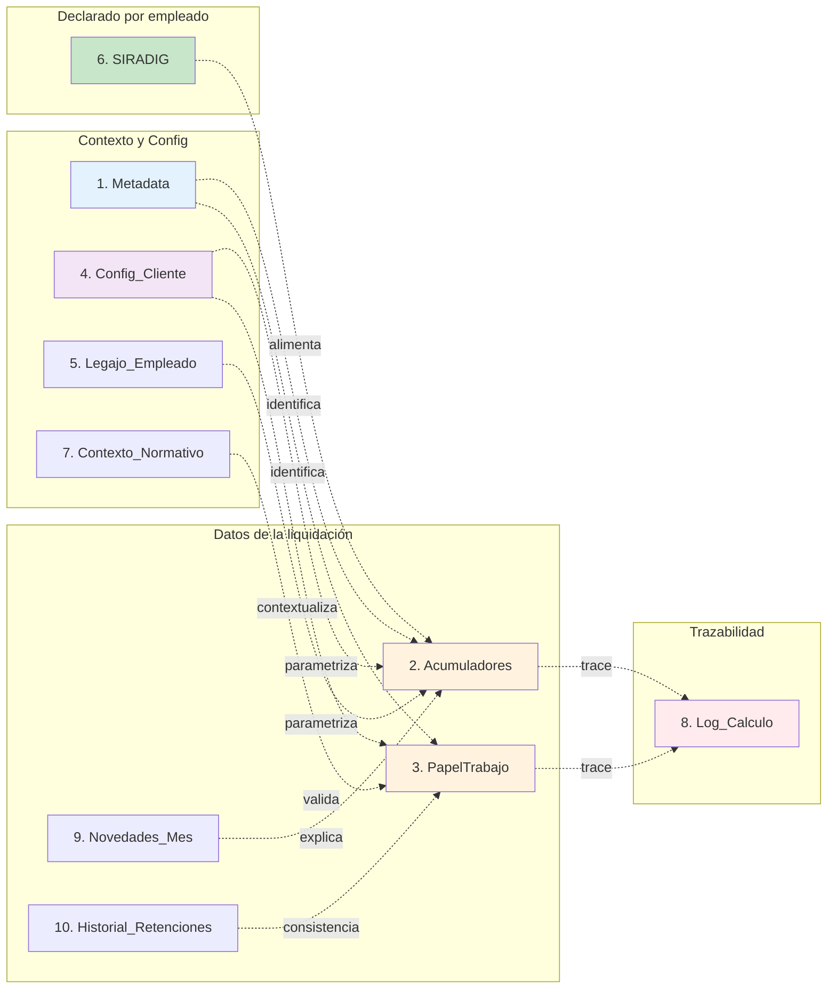
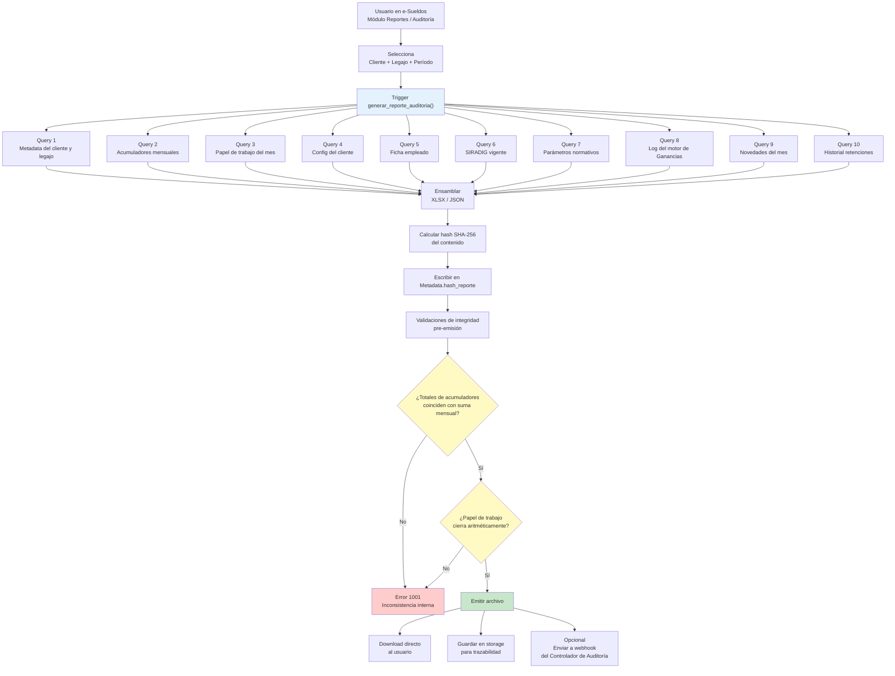

# Especificación Técnica — Reporte de Exportación para Auditoría de Ganancias 4ta

**Producto**: e-Sueldos
**Módulo destino**: Reportes / Auditoría
**Destinatario**: Equipo de Desarrollo Backend (Marcelo Palma + equipo)
**Consumidor del reporte**: Controlador de Auditoría de Ganancias 4ta (spec separado)
**Versión**: 1.0
**Autor**: Adrián Palma
**Fecha**: Julio 2026

---

## 1. Propósito

El reporte actual "Legajos Liquidados Detalle" que emite e-Sueldos alcanza para operación normal, pero **no contiene la información suficiente para auditar el cálculo del Impuesto a las Ganancias 4ta categoría**. La investigación forense sobre cuatro legajos reales (dos NETSER, uno La Palabra, uno Marinaro) demostró un bug estructural en el módulo de conciliación de SAC que solo se pudo diagnosticar por inspección manual asistida por LLM.

Este documento especifica un **reporte de exportación extendido** que permita al Controlador de Auditoría (spec separado) ejecutar las diez validaciones definidas (V1 a V10), con la información suficiente para producir dictamen automático por legajo. El reporte también debe ser útil para consultores humanos y para el usuario final del cliente cuando pida evidencia.

Este es un **producto interno** de e-Sueldos: no requiere cumplir con formato oficial de AFIP (F.649, SIRADIG), sí requiere ser auto-descriptivo y trazable.

## 2. Objetivos funcionales

1. Contener toda la información que el Controlador de Auditoría requiere para ejecutar V1 a V10 sin necesitar consultar el sistema en línea.
2. Ser humanamente legible (auditor manual puede leerlo sin herramientas).
3. Ser máquina-parseable (JSON canónico o XLSX con schema estable).
4. Ser reproducible: dos exportaciones consecutivas del mismo legajo/período dan el mismo archivo (excepto timestamp).
5. Ser versionado: cada archivo declara qué versión del motor de Ganancias lo produjo y con qué escala del Art. 94.
6. Soportar exportación por legajo individual y por lote (todos los legajos de un cliente para un período).

## 3. Alcance

**Incluido en v1.0**:
- Reporte de un legajo, un período, en formato XLSX.
- Metadata del cliente y del legajo.
- Acumuladores mensuales normalizados.
- Papel de trabajo lateral estructurado.
- Parametrización del cliente.
- Contexto normativo aplicado.
- Log de cálculo del motor.

**Fuera de alcance v1.0** (postergado a v2):
- Exportación por lote (todo el padrón de un cliente).
- Exportación en formato JSON API-first.
- Firma digital del reporte.
- Exportación PDF para envío al empleado (usar el F.649 existente).
- Reportes agregados por convenio, sucursal o centro de costo.

## 4. Arquitectura del reporte

### 4.1 Formato del archivo

**Formato principal**: `.xlsx` (Office Open XML) generado con `openpyxl` o equivalente.

**Nombre de archivo**: `Auditoria_{Cliente}_Legajo{ID}_{PeriodoMM-YYYY}_{Timestamp}.xlsx`

Ejemplo: `Auditoria_NETSER_Legajo67_062026_20260701T134500.xlsx`

**Formato alternativo**: `.json` con el mismo contenido estructural, para consumo programático. Se genera bajo el mismo trigger, con nombre equivalente y extensión `.json`.

### 4.2 Estructura de hojas

El XLSX contiene **once hojas** (la última condicional) con roles bien definidos:

| # | Nombre hoja           | Contenido                                                                            | Consumidor primario                   |
|---|-----------------------|--------------------------------------------------------------------------------------|---------------------------------------|
| 1 | `Metadata`            | Cliente, legajo, período, timestamp, versión del motor, firma del archivo            | Todo consumidor                       |
| 2 | `Acumuladores`        | Los 30+ conceptos mensuales (Ene-Dic + Total). Formato normalizado                   | V1, V2, V3, V5, V6, V8                |
| 3 | `PapelTrabajo`        | La cadena de cálculo del mes de liquidación, campo a campo                           | V1, V3, V4, V10                       |
| 4 | `Config_Cliente`      | Modalidad SAC, modo saldo, política de seguro, CCT, régimen HHEE                     | V8, V9, y todo el motor de referencia |
| 5 | `Legajo_Empleado`     | Fecha ingreso/egreso, cargas familiares, régimen previsional, zona, CCT del empleado | V4, V5 (topes), V7                    |
| 6 | `SIRADIG`             | Deducciones declaradas por el empleado con detalle                                   | V7 (topes)                            |
| 7 | `Contexto_Normativo`  | Escala Art. 94 aplicada, GNI/DE vigentes, RG de referencia                           | V4, V6                                |
| 8 | `Log_Calculo`         | Trazabilidad paso a paso del motor de Ganancias (los 12 pasos canónicos)             | **Controlador de Auditoría + Auditor** |
| 9 | `Novedades_Mes`       | Movimientos del mes de liquidación (aumentos, bonos, licencias, ajustes)             | Contextualización de saltos           |
| 10 | `Historial_Retenciones` | Detalle mensual de retenciones practicadas y saldos                                  | V10, análisis retroactivo             |
| 11 | `Ajuste_Final`        | Ajuste anual Diciembre o Liquidación Final por egreso — solo si aplica               | V19, V20                              |

**Diagrama de la arquitectura de hojas**:



## 5. Especificación detallada de cada hoja

### 5.1 Hoja 1 — `Metadata`

Layout: tabla vertical de dos columnas (`campo` | `valor`).

| Campo                       | Tipo         | Requerido | Descripción                                                                         |
|-----------------------------|--------------|-----------|-------------------------------------------------------------------------------------|
| `schema_version`            | string       | Sí        | Versión del schema del reporte. Comenzar en `1.0.0`. Semver.                        |
| `cliente_id`                | string       | Sí        | ID interno del cliente en e-Sueldos                                                 |
| `cliente_nombre`            | string       | Sí        | Razón social                                                                        |
| `cliente_cuit`              | string       | Sí        | CUIT del cliente (formato XX-XXXXXXXX-X)                                            |
| `legajo_id`                 | string       | Sí        | ID interno del legajo                                                               |
| `legajo_numero`             | string       | Sí        | Número de legajo del empleado en el cliente                                         |
| `empleado_cuil`             | string       | Sí        | CUIL del empleado                                                                   |
| `empleado_nombre`           | string       | No        | Nombre completo. Opcional por privacidad, presente por defecto                      |
| `periodo_fiscal`            | integer      | Sí        | Año del período fiscal (ej: 2026)                                                   |
| `mes_liquidacion`           | integer      | Sí        | Mes al que corresponde el cálculo (1-12)                                            |
| `tipo_liquidacion`          | enum         | Sí        | `mensual_normal`, `ajuste_anual_diciembre`, `liquidacion_final_egreso`, `complementaria`, `sac_junio`, `sac_diciembre` |
| `secuencia_en_mes`          | integer      | Sí        | 1 si es la única del mes, ≥2 si hay múltiples liquidaciones en el mismo mes         |
| `motivo_secuencia`          | string       | Cond.     | Si `secuencia_en_mes ≥ 2`: motivo (`retroactivo`, `correccion_error`, `pago_diferido`, otro) |
| `fecha_liquidacion`         | date         | Sí        | Fecha efectiva de la liquidación (ISO 8601)                                         |
| `timestamp_exportacion`     | datetime     | Sí        | Cuando se generó este archivo (ISO 8601 con TZ)                                     |
| `motor_ganancias_version`   | string       | Sí        | Versión del motor de Ganancias que produjo el cálculo (ej: `1.4.2`)                 |
| `usuario_exportacion`       | string       | Sí        | Usuario del sistema que solicitó el reporte                                         |
| `hash_reporte`              | string       | Sí        | SHA-256 del contenido de las hojas 2-11 (excluye la fila `hash_reporte` de sí misma) |

**Comportamiento esperado**:
- El `hash_reporte` permite detectar manipulaciones. El controlador puede verificar integridad.
- El `schema_version` permite evolución compatible: v1.1 puede agregar campos sin romper v1.0.

### 5.2 Hoja 2 — `Acumuladores`

Layout: **la misma estructura del reporte actual** ("Legajos Liquidados Detalle"), pero con nombres de campo normalizados en snake_case y sin las notas del margen derecho (esas van a hoja 8).

Filas: cada fila es un concepto. Columnas: `tipo`, `acumulador`, `enero`, `febrero`, …, `diciembre`, `total`.

**Conceptos requeridos** (mismo listado que el reporte actual, más algunos nuevos):

Existentes:
- `deducciones_art30_inciso_a__ganancia_no_imponible`
- `deducciones_art30_inciso_b__conyuge`
- `deducciones_art30_inciso_b__hijos`
- `deducciones_art30_inciso_b__otras_cargas`
- `deducciones_art30_inciso_c__deduccion_especial`
- `deducciones_art30_inciso_c__12va_parte`
- `descuentos_ley__sindicatos`
- `descuentos_ley__ley_19032_inssjp`
- `descuentos_ley__jubilacion_otras_empresas`
- `descuentos_ley__obra_social_otras_empresas`
- `descuentos_ley__jubilacion`
- `descuentos_ley__aportes_obra_social`
- `descuentos_ley__primas_seguro`
- `ingresos__rem_con_aporte`
- `ingresos__rem_sin_aporte`
- `ingresos__haberes_no_habituales`
- `ingresos__rem_otras_empresas`
- `ingresos__sac`
- `otras_deducciones__seguros_de_retiro`
- `otras_deducciones__cuotas_asistenciales_otras_empresas`
- `otras_deducciones__gastos_sepelio_dc`
- `otras_deducciones__otros_gastos_dc`
- `otras_deducciones__gastos_medicos_dc`
- `otras_deducciones__seguros_dc`
- `otras_deducciones__gastos_corredores_viajes_comercio`
- `otras_deducciones__intereses_hipotecarios`
- `otras_deducciones__servicios_domesticos`
- `otras_deducciones__horas_exentas`
- `otras_deducciones__horas_gravadas`
- `otras_deducciones__viaticos`
- `otras_deducciones__alquiler`
- `otras_deducciones__diferencia_art83_ley27743`
- `otras_deducciones__ganancia_neta` (la fila 35 del reporte actual)
- `otras_deducciones__educacion`
- `otras_deducciones__indumentaria`
- `otras_deducciones__alquileres_10_inquilino`
- `otras_deducciones__alquileres_10_propietario`
- `otras_deducciones__seguros_mixtos`
- `otras_deducciones__gastos_medicos`
- `otras_deducciones__gastos_sepelio`
- `otras_deducciones__otras_deducciones`
- `otras_deducciones__donaciones`
- `retencion__pago_a_cuenta`
- `retencion__retencion`
- `retencion__pagaran`
- `retencion__impuesto_calculado`
- `retencion__porcentaje`

**Nuevos requeridos para v1.0** (críticos para la auditoría del bug de SAC):

- `ingresos__sac_bruto_cobrado` — SAC bruto pagado en el mes (independiente de la provisión). Fila requerida aunque esté en 0 en meses no-pago.
- `ingresos__sac_anulacion_provisiones` — el monto negativo que anula las provisiones acumuladas al mes de pago. Solo tiene valor en Junio y Diciembre.
- `ingresos__sac_neto_a_base` — la suma efectiva del SAC que integra la base imponible del mes. En modalidad devengado esto coincide con la provisión mensual y con el neto de junio; en modalidad percibido coincide con el SAC bruto del mes de pago.
- `base_imponible__computable_mes` — Total Ingresos que el motor efectivamente usó para el mes. Debe coincidir con `papel_trabajo.total_ingresos`.

**Reglas de formato**:
- Valores en pesos argentinos, dos decimales, punto como separador decimal (no coma, para facilitar parseo).
- Meses no liquidados: `0.00`, no null ni vacío.
- Fila "Total" = suma de meses. Verificación aritmética requerida antes de emitir el archivo.

### 5.3 Hoja 3 — `PapelTrabajo`

Layout: tabla vertical (`campo` | `valor`) con la cadena de cálculo del mes.

| Campo                              | Tipo    | Requerido | Descripción                                                                              |
|------------------------------------|---------|-----------|------------------------------------------------------------------------------------------|
| `total_ingresos`                   | decimal | Sí        | Base imponible acumulada al mes                                                          |
| `total_ingresos_composicion`       | object  | Sí        | Desglose: `{rem_con_aporte, rem_sin_aporte, sac_computable, hnh, otras_empresas}`        |
| `deducciones_personales`           | decimal | Sí        | Total agregado                                                                           |
| `deducciones_personales_desglose`  | object  | Sí        | `{jubilacion, obra_social, inssjp, sindicatos, jub_otras, os_otras}`                     |
| `educativos_domesticos`            | decimal | Sí        | Total agregado                                                                           |
| `educativos_domesticos_desglose`   | object  | Sí        | `{educacion, servicios_domesticos, con_topes_aplicados: bool}`                           |
| `ganancia_neta_previa`             | decimal | Sí        |                                                                                          |
| `deducciones_generales_previa`     | decimal | Sí        |                                                                                          |
| `deducciones_generales_desglose`   | object  | Sí        | Todas las categorías con importe                                                         |
| `deducciones_art30`                | decimal | Sí        |                                                                                          |
| `deducciones_art30_desglose`       | object  | Sí        | `{gni, conyuge, hijos, otras_cargas, deduccion_especial, doceava_parte}`                 |
| `cm_asistencial`                   | decimal | Sí        | Cuota médico asistencial computada                                                       |
| `cm_asistencial_tope_aplicado`     | boolean | Sí        | Si se aplicó el tope del 5% de la GN                                                     |
| `ganancia_neta`                    | decimal | Sí        |                                                                                          |
| `escala_tramo_numero`              | integer | Sí        | Número de tramo del Art. 94 (1-9)                                                        |
| `escala_minimo_tramo`              | decimal | Sí        |                                                                                          |
| `escala_maximo_tramo`              | decimal | Sí        | Cero si es último tramo (sin techo)                                                      |
| `escala_importe_fijo`              | decimal | Sí        |                                                                                          |
| `escala_porcentaje`                | decimal | Sí        | En base 100 (ej: 27.00)                                                                  |
| `sobre_diferencia`                 | decimal | Sí        | `= ganancia_neta - escala_minimo_tramo`                                                  |
| `impuesto_determinado`             | decimal | Sí        | `= escala_importe_fijo + sobre_diferencia × escala_porcentaje / 100`                     |
| `pagos_anteriores`                 | decimal | Sí        | Retenciones acumuladas de meses anteriores                                               |
| `retencion_del_mes_calculada`      | decimal | Sí        | `= impuesto_determinado - pagos_anteriores`. Puede ser negativa                          |
| `retencion_del_mes_efectiva`       | decimal | Sí        | Retención realmente aplicada al recibo. Si `modo=compensar` y calc<0, es 0               |
| `saldo_a_favor_acumulado`          | decimal | Sí        | Solo si modo=compensar y calc<0. Se acumula para meses siguientes                        |

### 5.4 Hoja 4 — `Config_Cliente`

Parametrización del cliente que afecta el cálculo. Layout: `campo` | `valor` | `origen` (dónde en e-Sueldos vive esa config).

| Campo                              | Tipo    | Valores válidos                    | Descripción                                                     |
|------------------------------------|---------|------------------------------------|-----------------------------------------------------------------|
| `modalidad_sac`                    | enum    | `devengado`, `percibido`           | Método de imputación del SAC                                    |
| `modo_saldo_favor`                 | enum    | `compensar`, `devolver`            | Tratamiento de retención negativa                               |
| `poliza_seguro_cobra_sobre_sac`    | boolean | true, false                        | Si la póliza aplica alícuota sobre el SAC                       |
| `modalidad_hnh_default`            | enum    | `percibido`, `prorrateado`         | Tratamiento de HNH por defecto (puede sobreescribirse por evento) |
| `cct_aplicable_default`            | string  | Código CCT (ej: `108/75`)          | CCT del cliente por defecto (puede sobreescribirse por legajo)  |
| `regimen_horas_extras`             | enum    | `50_100`, `50_100_exentas_art82h`  | Régimen de HHEE                                                 |
| `saldo_a_favor_ganancias_previo`   | decimal | ≥ 0                                | Saldo acumulado de años anteriores, si existe                   |
| `agente_retencion_unico`           | boolean | true, false                        | Si el cliente actúa como agente único                           |
| `usa_siradig_import_automatico`    | boolean | true, false                        | Si importa SIRADIG desde AFIP directamente                      |
| `zona_geografica_default`          | enum    | `general`, `patagonica`, `tdf`     | Zona por defecto (puede sobreescribirse por legajo)             |
| `motor_calculo_version`            | string  | Semver                             | Versión del motor de Ganancias al momento del cálculo           |

**Nota sobre el tratamiento de HNH**: `modalidad_hnh_default` define el comportamiento por defecto, pero cada evento de HNH (bono, gratificación, retroactivo) puede optar por el otro criterio si el cliente lo declara al momento de cargar el evento. Esto se refleja en la Hoja 9 (Novedades_Mes), campo `modalidad_imputacion_ganancias` a nivel de novedad.

**Regla crítica de la fila HNH del reporte** (relevante para V11 del Controlador de Auditoría):

Cuando un HNH se pagó bajo modalidad `prorrateado`, la fila `haberes_no_habituales` de la Hoja 2 (Acumuladores) debe reflejar la distribución de cuotas mensuales **desde el mes de pago inclusive** hasta diciembre del año fiscal en curso, según RG 5417/2023 Anexo I punto B.5. Es decir, si un HNH de $1.500.000 se paga en Marzo con modalidad prorrateado a 10 cuotas:

- Columnas Ene, Feb: 0
- Columnas Mar, Abr, May, Jun, Jul, Ago, Sep, Oct, Nov, Dic: $150.000 cada una
- Columna Total: $150.000 al cierre de Marzo (una cuota), $300.000 al cierre de Abril (dos cuotas), y así hasta $1.500.000 al cierre de Diciembre.

**Comportamiento incorrecto conocido**: si el motor arranca la distribución en el mes siguiente al de pago (Abr en el ejemplo), pierde permanentemente la primera cuota, y el acumulador anual queda subvalorado. Este es el bug diagnosticado en el fixture 8.5 del spec del Controlador. La instrumentación de la Hoja 8 debe emitir en el Paso 1 el `Σ(HNH)` que efectivamente usa como parte del Total Ingresos — el Controlador comparará ese valor contra el DEBE-SER normativo.

### 5.5 Hoja 5 — `Legajo_Empleado`

Datos del empleado que impactan en el cálculo. Layout: `campo` | `valor` | `vigencia_desde` | `vigencia_hasta`.

| Campo                              | Tipo         | Requerido | Descripción                                                             |
|------------------------------------|--------------|-----------|-------------------------------------------------------------------------|
| `fecha_ingreso`                    | date         | Sí        | Alta del empleado                                                       |
| `fecha_egreso`                     | date         | No        | Baja (null si sigue activo)                                             |
| `motivo_egreso`                    | enum         | Cond.     | Si hay `fecha_egreso`: `renuncia`, `despido_sin_causa`, `despido_con_causa`, `mutuo_acuerdo`, `jubilacion`, `fallecimiento`, `fin_contrato_plazo_fijo` |
| `preaviso_pagado`                  | boolean      | Cond.     | Si hay egreso: si se pagó preaviso                                      |
| `dias_preaviso_pagado`             | integer      | Cond.     | Cantidad de días de preaviso pagados                                    |
| `regimen_previsional`              | enum         | Sí        | `sipa`, `docente`, `judicial`, `minero`, `insalubre`, `otro`            |
| `zona_geografica`                  | enum         | Sí        | `general`, `patagonica`, `tdf`. Override sobre config del cliente        |
| `cct_aplicable`                    | string       | Sí        | Override sobre CCT del cliente                                          |
| `categoria`                        | string       | Sí        | Categoría dentro del CCT                                                |
| `situacion_revista`                | enum         | Sí        | `activo`, `licencia_sgh`, `suspendido`, `reserva_puesto`, etc.          |
| `cargas_familia__conyuge`          | boolean      | Sí        | Cónyuge declarada como carga                                            |
| `cargas_familia__cant_hijos`       | integer      | Sí        | Cantidad de hijos declarados como carga                                 |
| `cargas_familia__otras`            | integer      | Sí        | Otras cargas familiares                                                 |
| `tiene_otros_empleadores`          | boolean      | Sí        | Según SIRADIG del período                                               |
| `otros_empleadores`                | array        | Cond.     | Si `tiene_otros_empleadores`: `[{cuit, razon_social, remuneracion_estimada}]` |
| `cuit_agente_retencion_designado`  | string       | Cond.     | Si tiene múltiples empleadores, cuál es el agente único                 |
| `discapacidad_declarada`           | boolean      | Sí        | Habilita deducciones adicionales                                        |
| `regimen_especial`                 | enum         | No        | `promocion_industrial`, `zona_franca`, etc.                             |

### 5.6 Hoja 6 — `SIRADIG`

Deducciones declaradas por el empleado en el F.572 web (SIRADIG) para el período.

Layout: una fila por cada rubro de deducción declarada, con columnas:

| Columna              | Tipo    | Descripción                                                              |
|----------------------|---------|--------------------------------------------------------------------------|
| `rubro`              | string  | Código de rubro (`cuota_medica`, `alquiler`, `donacion`, etc.)           |
| `subrubro`           | string  | Sub-categoría                                                            |
| `beneficiario_cuit`  | string  | CUIT del prestador/receptor                                              |
| `beneficiario_nombre`| string  | Razón social del prestador                                               |
| `monto_declarado`    | decimal | Lo que el empleado declaró en SIRADIG                                    |
| `monto_computado`    | decimal | Lo que el sistema efectivamente computó (aplicando tope)                 |
| `tope_aplicado`      | decimal | Si computado < declarado, cuál fue el tope                               |
| `regla_tope`         | string  | Regla del tope (`40_pct_gni`, `5_pct_gn`, `tope_absoluto_X`, `sin_tope`) |
| `comprobante_ref`    | string  | Referencia al comprobante o factura                                      |
| `periodo_desde`      | date    | Vigencia del comprobante                                                 |
| `periodo_hasta`      | date    |                                                                          |
| `estado_validacion`  | enum    | `validado`, `pendiente`, `rechazado`                                     |

**Rubros esperados** (no exhaustivo):
- `cuota_medica`, `gastos_medicos`, `servicios_domesticos`, `alquiler_vivienda`, `alquiler_locacion`, `intereses_hipotecarios`, `donaciones`, `primas_seguro_vida`, `primas_seguro_retiro`, `aportes_planes_retiro`, `gastos_educativos`, `cargas_familia_conyuge`, `cargas_familia_hijo`, `indumentaria_trabajo`, `viaticos`, `honorarios_medicos`

### 5.7 Hoja 7 — `Contexto_Normativo`

Los valores paramétricos vigentes para el mes de liquidación. Esta hoja convierte la normativa en dato estructurado y auditable, de modo que el Controlador pueda verificar contra cada regla específica.

#### 5.7.1 Parámetros generales

| Campo                            | Tipo    | Descripción                                                             |
|----------------------------------|---------|-------------------------------------------------------------------------|
| `rg_afip_vigente`                | string  | Última RG que actualizó la escala/valores (ej: `RG 5525/2026`)          |
| `escala_art94_fecha_vigencia`    | date    | Desde cuándo rige la escala aplicada                                    |
| `gni_anual_general`              | decimal | GNI anual para zona general                                             |
| `gni_anual_patagonica`           | decimal | GNI anual para zona patagónica (× 1.22 sobre general)                   |
| `deduccion_especial_anual`       | decimal | DE anual (× 3.8 vs GNI para empleados en RD)                            |
| `carga_conyuge_anual`            | decimal | Deducción anual por cónyuge                                             |
| `carga_hijo_anual`               | decimal | Deducción anual por hijo                                                |
| `indice_ripte_aplicado`          | decimal | Índice de actualización usado                                           |

#### 5.7.2 Tabla `escala_art94`

Los 9 tramos con sus valores actuales.

| tramo | minimo         | maximo         | importe_fijo   | porcentaje |
|-------|----------------|----------------|----------------|------------|
| 1     | 0              | 3.375.056,00   | 0              | 5          |
| ...   | ...            | ...            | ...            | ...        |
| 9     | 30.375.456,98  | ∞              | 7.336.360,37   | 35         |

#### 5.7.3 Tabla `topes_por_rubro` — la referencia auditable de cada deducción

Esta tabla es **el corazón de la validación de topes por parte del Controlador**. Cada entrada especifica un rubro de deducción con su regla exacta, base de cálculo, método de imputación y referencia normativa. Sin esta tabla parametrizada, el Controlador no puede saber cuál es el tope correcto que debía haberse aplicado.

**Estructura obligatoria** de cada entrada:

| Campo                       | Tipo    | Descripción                                                                                                            |
|-----------------------------|---------|------------------------------------------------------------------------------------------------------------------------|
| `rubro`                     | string  | Código canónico del rubro (`gastos_medicos`, `alquiler_vivienda`, `donaciones`, etc.)                                 |
| `descripcion`               | string  | Nombre legible                                                                                                          |
| `metodo_imputacion`         | enum    | `percibido` o `devengado` — cómo se computa temporalmente                                                              |
| `tiene_tope`                | boolean | Si el rubro tiene tope aplicable                                                                                        |
| `tipo_tope`                 | enum    | `absoluto`, `porcentaje_de_base`, `menor_entre_varios`, `sin_tope`                                                     |
| `bases_de_tope`             | array   | Lista de bases: cada una con `nombre_base`, `formula_base` y `porcentaje_aplicado`                                    |
| `regla_agregacion`          | enum    | Cuando hay múltiples bases: `menor`, `mayor`, `suma`                                                                    |
| `pre_calculo`               | string  | Fórmula que se aplica antes del tope (ej: alquileres → `10% × monto_pagado` antes de topear)                            |
| `condiciones_admisibilidad` | array   | Condiciones normativas para poder deducir (ej: donaciones → receptor en listado autorizado AFIP)                        |
| `referencia_normativa`      | string  | Ley/RG específica                                                                                                       |
| `vigencia_desde`            | date    | Cuándo entra en vigor esta regla                                                                                        |

**Ejemplo concreto — Gastos médicos**:

```json
{
  "rubro": "gastos_medicos",
  "descripcion": "Honorarios de profesionales médicos y odontológicos",
  "metodo_imputacion": "percibido",
  "tiene_tope": true,
  "tipo_tope": "menor_entre_varios",
  "bases_de_tope": [
    {
      "nombre_base": "porcentaje_gni_anual",
      "formula_base": "0.40 * contexto_normativo.gni_anual_general",
      "porcentaje_aplicado": 40
    },
    {
      "nombre_base": "porcentaje_ganancia_neta_cerrada",
      "formula_base": "0.05 * ganancia_neta_cerrada",
      "porcentaje_aplicado": 5,
      "nota": "La GN debe ser la CERRADA (post todas las deducciones), no la Previa"
    }
  ],
  "regla_agregacion": "menor",
  "pre_calculo": null,
  "condiciones_admisibilidad": [
    "comprobante_tipo_B_C_M",
    "prestador_matriculado"
  ],
  "referencia_normativa": "RG 5417 Anexo I punto D.2",
  "vigencia_desde": "2024-08-01"
}
```

**Ejemplo concreto — Alquileres del inquilino**:

```json
{
  "rubro": "alquiler_vivienda",
  "descripcion": "Alquiler de vivienda del contribuyente",
  "metodo_imputacion": "percibido",
  "tiene_tope": true,
  "tipo_tope": "porcentaje_de_base",
  "bases_de_tope": [
    {
      "nombre_base": "gni_anual",
      "formula_base": "contexto_normativo.gni_anual_general",
      "porcentaje_aplicado": 100
    }
  ],
  "regla_agregacion": "menor",
  "pre_calculo": "0.10 * monto_pagado_en_el_periodo",
  "condiciones_admisibilidad": [
    "contrato_registrado_en_AFIP",
    "unica_vivienda_del_inquilino",
    "no_titular_de_otro_inmueble"
  ],
  "referencia_normativa": "Art. 85 inc. h) LIG; RG 5417 Anexo I punto D.5",
  "vigencia_desde": "2024-08-01"
}
```

**Rubros mínimos que la tabla debe contener** (v1.0):

- `gastos_medicos` — honorarios profesionales
- `cuota_medica_asistencial` — prepaga u obra social voluntaria
- `gastos_educativos` — colegio, universidad, capacitación
- `servicios_domesticos` — personal doméstico registrado
- `alquiler_vivienda` — alquiler del inquilino
- `alquiler_locacion` — alquiler para uso comercial (deducción distinta)
- `intereses_hipotecarios` — préstamo hipotecario única vivienda
- `donaciones` — a entidades autorizadas AFIP
- `primas_seguro_vida` — seguro de vida
- `primas_seguro_retiro` — seguro de retiro privado
- `aportes_planes_retiro` — planes de retiro
- `indumentaria_trabajo` — indumentaria específicamente laboral
- `sepelio` — gastos de sepelio

Cada uno con su estructura completa. El Controlador consumirá esta tabla en V7.a-V7.h para validar cada rubro específicamente.

#### 5.7.4 Actualización de la tabla

La tabla `topes_por_rubro` se actualiza cuando:
- Cambia una RG que modifica algún tope (ej: RG semestral que ajusta valores).
- Sale una nueva norma que agrega o modifica un rubro.

Cada entrada tiene `vigencia_desde` para que el Controlador pueda auditar retroactivamente con las reglas que aplicaban en el mes bajo análisis, no las actuales.

### 5.8 Hoja 8 — `Log_Calculo` (registro forense de lo que hizo el sistema)

Trazabilidad paso a paso del motor de Ganancias para este legajo/mes. **Es la hoja más importante para auditoría forense y el corazón de la interoperabilidad con el Controlador de Auditoría**.

#### 5.8.0 Naturaleza de esta hoja: registro AS-IS, no deber ser

**Distinción conceptual crítica**: esta hoja registra **qué hizo el sistema realmente al calcular**, no qué debería haber hecho según la ley. Es un registro forense.

Si el sistema tomó un acumulador con un valor incorrecto, esta hoja lo muestra con el valor incorrecto que efectivamente usó. Si el sistema no aplicó un tope que la ley exige, esta hoja muestra la deducción computada sin tope. Si el sistema aplicó una fórmula distinta a la normativa, esta hoja muestra la fórmula tal como el motor la ejecutó, aunque sea la fórmula equivocada.

**Esta hoja NO es el "deber ser normativo"**. El deber ser vive en el papel de trabajo detallado del Controlador de Auditoría (§7bis del spec del Controlador). Ese sí aplica la Ley 27.743 y la RG 5417 estrictamente, calcula topes según la normativa vigente, y produce el número que la retención debería ser.

**La comparación entre ambos es lo que produce el diagnóstico**:

| Aspecto              | Hoja 8 (este spec)                             | Papel de trabajo del Controlador (§7bis)      |
|----------------------|------------------------------------------------|-----------------------------------------------|
| Naturaleza           | AS-IS forense                                  | DEBER-SER normativo                           |
| Fuente               | Motor de Ganancias de e-Sueldos                | Motor de referencia del Controlador           |
| Qué muestra          | Cómo calculó el sistema (con errores incluidos) | Cómo debería haberse calculado según la ley   |
| Contenido de bugs    | Los expone tal como el sistema los ejecutó     | Los ignora — calcula el ideal normativo       |
| Uso                  | Evidencia de qué hizo el sistema               | Referencia canónica contra la cual comparar   |

**Ejemplo del contraste**:

Supongamos que un legajo tiene provisiones de SAC devengadas por 4.599.585,70 Ene-May, y el motor del sistema tiene el bug de no incluirlas en la base imponible del semestre.

- El Paso 2 de **esta hoja** mostrará: `SAC_computable = -3.775.889,30` con la fórmula que efectivamente aplicó el motor (que resta las provisiones en lugar de sumarlas), las entradas concretas que tomó, y la operación errónea. El valor es incorrecto pero es lo que el sistema hizo.

- El Paso 2 del **papel de trabajo del Controlador** mostrará: `SAC_computable = 5.423.282,10` con la fórmula normativamente correcta (`Σ(fila_sac) + Σ(anulaciones)`), aplicada a los mismos acumuladores del legajo.

El Controlador detecta el bug precisamente porque tiene dos versiones del Paso 2 lado a lado.

#### 5.8.1 Estructura obligatoria: los 12 pasos canónicos

El motor debe emitir **exactamente 12 pasos numerados**, con la misma estructura y en el mismo orden que el papel de trabajo del Controlador de Auditoría (ver spec del Controlador §7bis). Esto permite comparación paso a paso lado a lado, sin necesidad de reinterpretación.

Los 12 pasos son:

| # | Nombre                                              | Referencia normativa                             |
|---|-----------------------------------------------------|--------------------------------------------------|
| 1 | Composición del Total de Ingresos                   | Art. 82 LIG; RG 5417/2023 Anexo I punto A        |
| 2 | Cálculo del SAC computable                          | Art. 24, 82 inc. f) LIG; RG 5417 punto B.4       |
| 3 | Deducciones personales del Art. 82                  | Art. 82 inc. c) y d) LIG                         |
| 4 | Deducciones generales (con topes)                   | Art. 85 LIG; RG 5417 Anexo I punto D             |
| 5 | Deducciones del Art. 30                             | Art. 30 LIG                                      |
| 6 | 12va parte del Art. 30                              | Art. 30 último párrafo LIG                       |
| 7 | Ganancia Neta Previa                                | RG 5417 Anexo I punto E                          |
| 8 | Ganancia Neta                                       | Art. 93 LIG                                      |
| 9 | Identificación del tramo de la escala Art. 94       | Art. 94 LIG                                      |
| 10 | Cálculo del impuesto determinado                    | Art. 94 LIG                                      |
| 11 | Pagos anteriores acumulados                         | RG 5417 Anexo I punto G                          |
| 12 | Retención del mes                                   | RG 5417 Anexo I punto H                          |

#### 5.8.2 Layout de cada paso

Layout tabular con las siguientes columnas obligatorias:

| Columna                | Tipo    | Descripción                                                                       |
|------------------------|---------|-----------------------------------------------------------------------------------|
| `paso_numero`          | integer | 1 a 12                                                                            |
| `paso_nombre`          | string  | Nombre estandarizado (ver tabla arriba)                                           |
| `referencia_normativa` | string  | Ley/RG/Artículo                                                                   |
| `formula`              | string  | Expresión matemática simbólica (ej: `TI = Σ(RemCA) + Σ(RemSA) + SAC_comp + …`)    |
| `explicacion`          | string  | Descripción legible en 2-3 líneas                                                 |
| `entradas`             | object  | Array de `{nombre, valor, origen}` para cada input                                |
| `operacion`            | string  | Aritmética explícita con los valores concretos (ej: `70375599.33 + 365210.78 + …`) |
| `salida`               | decimal | Resultado numérico del paso                                                       |
| `topes_aplicados`      | array   | Array de `{rubro, tope_regla, valor_declarado, valor_computado}`                  |
| `observaciones`        | string  | Alertas, condiciones especiales, notas                                            |

**Regla crítica**: el `paso_nombre` y la `referencia_normativa` deben coincidir **al carácter** con la especificación del Controlador (§7bis del spec del Controlador). No inventar nombres nuevos, no traducir. La comparación programática depende de esta coincidencia exacta.

#### 5.8.3 Estructura del campo `entradas`

Cada entrada tiene tres campos:

```json
{
  "nombre": "string",     // Símbolo usado en la fórmula (ej: "Σ(RemCA)")
  "valor": number,        // Valor numérico
  "origen": "string"      // De dónde salió el valor (ver enumeración abajo)
}
```

**Valores válidos de `origen`**:

- `acumulador:<nombre>` — apunta a una fila específica de la Hoja 2. Ejemplo: `acumulador:ingresos__rem_con_aporte.total`.
- `parametro:<nombre>` — apunta a un parámetro de la Hoja 7. Ejemplo: `parametro:gni_anual_general`.
- `config:<nombre>` — apunta a la Hoja 4. Ejemplo: `config:modalidad_sac`.
- `siradig:<rubro>.<campo>` — apunta a la Hoja 6. Ejemplo: `siradig:alquiler_vivienda.monto_declarado`.
- `paso:<n>` — resultado calculado en un paso anterior. Ejemplo: `paso:6` significa "salida del Paso 6".
- `constante:<valor>` — valor literal (típicamente cero).

Esta enumeración garantiza que **cada valor sea trazable** hasta su origen documental, y que el Controlador pueda verificar la consistencia cruzada (por ejemplo, que el `Σ(RemCA)` del Paso 1 coincida con el `total` de la fila `ingresos__rem_con_aporte` de la Hoja 2).

#### 5.8.4 Estructura del campo `topes_aplicados`

Solo aplica en Paso 4 (Deducciones Generales) y ocasionalmente Paso 8 (si se aplicó tope en CM Asistencial). Formato:

```json
[
  {
    "rubro": "gastos_medicos",
    "tope_regla": "min(40% GNI anual, 5% GN)",
    "valor_declarado": 850000.00,
    "tope_valor": 515180.26,
    "valor_computado": 515180.26,
    "tope_efectivo": "40% GNI"
  }
]
```

Cuando el sistema no aplicó ningún tope, el array queda vacío `[]`, no null.

#### 5.8.5 Formato dual: XLSX + JSON

El log se emite en dos formatos simultáneos:

**En el XLSX (Hoja 8)**: layout tabular con las 10 columnas del §5.8.2. Los campos `entradas` y `topes_aplicados` se serializan como JSON en su celda (una sola línea, sin salto). Esto permite lectura humana con Excel/LibreOffice sin perder estructura.

**En el JSON adjunto**: mismo contenido, pero con los objetos anidados en su estructura nativa (ver §5.8.7).

#### 5.8.6 Ejemplo de fila (Paso 2 — SAC computable, con bug del sistema visible)

Para el legajo La Palabra Legajo 1 en Julio 2026, con el bug conocido del motor de Ganancias del sistema:

| paso_numero | paso_nombre                | referencia_normativa           | formula                                     | explicacion                                                       | entradas                                                                                                                    | operacion                | salida       | topes_aplicados | observaciones                                                                                          |
|-------------|----------------------------|--------------------------------|---------------------------------------------|-------------------------------------------------------------------|-----------------------------------------------------------------------------------------------------------------------------|--------------------------|--------------|-----------------|--------------------------------------------------------------------------------------------------------|
| 2           | Cálculo del SAC computable | Art. 24, 82 inc. f) LIG        | `SAC_comp = Σ(fila_sac_meses)`              | El motor toma la suma directa de la fila SAC del período.         | `[{"nombre":"Σ(fila_sac_meses)","valor":-3775889.30,"origen":"acumulador:ingresos__sac.total"}]`                             | `-3775889.30`            | -3775889.30  | `[]`            | AS-IS: valor tal como el sistema lo calculó. La fórmula aplicada no recupera las anulaciones de junio. |

**Lo que este renglón muestra**: el sistema aplicó una fórmula que suma directamente la fila SAC sin recuperar las anulaciones. La operación es matemáticamente consistente con la fórmula que el motor ejecutó, pero la fórmula misma no cumple la normativa del devengado (que requiere sumar las provisiones más los cobros efectivos). El log no juzga: registra.

**Lo que el Controlador va a ver** al leer esta fila: la fórmula `SAC_comp = Σ(fila_sac_meses)` difiere de la fórmula canónica del Paso 2 (`SAC_comp = Σ(fila_sac_meses) + Σ(anulaciones_meses_pago)`). Con esa sola diferencia detectada, el Controlador emite el hallazgo V2 con recomendación normativa.

**Contraste con el mismo Paso 2 sin bug** (motor bien implementado, sistema Marinaro con SAC percibido):

| 2 | Cálculo del SAC computable | Art. 24, 82 inc. f) LIG | `SAC_comp = Σ(fila_sac_meses)` | En modalidad percibido, el SAC está integrado en Rem con Aporte del mes de pago. | `[{"nombre":"Σ(fila_sac_meses)","valor":0.02,"origen":"acumulador:ingresos__sac.total"}]` | `0.02` | 0.02 | `[]` | AS-IS: el neto anual es cero por redondeo, coherente con modalidad percibida. |

Aquí la misma fórmula `Σ(fila_sac_meses)` es **correcta** porque la modalidad declarada es `percibido`. El Controlador va a considerar este Paso 2 consistente con la modalidad del cliente y no emite hallazgo.

**Regla operativa**: el motor emite la fórmula que efectivamente aplicó. El Controlador compara esa fórmula contra la que la ley exige para la modalidad del cliente. Un mismo output puede ser correcto o incorrecto según el contexto.

#### 5.8.7 Estructura JSON equivalente de la Hoja 8

```json
{
  "log_calculo": {
    "motor_version": "1.4.2",
    "timestamp_calculo": "2026-07-15T10:23:45-03:00",
    "modalidad_sac_aplicada": "devengado",
    "modo_saldo_favor": "compensar",
    "pasos": [
      {
        "paso_numero": 1,
        "paso_nombre": "Composición del Total de Ingresos",
        "referencia_normativa": "Art. 82 LIG; RG 5417/2023 Anexo I punto A",
        "formula": "TI = Σ(RemCA) + Σ(RemSA) + SAC_comp + Σ(HNH) + Σ(RemOE)",
        "explicacion": "Suma de los componentes brutos de remuneración del período fiscal.",
        "entradas": [
          {"nombre": "Σ(RemCA)", "valor": 70375599.33, "origen": "acumulador:ingresos__rem_con_aporte.total"},
          {"nombre": "Σ(RemSA)", "valor": 365210.78, "origen": "acumulador:ingresos__rem_sin_aporte.total"},
          {"nombre": "SAC_comp", "valor": 5423282.10, "origen": "paso:2"},
          {"nombre": "Σ(HNH)", "valor": 0, "origen": "acumulador:ingresos__haberes_no_habituales.total"},
          {"nombre": "Σ(RemOE)", "valor": 0, "origen": "acumulador:ingresos__rem_otras_empresas.total"}
        ],
        "operacion": "70375599.33 + 365210.78 + 5423282.10 + 0 + 0",
        "salida": 76164092.21,
        "topes_aplicados": [],
        "observaciones": null
      },
      {
        "paso_numero": 2,
        "paso_nombre": "Cálculo del SAC computable",
        "...": "..."
      },
      "// … pasos 3 al 12 …"
    ]
  }
}
```

#### 5.8.8 Correspondencia estructural (no de contenido) con el papel de trabajo del Controlador

**Regla de interoperabilidad**: los objetos son estructuralmente idénticos pero conceptualmente opuestos.

**Estructura idéntica**: los campos, los nombres de pasos, las referencias normativas, los orígenes trazables (`acumulador:`, `parametro:`, `paso:`, etc.) son los mismos en ambos documentos. Esto permite comparación programática 1:1.

**Contenido opuesto**:
- **Este log (Hoja 8)**: registra qué fórmula aplicó el motor, qué entradas tomó, qué operación ejecutó, qué salida produjo. Es AS-IS.
- **Papel de trabajo del Controlador (§7bis)**: computa qué fórmula debería aplicarse según la ley, qué entradas serían las correctas, qué operación es la normativa, qué salida se espera. Es DEBE-SER.

Con este contrato, el Controlador ejecuta una comparación paso a paso con la lógica:

```python
for i in range(12):
    as_is    = log_calculo_del_sistema.pasos[i]        # de esta Hoja 8
    debe_ser = motor_referencia_normativo.pasos[i]     # del Controlador §7bis

    # Comparación estructural (los nombres deben coincidir)
    assert as_is.paso_nombre == debe_ser.paso_nombre
    assert as_is.referencia_normativa == debe_ser.referencia_normativa

    # Comparación de fórmulas (si difieren, es señal de aplicación incorrecta)
    if as_is.formula != debe_ser.formula:
        reportar_divergencia_de_formula(
            paso=i+1,
            formula_sistema=as_is.formula,
            formula_normativa=debe_ser.formula,
            severidad="ALTA"
        )

    # Comparación de salidas (delta cuantifica el impacto)
    delta = as_is.salida - debe_ser.salida
    if abs(delta) > TOLERANCIA:
        reportar_divergencia_de_valor(
            paso=i+1,
            valor_sistema=as_is.salida,
            valor_normativo=debe_ser.salida,
            delta=delta,
            entradas_sistema=as_is.entradas,
            entradas_normativas=debe_ser.entradas
        )
```

Con este flujo, el Controlador no solo detecta **que** hay error, sino **exactamente qué difiere**: si es la fórmula (el motor aplica una lógica distinta a la ley), si son las entradas (el motor toma acumuladores incorrectos o parámetros desactualizados), o si es la operación aritmética (el motor tiene un bug de cálculo).

La sección 7bis.4 del spec del Controlador (comparación lado a lado) depende directamente de este contrato: para cada paso muestra la fórmula AS-IS, la fórmula DEBE-SER, los valores, y la interpretación del delta.

#### 5.8.9 Consideraciones para la implementación en e-Sueldos

**Nota crítica para el equipo dev**: el motor actual probablemente no tiene este log estructurado. Implementarlo requiere agregar instrumentación a las funciones de cálculo. Vale la pena porque:

1. Permite auditoría automatizada por el Controlador de Auditoría.
2. Permite debugging en producción sin reproducir el caso — el log ES la reproducción.
3. Sirve como evidencia ante consultas del cliente, del empleado o de AFIP.
4. Cierra el círculo de trazabilidad: cualquier retención del sistema es auditable hasta su origen documental.

**Estrategia sugerida de implementación**:

Fase 1a (mínimo viable para auditoría): instrumentar los pasos 1, 2, 8 y 12. Con estos cuatro pasos, el Controlador ya detecta el bug de SAC y cuantifica el impacto en la retención. Es el 80% del valor con el 30% del esfuerzo.

Fase 1b: instrumentar pasos 3, 5, 6, 9, 10, 11 (los que son sumas o cálculos directos sin lógica compleja).

Fase 2: instrumentar pasos 4 y 7 (los que involucran topes y cálculos condicionales).

**Testing**: cada paso debe tener un test unitario que valide que, dado el input, la operación emitida y la salida coinciden. Esto garantiza que el log no "miente" respecto al cálculo real.

**Rendimiento**: la emisión del log agrega overhead de ~5-10% al cálculo de la retención. En volumen (padrón de 500+ legajos), considerar emisión asíncrona post-cálculo si la latencia es crítica.

#### 5.8.10 Matriz cruzada — instrumentación adicional por paso según validación

Esta subsección es la clave para escalar la instrumentación sin tener que modificar el spec cada vez que se agrega una nueva validación al Controlador de Auditoría. Define, para cada uno de los 12 pasos canónicos, qué campos adicionales debe exponer el motor en `entradas` u `observaciones` según el tipo de validación que consumirá esa información.

La regla de oro: **el motor de e-Sueldos instrumenta una vez todos los campos de esta matriz. El Controlador consume los que necesita en cada V**. Ninguna V nueva del Controlador debería requerir cambios al motor si esta matriz se implementa completa.

**Paso 1 — Composición del Total de Ingresos**

| Campo adicional en `entradas`               | Consumidor (V) | Cuándo aplica                             |
|---------------------------------------------|----------------|-------------------------------------------|
| `sac_computable.desglose.provisiones_devengadas` | V8, DEBE-SER  | Siempre en modalidad devengado            |
| `sac_computable.desglose.anulaciones_en_meses_pago` | V8, DEBE-SER | Siempre en modalidad devengado           |
| `sac_computable.desglose.cobros_efectivos`  | V8, DEBE-SER   | Siempre en modalidad devengado            |
| `sac_computable.formula_aplicada`           | V8             | Siempre — string con la fórmula literal   |
| `hnh_computable.distribucion_por_mes`       | V11            | Cuando hay HNH prorrateado                |
| `hnh_computable.mes_arranque_efectivo`      | V11            | Cuando hay HNH prorrateado                |
| `hnh_computable.divisor_prorrateo`          | V11            | Cuando hay HNH prorrateado                |
| `remuneraciones_otras_empresas.desglose`    | V14            | Cuando `tiene_otros_empleadores == true` |

**Paso 2 — SAC computable**

| Campo adicional                             | Consumidor      | Cuándo aplica                     |
|---------------------------------------------|-----------------|-----------------------------------|
| `provisiones_mensuales_devengadas`          | V8, DEBE-SER    | Modalidad devengado               |
| `anulacion_junio` con detalle bruto vs neto | V8              | Modalidad devengado, mes ≥ 6      |
| `anulacion_diciembre` con detalle           | V8              | Modalidad devengado, mes = 12     |
| `modalidad_aplicada`                        | V8              | Siempre                           |

**Paso 3 — Deducciones personales**

| Campo adicional                        | Consumidor       | Cuándo aplica                       |
|----------------------------------------|------------------|-------------------------------------|
| `alicuota_jubilacion_aplicada`         | V16              | Siempre — puede diferir del 11% SIPA |
| `alicuota_obra_social_aplicada`        | V16              | Siempre                             |
| `alicuota_inssjp_aplicada`             | V16              | Siempre                             |
| `regimen_previsional_declarado`        | V16              | Siempre — origen: legajo            |
| `topes_maximos_aportes_aplicados`      | V5, V16          | Cuando algún aporte llegó al tope   |

**Paso 4 — Deducciones generales (con topes)**

| Campo adicional                    | Consumidor     | Cuándo aplica                                   |
|------------------------------------|----------------|-------------------------------------------------|
| `orden_aplicacion_topes`           | V18            | Cuando hay ≥ 2 rubros con tope                  |
| `base_para_tope_pct_gn`            | V18            | Cuando algún tope depende de GN (donaciones, CMA) |
| `interaccion_entre_topes`          | V18            | Cuando un tope depende de otro rubro deducido   |
| `desglose_por_rubro`               | V7.a-V7.h      | Siempre — obligatorio para cada rubro presente  |

**Estructura obligatoria de `desglose_por_rubro`** (array, uno por rubro deducido):

```json
{
  "rubro": "string",                          // debe coincidir con Contexto_Normativo.topes_por_rubro[].rubro
  "metodo_imputacion_aplicado": "percibido" | "devengado",
  "monto_declarado_siradig": number,          // origen: siradig[rubro].monto_declarado
  "monto_pagado_efectivo": number,            // origen: siradig[rubro] comprobantes agregados
  "pre_calculo_aplicado": {
     "formula": "string",                     // ej: "0.10 * monto_pagado" para alquileres
     "resultado": number                      // valor antes de aplicar tope
  },
  "topes_evaluados": [                        // uno por cada base del rubro
     {
        "nombre_base": "string",
        "formula_base": "string",
        "valor_base_calculado": number,       // valor efectivo de la base
        "valor_tope_calculado": number        // porcentaje × valor_base
     }
  ],
  "regla_agregacion_aplicada": "menor" | "mayor" | "suma",
  "tope_efectivo_aplicado": number,           // resultado de la regla de agregación
  "valor_computado_final": number,            // min(pre_calculo, tope_efectivo)
  "condiciones_admisibilidad_verificadas": [ // array de {condicion, cumplida}
     {"condicion": "contrato_registrado_en_AFIP", "cumplida": true | false | "no_verificado"}
  ]
}
```

Esta estructura es lo que permite al Controlador ejecutar V7.a-V7.h con precisión de rubro. Sin este desglose, el Controlador solo puede validar que el total agregado no exceda algún tope genérico, pero no puede detectar:

- Si el método de imputación es el correcto (percibido para todos los rubros salvo los del Art. 30).
- Si la base para el tope % GN es la GN cerrada o la Previa (error común).
- Si el `pre_calculo` se aplicó correctamente antes del tope (ej: alquileres primero 10%, después tope).
- Si el motor consideró todas las bases del tope o solo una (ej: gastos médicos con dos bases).
- Si las condiciones de admisibilidad se verificaron (ej: donaciones a receptor autorizado).

**Paso 5 — Deducciones del Art. 30**

| Campo adicional                             | Consumidor     | Cuándo aplica                             |
|---------------------------------------------|----------------|-------------------------------------------|
| `factor_proporcionalidad`                   | V13            | Ingreso o egreso mid-year                 |
| `meses_efectivamente_trabajados`            | V13            | Ingreso o egreso mid-year                 |
| `origen_tabla_gni_de` (`general`/`patagonica`/`tdf`) | V15  | Siempre                                   |
| `zona_geografica_aplicada`                  | V15            | Siempre — origen: legajo o config cliente |
| `gni_anual_efectivamente_usado`             | V15, V17       | Siempre                                   |
| `de_anual_efectivamente_usado`              | V15, V17       | Siempre                                   |

**Paso 6 — 12va parte del Art. 30**

| Campo adicional                       | Consumidor | Cuándo aplica                          |
|---------------------------------------|------------|----------------------------------------|
| `componentes_del_numerador`           | V6         | Siempre — GNI, DE, cargas familia      |
| `formula_aplicada`                    | V6         | Siempre                                |

**Paso 7 — Ganancia Neta Previa**

Sin campos adicionales requeridos. La transparencia del paso 4 y 5 alcanza.

**Paso 8 — Ganancia Neta**

Sin campos adicionales requeridos.

**Paso 9 — Identificación del tramo de la escala Art. 94**

| Campo adicional                       | Consumidor    | Cuándo aplica                                 |
|---------------------------------------|---------------|-----------------------------------------------|
| `numero_tramo` (1-9)                  | V4, V12       | Siempre — no solo el porcentaje               |
| `escala_fecha_vigencia_aplicada`      | V17           | Siempre — permite validar contra Contexto_Normativo |
| `tramo_diferente_al_mes_anterior`     | V12           | Cuando hay cambio de tramo intra-año         |
| `alicuota_marginal_efectiva`          | V4, V12       | Siempre — para cálculo de impactos           |

**Paso 10 — Impuesto determinado**

| Campo adicional                    | Consumidor | Cuándo aplica                     |
|------------------------------------|------------|-----------------------------------|
| `formula_aplicada_verbatim`        | V10        | Siempre                           |

**Paso 11 — Pagos anteriores**

| Campo adicional                              | Consumidor | Cuándo aplica                         |
|----------------------------------------------|------------|---------------------------------------|
| `retenciones_otras_empresas_computadas`      | V14        | Cuando hay multiempleo con agente único |
| `saldo_a_favor_previo_aplicado`              | V10        | Cuando existe saldo del ejercicio anterior |
| `desglose_mensual_retenciones_practicadas`   | V10        | Siempre                               |

**Paso 12 — Retención del mes**

| Campo adicional                       | Consumidor | Cuándo aplica                             |
|---------------------------------------|------------|-------------------------------------------|
| `modo_saldo_favor_aplicado`           | V10        | Siempre — `compensar` o `devolver`        |
| `retencion_teorica_calculada`         | V10        | Siempre — antes de aplicar `modo`         |
| `saldo_a_favor_generado_en_el_mes`    | V10        | Cuando `retencion_teorica < 0`            |

**Convención de nombres para campos condicionales**

Cuando un campo es "condicional" (solo aplica en ciertos escenarios), el motor debe emitir el campo con valor `null` explícito cuando no aplica, no omitirlo. Esto permite al Controlador distinguir "no aplica" de "el motor olvidó exponerlo".

**Prioridad de implementación de la matriz**

Fase 1a (junto con MVP): implementar los campos que consumen V1-V11 (los que ya están definidos en el spec del Controlador).

Fase 1b (para preparar V12-V18): implementar el resto de los campos aunque las validaciones no estén aún desarrolladas en el Controlador. Esto evita tener que volver al motor cada vez que se agrega una V nueva.

Este enfoque de "instrumentar de más" tiene costo mínimo (unos KB adicionales por reporte, imperceptibles) y habilita todo el roadmap de validaciones futuras sin bloqueos entre equipos.

#### 5.8.11 Agrupación de pasos por fase del cálculo y campos requeridos por propiedad de cobertura

El motor de Ganancias ejecuta el cálculo en **seis fases conceptuales** definidas por su propósito normativo. Los 12 pasos canónicos del Log_Calculo se agrupan en estas seis fases, y cada fase requiere que el motor exponga campos adicionales para permitir al Controlador verificar las propiedades de cobertura definidas en §6.0 del spec del Controlador.

**Correspondencia entre pasos y fases**:

| Paso | Nombre                                              | Fase | Sub-fase                                    |
|------|-----------------------------------------------------|------|---------------------------------------------|
| 1    | Composición del Total de Ingresos                   | 1    | Renta Bruta consolidada                     |
| 2    | Cálculo del SAC computable                          | 1    | Consolidación temporal SAC                  |
| 3    | Deducciones personales del Art. 82                  | 2    | 2.a Aportes obligatorios                    |
| 4    | Deducciones generales (con topes)                   | 2    | 2.b Deducciones Art. 85                     |
| 5    | Deducciones del Art. 30                             | 2    | 2.c Deducciones personales                  |
| 6    | 12va parte del Art. 30                              | 2    | 2.c Neutralización SAC                      |
| 7    | Ganancia Neta Previa                                | 3    | 3.a GN Previa                               |
| 8    | Ganancia Neta                                       | 3    | 3.e GN cerrada                              |
| 9    | Identificación del tramo Art. 94                    | 4    | 4.a Ubicación en escala                     |
| 10   | Cálculo del impuesto determinado                    | 4    | 4.b Aplicación de escala                    |
| 11   | Pagos anteriores acumulados                         | 5    | 5.a Retenciones previas                     |
| 12   | Retención del mes                                   | 5    | 5.d Retención efectiva                      |

**Fase 6 (cierre de ejercicio)** no está mapeada a un paso específico del Log_Calculo porque solo aplica en Diciembre o en liquidación final por egreso. Cuando corresponda, el motor debe emitir la Hoja 11 (`Ajuste_Final`) con toda la información específica de la fase.

**Campos adicionales requeridos por fase para cubrir las propiedades**:

**Fase 1 — Renta Bruta**. En Paso 1 y Paso 2, además de los campos ya especificados en §5.8.10, el motor debe emitir:

| Campo adicional                              | Propiedad cubierta | Descripción                                                          |
|----------------------------------------------|-------------------|----------------------------------------------------------------------|
| `clasificacion_fiscal_por_concepto`          | P.1.1             | Array con cada concepto del período y su clasificación completa      |
| `fundamento_normativo_por_concepto`          | P.1.1             | Referencia legal para cada clasificación                             |
| `metodo_imputacion_por_concepto`             | P.1.2             | Percibido/devengado aplicado por concepto                            |
| `desglose_bruto_gravado_exento`              | P.1.6             | Para conceptos con exención parcial                                  |
| `flags_coherencia_ganancias_aportes`         | P.1.5             | Para cada concepto, si `aplica_ganancias`/`aplica_aportes` son coherentes con su clasificación |

**Fase 2 — Deducciones Admisibles**. En Pasos 3, 4, 5 y 6, además de los campos ya especificados:

| Campo adicional                              | Propiedad cubierta | Descripción                                                          |
|----------------------------------------------|-------------------|----------------------------------------------------------------------|
| `condiciones_admisibilidad_verificadas`      | P.2.1             | Por cada rubro deducible, checklist explícita de condiciones         |
| `base_calculo_normativa_por_tope`            | P.2.3             | La base que corresponde según normativa para cada tope               |
| `base_calculo_efectivamente_usada`           | P.2.3             | La base que el motor efectivamente aplicó                            |
| `orden_aplicacion_completo`                  | P.2.5             | Secuencia declarada de aplicación de deducciones                     |
| `rg_fuente_de_cada_parametro`                | P.2.7             | Para cada valor normativo usado, la RG y fecha de vigencia            |
| `factor_proporcionalidad_declarado`          | P.2.6             | Para deducciones Art. 30 en legajos mid-year                         |
| `formula_pre_calculo_aplicada`               | P.2.4             | Cuando hay pre-cálculo, la fórmula literal                           |

**Fase 3 — Ganancia Neta**. En Pasos 7 y 8:

| Campo adicional                              | Propiedad cubierta | Descripción                                                          |
|----------------------------------------------|-------------------|----------------------------------------------------------------------|
| `regla_piso_cero_disparada`                  | P.3.2             | Boolean: si el motor activó la regla del piso cero                   |
| `gn_pre_regla_piso`                          | P.3.2             | Valor previo a aplicar el piso (puede ser negativo)                  |
| `gn_mensual_del_periodo`                     | P.3.5             | Array de 12: GN acumulada al cierre de cada mes                      |
| `fila_35_al_mes_de_liquidacion`              | P.3.3             | Valor específico de la fila 35 en el mes de liquidación               |

**Fase 4 — Impuesto sobre Ganancia Neta**. En Pasos 9 y 10:

| Campo adicional                              | Propiedad cubierta | Descripción                                                          |
|----------------------------------------------|-------------------|----------------------------------------------------------------------|
| `escala_fecha_vigencia_por_mes`              | P.4.3             | Array: qué escala aplicó a cada mes del período                      |
| `tramo_aplicado_por_mes`                     | P.4.4             | Array: número de tramo aplicado a cada mes                           |
| `formula_impuesto_verbatim`                  | P.4.2             | String literal de la fórmula ejecutada                                |

**Fase 5 — Retención del Mes**. En Pasos 11 y 12:

| Campo adicional                              | Propiedad cubierta | Descripción                                                          |
|----------------------------------------------|-------------------|----------------------------------------------------------------------|
| `desglose_pagos_anteriores`                  | P.5.1             | `{retenciones_mes_a_mes, saldo_previo_aplicado, otras_empresas}`     |
| `saldo_a_favor_previo_al_mes`                | P.5.4             | Saldo acumulado al cierre del mes anterior                            |
| `saldo_a_favor_generado_en_el_mes`           | P.5.3             | Cuando aplica modo compensar y retención calculada < 0                |
| `saldo_a_favor_aplicado_este_mes`            | P.5.4             | Cuando hay retención positiva y saldo previo                          |
| `modo_saldo_favor_activo`                    | P.5.3             | Modo declarado y aplicado                                             |

**Fase 6 — Cierre de Ejercicio**. Se emite en la Hoja 11 `Ajuste_Final`. Los campos ya están detallados en §5.11.1 y §5.11.2. La cobertura de las propiedades P.6.1 a P.6.9 se resuelve con esos campos.

**Estructura JSON extendida del log_calculo con agrupación por fase**:

```json
{
  "log_calculo": {
    "motor_version": "1.4.2",
    "modalidad_sac_aplicada": "devengado",
    "modo_saldo_favor": "compensar",
    "fases": {
      "fase_1_renta_bruta": {
        "pasos": [
          {"numero": 1, "...": "..."},
          {"numero": 2, "...": "..."}
        ],
        "campos_fase": {
          "clasificacion_fiscal_por_concepto": [...],
          "flags_coherencia_ganancias_aportes": [...]
        }
      },
      "fase_2_deducciones": {
        "pasos": [
          {"numero": 3, "...": "..."},
          {"numero": 4, "...": "..."},
          {"numero": 5, "...": "..."},
          {"numero": 6, "...": "..."}
        ],
        "campos_fase": {
          "condiciones_admisibilidad_verificadas": [...],
          "orden_aplicacion_completo": [...]
        }
      },
      "fase_3_ganancia_neta": {
        "pasos": [
          {"numero": 7, "...": "..."},
          {"numero": 8, "...": "..."}
        ],
        "campos_fase": {
          "gn_mensual_del_periodo": [...],
          "regla_piso_cero_disparada": false
        }
      },
      "fase_4_impuesto": {
        "pasos": [
          {"numero": 9, "...": "..."},
          {"numero": 10, "...": "..."}
        ],
        "campos_fase": {
          "escala_fecha_vigencia_por_mes": [...],
          "tramo_aplicado_por_mes": [...]
        }
      },
      "fase_5_retencion": {
        "pasos": [
          {"numero": 11, "...": "..."},
          {"numero": 12, "...": "..."}
        ],
        "campos_fase": {
          "desglose_pagos_anteriores": {...},
          "saldo_a_favor_generado_en_el_mes": 0
        }
      },
      "fase_6_cierre_ejercicio": {
        "aplica": false,
        "razon_no_aplica": "mes_liquidacion no es Diciembre y no hay egreso"
      }
    }
  }
}
```

Cuando la fase 6 aplica, `aplica: true` y sus datos vienen consolidados desde la Hoja 11.

**Regla de completitud de la instrumentación**: para que el Controlador pueda cubrir cualquier escenario, cada fase debe emitir la totalidad de los campos listados aquí, con valor `null` explícito cuando no aplica. Un campo omitido no equivale a "no aplica" — indica que el motor no lo instrumentó y por lo tanto la propiedad correspondiente no puede validarse.


### 5.9 Hoja 9 — `Novedades_Mes`

Detalle de movimientos del mes que impactan en la liquidación (más allá de los importes agregados).

| Columna                              | Tipo         | Descripción                                                                           |
|--------------------------------------|--------------|---------------------------------------------------------------------------------------|
| `concepto`                           | string       | Código del concepto (ej: `sueldo_basico`, `hora_extra_50`, `bono_extraordinario`)      |
| `descripcion`                        | string       | Descripción legible                                                                   |
| `cantidad`                           | decimal      | Cantidad (horas, días)                                                                |
| `unidad`                             | enum         | `horas`, `dias`, `meses`, `unidades`                                                  |
| `importe_unitario`                   | decimal      | Valor por unidad                                                                      |
| `importe_total`                      | decimal      | Importe total del concepto en el mes                                                  |
| `categoria`                          | enum         | `remunerativo`, `no_remunerativo`, `descuento`, `deduccion`, `hnh`, `indemnizatorio`, `exento_art26` |
| `aplica_ganancias`                   | boolean      | Si integra la base de Ganancias                                                       |
| `aplica_aportes`                     | boolean      | Si sujeto a aportes previsionales                                                     |
| `clasificacion_fiscal_detallada`     | string       | Sub-clasificación (ver §5.9.1 abajo)                                                  |
| `fundamento_normativo_clasificacion` | string       | Ley/RG que respalda la clasificación (ej: "Art. 26 inc. i) LIG")                     |
| `tope_exencion_aplicable`            | decimal      | Solo si `categoria == indemnizatorio` con exención parcial                            |
| `importe_gravado`                    | decimal      | Solo si hay exención parcial: qué parte sí grava                                      |
| `importe_exento`                     | decimal      | Solo si hay exención parcial: qué parte no grava                                      |
| `modalidad_imputacion_ganancias`     | enum         | Solo si `categoria == hnh`: `percibido` o `prorrateado`                               |
| `cuotas_prorrateo`                   | integer      | Solo si `modalidad_imputacion_ganancias == prorrateado`: cantidad de cuotas hasta Dic |
| `cuota_mensual`                      | decimal      | Solo si prorrateado: `importe_total / cuotas_prorrateo`                               |
| `mes_inicio_prorrateo`               | integer      | Solo si prorrateado: **debe coincidir con `mes_liquidacion` de la Metadata**          |
| `distribucion_efectiva_por_mes`      | array[12]    | Solo si prorrateado: cómo el motor efectivamente distribuyó las cuotas mes a mes      |

#### 5.9.1 Valores válidos de `clasificacion_fiscal_detallada`

Para permitir a V20 (liquidación final) y V21 (exenciones Art. 26) validar el tratamiento correcto de cada concepto, la clasificación fiscal detallada debe usar códigos canónicos. Estos son los principales:

**Categoría `indemnizatorio`**:
- `indemnizacion_antiguedad_art245_lct` — Indemnización por antigüedad (exenta con tope según CSJN "Vizzoti")
- `indemnizacion_preaviso_omitido` — Sustitutiva de preaviso (**gravada**)
- `sac_sobre_preaviso` — SAC sobre indemnización de preaviso (gravado)
- `vacaciones_no_gozadas` — Compensación por vacaciones no tomadas (**gravadas**)
- `sac_sobre_vacaciones_no_gozadas` — SAC proporcional (gravado)
- `indemnizacion_mutuo_acuerdo_art241` — Gratificación por mutuo acuerdo (gravada como HNH)
- `gratificacion_egreso_voluntario` — Voluntario del empleador (típicamente gravada como HNH)
- `indemnizacion_dias_trabajados` — Últimos días del mes de egreso (gravados como salario)
- `sac_proporcional_egreso` — SAC proporcional al egreso (gravado)

**Categoría `exento_art26`**:
- `indemnizacion_accidente_trabajo` — Ley 24.028 (exenta)
- `subsidio_familiar` — ANSES (exento)
- `beca_estudio` — Con criterios específicos (exenta si cumple)
- `asignacion_familiar` — Exenta

**Categoría `no_remunerativo`** (subclasificaciones específicas):
- `viatico_fijo_por_ccto` — Viático fijo declarado no remunerativo por CCT
- `gratificacion_no_remun_por_paritaria` — Suma no remunerativa por acuerdo homologado

**Punto crítico**: para las subclasificaciones de `no_remunerativo`, la regla habitual "no remunerativo no grava Ganancias" **no siempre aplica**. Un concepto puede ser no remunerativo a efectos previsionales (no genera aportes) pero remunerativo a efectos de Ganancias. La `clasificacion_fiscal_detallada` permite al Controlador distinguir estos casos y activar V21.

**Regla de validación intra-Hoja para HNH prorrateados**:

Para cada novedad con `categoria == hnh` y `modalidad_imputacion_ganancias == prorrateado`:

- `mes_inicio_prorrateo` debe ser igual al `mes_liquidacion` del reporte (el prorrateo empieza en el mes de pago, no en el siguiente — RG 5417 Anexo I punto B.5).
- `cuotas_prorrateo` = `13 - mes_liquidacion` (cantidad de meses desde el pago hasta diciembre inclusive). Ejemplo: pago en Marzo → cuotas = 10; pago en Julio → cuotas = 6; pago en Diciembre → cuotas = 1 (equivale a percibido).
- `cuota_mensual × cuotas_prorrateo` debe ser igual (con tolerancia de redondeo) a `importe_total`.
- La suma de la fila `haberes_no_habituales` de la Hoja 2 en las columnas de `mes_inicio_prorrateo` a `Dic` debe coincidir con `importe_total` de esta novedad.
- El array `distribucion_efectiva_por_mes` debe coincidir con la fila `haberes_no_habituales` de la Hoja 2 mes a mes. Si difieren, hay una inconsistencia entre la intención declarada (novedad) y la ejecución del motor (acumulador). El Controlador consumirá esta información en V11 para distinguir entre bug de intención y bug de ejecución.

Si alguna de estas condiciones falla, el reporte se debe emitir igual pero con una **advertencia** en la Hoja 1 (Metadata) indicando `inconsistencia_hnh_detectada: true`. La emisión no se bloquea porque puede tratarse de casos legítimos (múltiples HNH en el mismo mes, políticas especiales del cliente), pero la advertencia sirve como señal para el Controlador de Auditoría.

### 5.10 Hoja 10 — `Historial_Retenciones`

Detalle mes a mes de retenciones practicadas y saldos.

| Mes | Impuesto Det. Acum. | Retención del Mes | Retención Efectiva | Saldo a Favor Ac. | Modo | Observación |
|-----|---------------------|-------------------|--------------------|-------------------|------|-------------|
| Ene | ...                 | ...               | ...                | ...               | ...  | ...         |
| ... | ...                 | ...               | ...                | ...               | ...  | ...         |

Permite reconstruir el histórico de retenciones sin necesidad de re-consultar cada liquidación mensual.

### 5.11 Hoja 11 — `Ajuste_Final` (solo si `tipo_liquidacion` requiere ajuste)

Esta hoja solo se emite cuando `metadata.tipo_liquidacion` es `ajuste_anual_diciembre` o `liquidacion_final_egreso`. Contiene la información específica del cálculo de cierre.

#### 5.11.1 Layout general

Layout tabular con dos secciones diferenciadas según el tipo.

**Sección A — Ajuste anual de Diciembre**

| Campo                                       | Tipo    | Descripción                                                                        |
|---------------------------------------------|---------|------------------------------------------------------------------------------------|
| `impuesto_anual_definitivo`                 | decimal | Impuesto del año calculado con base cerrada                                        |
| `retenciones_practicadas_enero_noviembre`   | decimal | Suma de retenciones efectivas Ene-Nov                                              |
| `ajuste_a_practicar_en_diciembre`           | decimal | Diferencia: `impuesto_anual - retenciones_ene_nov`                                  |
| `sac_diciembre_efectivamente_cobrado`       | decimal | Distinto al provisionado — es el cobro real                                        |
| `siradig_definitivo_recibido`               | boolean | Si el empleado envió el SIRADIG anual definitivo antes del cálculo                 |
| `deducciones_anuales_reconsolidadas`        | object  | Recomputo anual de gastos médicos, donaciones, alquileres con topes anuales        |
| `topes_anuales_aplicados`                   | array   | Detalle por rubro de tope anual efectivamente aplicado (no mensual proporcional)   |
| `saldo_a_pagar_o_favor_final`               | decimal | Positivo si empleado debe pagar más, negativo si tiene saldo a favor              |
| `mecanismo_devolucion_o_compensacion`       | enum    | `retencion_dic`, `compensacion_futuro`, `devolucion_directa`, `saldo_para_siradig` |

**Sección B — Liquidación final por egreso**

| Campo                                       | Tipo    | Descripción                                                                        |
|---------------------------------------------|---------|------------------------------------------------------------------------------------|
| `fecha_egreso_efectiva`                     | date    | Debe coincidir con `legajo_empleado.fecha_egreso`                                   |
| `motivo_egreso`                             | enum    | Debe coincidir con `legajo_empleado.motivo_egreso`                                  |
| `meses_efectivamente_trabajados`            | integer | Enero a mes de egreso                                                              |
| `deducciones_art30_proporcionalizadas`      | object  | GNI, DE y cargas prorrateados por meses efectivamente trabajados                   |
| `conceptos_de_egreso`                       | array   | Cada concepto de la liquidación final con clasificación fiscal completa            |
| `indemnizacion_antiguedad`                  | object  | Ver §5.11.2                                                                        |
| `indemnizacion_preaviso`                    | object  | Ver §5.11.2                                                                        |
| `vacaciones_no_gozadas`                     | object  | Importe + SAC proporcional (todo gravado)                                          |
| `sac_proporcional_egreso`                   | decimal | Gravado                                                                            |
| `otros_conceptos_egreso`                    | array   | Bonos, gratificaciones extraordinarias con su clasificación                        |
| `total_base_gravada_egreso`                 | decimal | Suma de conceptos gravados                                                         |
| `total_exento_egreso`                       | decimal | Suma de conceptos exentos                                                          |
| `retencion_liquidacion_final`               | decimal | Retención aplicada en el cheque final                                              |
| `certificado_f649_final_emitido`            | boolean | Si se emitió el F.649 anual con período corto                                      |

#### 5.11.2 Estructura de `indemnizacion_antiguedad` e `indemnizacion_preaviso`

Ambas requieren desglose específico porque tienen tratamiento fiscal distinto.

```json
{
  "concepto": "indemnizacion_antiguedad_art245_lct",
  "importe_bruto_pagado": number,
  "años_de_servicio": number,
  "mejor_remuneracion_ultimo_año": number,
  "calculo_base_lct": number,             // años × mejor rem
  "tope_vizzoti_aplicable": boolean,      // 67% del promedio de convenio
  "tope_vizzoti_valor": number,           // si aplica
  "importe_exento_art_20_inc_i_lig": number,
  "importe_gravado": number,              // debería ser 0 si no supera Vizzoti
  "fundamento_normativo": "Art. 20 inc. i) LIG; CSJN Vizzoti"
}
```

Para preaviso el tratamiento es **inverso**: todo el preaviso está **gravado** (no exento), y su SAC también. La estructura es similar pero con `importe_exento_art_20_inc_i_lig = 0` y todo el importe en `importe_gravado`.

**Regla de validación intra-Hoja**: la suma de `importe_exento` + `importe_gravado` debe ser igual a `importe_bruto_pagado` para cada concepto. Si difieren, el motor está aplicando la exención incorrectamente.

#### 5.11.3 Cuándo se emite esta hoja

- `mes_liquidacion == 12` y `tipo_liquidacion == ajuste_anual_diciembre` → Sección A obligatoria.
- `tipo_liquidacion == liquidacion_final_egreso` → Sección B obligatoria (puede ser cualquier mes del año).
- En cualquier otro caso: la hoja no se emite (o se emite vacía con marca `no_aplica: true`).

## 6. Flujo de generación del reporte



### 6.1 Validaciones pre-emisión (críticas)

**Antes de emitir el archivo**, el generador debe verificar:

1. **Consistencia de totales**: para cada fila de `Acumuladores`, la columna Total = Σ(Ene-Dic). Si no coincide con tolerancia 0.05, error 1001.
2. **Cierre del papel de trabajo**: la cadena aritmética de `PapelTrabajo` debe cumplir sus fórmulas al peso. Si no, error 1002.
3. **Completitud de hojas requeridas**: las 10 hojas obligatorias presentes (más la 11 si aplica) con al menos los campos requeridos marcados en la especificación.
4. **Coherencia entre `modalidad_sac` (Config) y patrón de la fila SAC**: si config dice `percibido` pero la fila SAC tiene provisiones no nulas, advertencia (no error) en hoja Metadata.
5. **Coherencia de escala**: el tramo declarado en `PapelTrabajo.escala_tramo_numero` corresponde a la GN según la tabla de `Contexto_Normativo`. Si no, error 1003.

Si alguna validación falla, el archivo NO se emite y se registra en el log del sistema para investigar la inconsistencia. El auditor debe recibir un archivo consistente o ninguno — no una versión rota.

## 7. Puntos de acceso en el sistema

### 7.1 UI del usuario

Ruta sugerida: **Reportes → Auditoría → Ganancias 4ta Categoría**.

Formulario con:
- Cliente (dropdown, autocomplete)
- Legajo (dropdown filtrado por cliente)
- Período (año + mes de liquidación)
- Formato (XLSX / JSON / Ambos)
- Modo (Descarga directa / Enviar por email / Publicar en webhook del Controlador)

Botón "Generar Reporte" → invoca el flujo del §6.

**Permisos**: solo usuarios con rol `auditor`, `admin`, o `analista_impuestos` pueden generar. Registrar cada generación en el audit log del sistema con `usuario_exportacion`.

### 7.2 API REST (v2, no incluido en v1.0)

Endpoint futuro:
```
POST /api/v2/reportes/auditoria-ganancias
Content-Type: application/json
Authorization: Bearer <token>

{
  "cliente_id": "...",
  "legajo_id": "...",
  "periodo_fiscal": 2026,
  "mes_liquidacion": 6,
  "formato": "xlsx" | "json" | "both",
  "webhook_url": "https://..." (opcional)
}

Response 200:
{
  "reporte_id": "uuid",
  "download_url": "https://...",
  "hash_reporte": "sha256:...",
  "expires_at": "ISO8601"
}
```

### 7.3 Trigger automático (v2)

Configuración a nivel cliente:
- "Generar reporte de auditoría automáticamente al cerrar liquidación mensual"
- Envío al webhook del Controlador de Auditoría para procesamiento asíncrono.
- Publicación de hallazgos como comentarios en Redmine con ticket auto-generado si severidad ≥ ALTA.

## 8. Casos de uso

### 8.1 Auditor manual

Adrián recibe una consulta del cliente sobre una retención específica. Genera el reporte del legajo/mes en cuestión. Abre el XLSX. En cinco minutos revisa las hojas 1, 3 y 8 y responde con evidencia. El reporte se archiva como respaldo.

### 8.2 Controlador de auditoría automatizado

Al cerrar la liquidación mensual, el sistema dispara la exportación en formato JSON de todos los legajos del cliente hacia el endpoint del Controlador. El Controlador ejecuta V1-V10 sobre cada uno. Los legajos con hallazgos CRITICOS quedan flagueados para revisión humana antes de emitir los recibos.

### 8.3 Investigación forense post-hoc

Ante duda sobre una liquidación pasada, se regenera el reporte del mes en cuestión con la versión del motor que estaba activa entonces (por eso el campo `motor_ganancias_version` en Metadata). Se compara con la versión actual — si el motor se actualizó, se puede detectar si el hallazgo actual habría existido con el motor viejo.

### 8.4 Demanda judicial o inspección AFIP

El cliente enfrenta una consulta oficial. e-Sueldos genera el reporte con hash firmado (v2 con firma digital). Se entrega como evidencia trazable de cómo se calculó la retención, con log paso a paso.

## 9. Consideraciones de performance y volumen

- **Tamaño esperado por reporte**: XLSX entre 30 y 80 KB por legajo. JSON entre 15 y 40 KB.
- **Tiempo de generación**: objetivo < 3 segundos para un legajo. Aceptable hasta 10 segundos.
- **Concurrencia**: soportar 10 generaciones simultáneas sin degradación.
- **Storage retention**: guardar los reportes emitidos durante al menos 10 años (prescripción tributaria).
- **Backup**: incluir en el backup diario del sistema.

## 10. Consideraciones de privacidad y seguridad

- Los reportes contienen datos personales del empleado (CUIL, nombre, cargas de familia, deducciones declaradas). Tratamiento según Ley 25.326 de Protección de Datos Personales.
- El campo `empleado_nombre` puede omitirse a solicitud del cliente (parámetro de config).
- El hash SHA-256 en Metadata garantiza integridad post-emisión.
- El download URL (v2) debe ser temporal (24h) y requerir token válido.
- Registrar cada descarga en audit log del sistema con IP, usuario y timestamp.

## 11. Criterios de aceptación

El módulo se considera terminado cuando:

1. **Compatibilidad hacia atrás**: los reportes actuales "Legajos Liquidados Detalle" siguen funcionando exactamente igual. El nuevo reporte es adicional, no reemplazo.
2. **Los cinco casos analizados**: se pueden regenerar como reporte de auditoría y contienen toda la información que se usó en el análisis manual.
3. **Validaciones pre-emisión**: las cinco validaciones del §6.1 están implementadas y bloquean la emisión ante inconsistencia.
4. **UI funcional**: el usuario puede generar el reporte desde el menú de Reportes con los tres inputs (cliente, legajo, período).
5. **Formato XLSX**: se abre correctamente en Excel, LibreOffice Calc y Google Sheets sin advertencias de formato.
6. **Formato JSON**: valida contra el schema publicado (JSON Schema Draft 2020-12).
7. **Hash de integridad**: el hash SHA-256 se calcula consistentemente y permite verificar que el archivo no fue modificado.
8. **Tests automatizados**: suite que valida contra los cinco casos históricos (NETSER Legajo 67 inicial, NETSER Legajo 67 recálculo, La Palabra Legajo 1, Marinaro Legajo 1, NETSER Legajo 1 HNH). Los reportes generados deben coincidir con los datos que analizamos manualmente.
9. **Documentación de usuario**: instructivo breve en el manual de e-Sueldos sobre cómo generar y usar el reporte.
10. **Log_Calculo con los 12 pasos canónicos**: la Hoja 8 emite exactamente los 12 pasos definidos en §5.8.1, con `paso_nombre` y `referencia_normativa` que coinciden al carácter con la especificación del Controlador de Auditoría (§7bis). Cada paso incluye entradas trazables al origen documental (acumulador, parámetro, config, siradig, paso previo o constante).
11. **Interoperabilidad con el Controlador**: dado un reporte emitido por e-Sueldos y ejecutado el Controlador contra él, la comparación paso a paso del §7bis.4 del spec del Controlador produce un cuadro coherente donde toda divergencia queda atribuible a un paso concreto del motor.

## 12. Priorización sugerida

Como el módulo es amplio, propuesta de release en fases:

**Fase 1 (Sprint 1-2)** — MVP funcional:
- Hojas 1, 2, 3, 4 (Metadata, Acumuladores, PapelTrabajo, Config_Cliente).
- Hoja 8 acotada: **solo pasos 1, 2, 8 y 12** (los que detectan el bug de SAC con el 80% del valor).
- Trigger UI básico.
- Formato XLSX solamente.
- Validaciones pre-emisión.

**Fase 2 (Sprint 3-4)** — Contexto completo:
- Hojas 5, 6, 7 (Legajo_Empleado, SIRADIG, Contexto_Normativo).
- Hoja 8 completa: **pasos 3, 5, 6, 9, 10, 11** (sumas y cálculos directos).
- Formato JSON adicional.
- Hash de integridad.

**Fase 3 (Sprint 5-6)** — Trazabilidad y automatización:
- Hoja 8 completa: **pasos 4 y 7** (topes y cálculos condicionales, los más complejos).
- Hojas 9, 10 (Novedades, Historial_Retenciones).
- API REST v2.
- Webhook al Controlador de Auditoría.

**Fase 4 (v2, futuro)**:
- Exportación por lote (todo el padrón).
- Firma digital.
- Trigger automático al cierre de liquidación.

**Rationale de la priorización de Hoja 8**: instrumentar los 12 pasos de una vez implica tocar todo el motor de Ganancias, con riesgo de regresión. Instrumentarlos en tres olas permite validar cada ola contra los cinco casos históricos antes de avanzar. Los pasos 1, 2, 8 y 12 son los mínimos indispensables: si estos cuatro están bien instrumentados y el Controlador puede compararlos contra su referencia, el bug de SAC se detecta y cuantifica sin necesidad de los otros ocho.

## Anexo A — Mapping con nombres actuales de e-Sueldos

Para facilitar la implementación, tabla de correspondencia entre los nombres de campo de este spec (snake_case normalizado) y los nombres actuales en la base de datos de e-Sueldos.

| Campo del spec                                 | Tabla / Campo actual en e-Sueldos |
|------------------------------------------------|-----------------------------------|
| `ingresos__rem_con_aporte`                     | (a completar por el equipo dev)   |
| `ingresos__sac`                                | (a completar por el equipo dev)   |
| `deducciones_art30_inciso_c__12va_parte`       | (a completar por el equipo dev)   |
| ... (todos los campos)                         | ...                               |

*Nota: el equipo de desarrollo debe completar este mapping como parte del diseño técnico previo a la implementación.*

## Anexo B — Ejemplo de JSON canónico

Estructura equivalente al XLSX en formato JSON, para consumo programático.

```json
{
  "schema_version": "1.0.0",
  "metadata": { ... },
  "acumuladores": {
    "ingresos__rem_con_aporte": {
      "enero": 6875882.90,
      "febrero": 6288917.29,
      "...": "...",
      "total": 41758410.80
    },
    "...": "..."
  },
  "papel_trabajo": { ... },
  "config_cliente": { ... },
  "legajo_empleado": { ... },
  "siradig": [ ... ],
  "contexto_normativo": { ... },
  "log_calculo": [ ... ],
  "novedades_mes": [ ... ],
  "historial_retenciones": [ ... ],
  "hash_reporte": "sha256:..."
}
```

---

**Fin de la especificación.**
